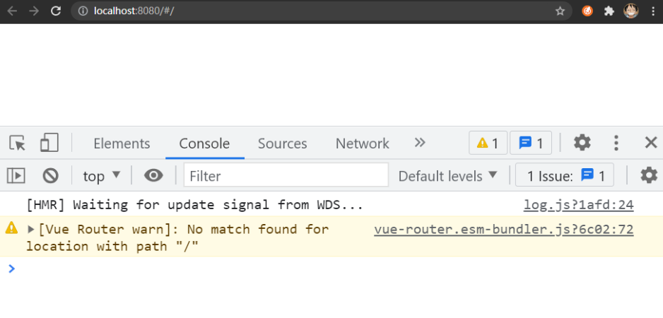

# 3-03：初始化项目结构（图文节）

`@vue/cli` 在帮助我们创建项目的同时，也生成了很多无用的代码，那么这一小节我们需要去除掉这些无用的代码。

去除的方式如下所示：

1. `App.vue` 初始化代码如下：

   ```vue
   <template>
     <router-view />
   </template>

   <style lang="scss"></style>
   ```

2. 删除 `views` 文件夹下的所有 `.vue` 文件

3. 删除 `components` 文件夹下的所有 `.vue` 文件

4. `router/index.js` 中初始化代码如下：

   ```js
   import { createRouter, createWebHashHistory } from 'vue-router'

   const routes = []

   const router = createRouter({
     history: createWebHashHistory(),
     routes
   })

   export default router
   ```

5. 浏览器中重新访问你的应用，得到如下页面即可：
   
