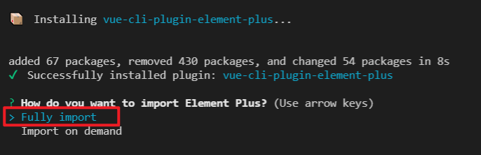
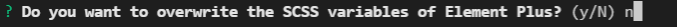
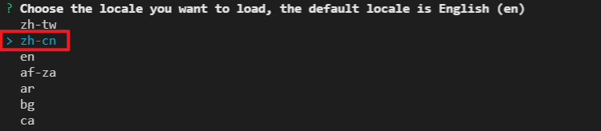
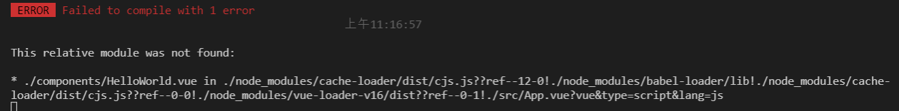

# 3-06：导入 element-plus

在开发我们的项目之前，我们需要先去导入 `element-ui` 的 `vue3` 支持版本，也就是 [element-plus](http://element-plus.org/#/zh-CN)

`element-plus` 提供了快捷导入的方式，即：[vue-cli-plugin-element-plus](https://github.com/element-plus/vue-cli-plugin-element-plus)，大家可以通过以下方式来快捷导入 `element-plus` （注意：此种方式会自动修改 `App.vue` 文件）：

1. 在通过 `vue-cli` 创建的项目中，执行

   ```
   vue add element-plus
   ```

2. 选择全局导入
   

3. 暂不生成覆盖变量的 `scss` 文件
   

4. 选择简体中文即可
   

5. 出现该提示表示安装完成
   

6. 此时运行项目，则会得到如下错误
   

7. 出现该错误的原因是因为 [vue-cli-plugin-element-plus](https://github.com/element-plus/vue-cli-plugin-element-plus) 默认修改了 `APP.vue` 文件，导入了 `HelloWorld`

8. 所以我们需要到 `APP.vue` 中，初始化如下代码：

   ```vue
   <template>
     <router-view />
   </template>

   <script>
     export default {
       name: 'App'
     }
   </script>

   <style></style>
   ```

那么至此，`element-plus` 导入成功，下一小节我们就正式开始项目的开发工作吧！
