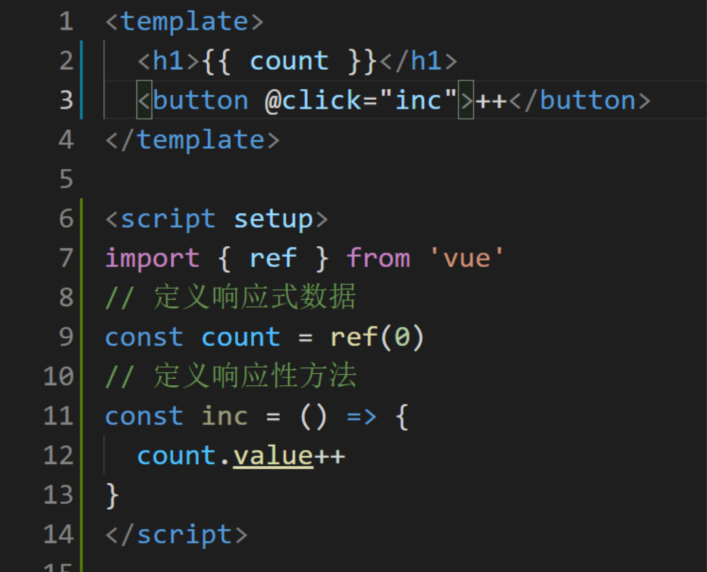
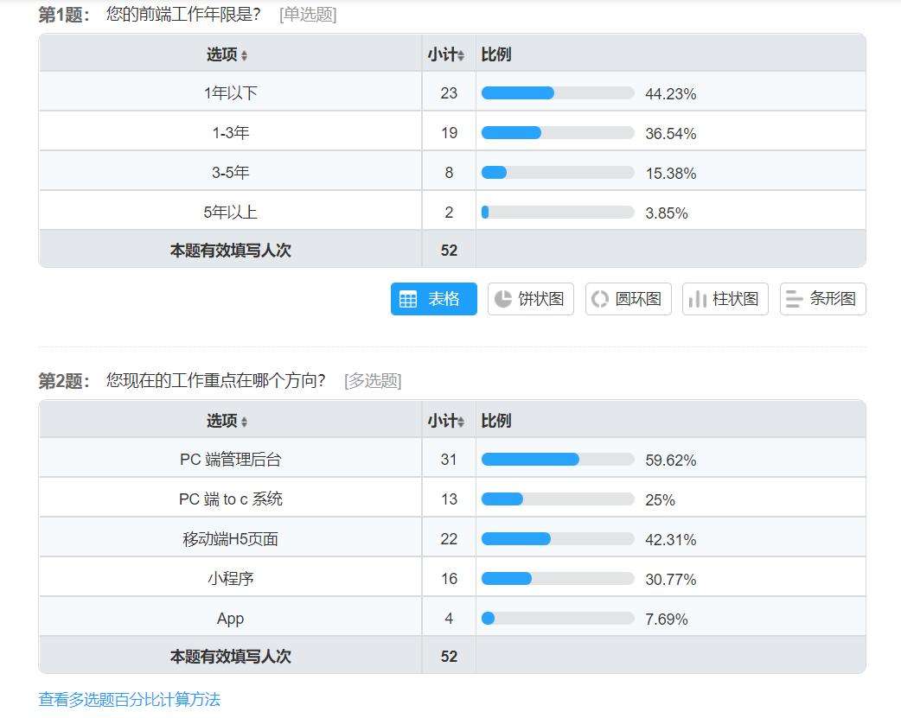

# 第一章：开篇

慕课网的小伙伴本大家好，我是 `Sunday`

这次给大家带来的课程是 **基于 Vue 3 最新语法标准，后台前端综合解决方案**

## vue 的最新变化

自从 `vue` 在 `2020年09月18日` 发布了 `3.0` 的版本之后，很多开发者都开始尝试被大受推崇的 `Composition API` ，但是在经过了短期的追捧之后，大家却发现，在企业中 `Composition API` 却并没有被大范围的普及，很多的公司虽然升级到了 `vue 3` ，但却依然使用着 `options API` 语法。

追其根本，原因还是在 `Composition API` 所提供的 `setup 函数语法` 中，如果你使用 `setup 函数语法` ，那么你得到的代码可能是这样的：

此时我们想要在 `template` 中使用一个 **响应式数据**，不但要通过 `ref` 进行声明，还需要在 `setup` 函数中进行 `return` 操作。同样方法也是如此。

那么当我们的一个项目足够复杂时，这样的一种结构形式就会变得 **非常的难看** 并且 **难以维护**

而这样的问题作为 `vue` 官方也是看到了的。

所以说在 `vue3` 仅仅发布了一个月之后，也就是在 `2020年10月28` ，`Vue` 就提出了一个 `RFC` ，尝试新的方式来废弃掉这种 `setup 函数式` 语法。

时隔一年，在 `2021年8月5日` ，伴随着 `vue 3.2` 的发布，`vue` 正式推出了全新的 `composition API` 语法标准 `script-setup`

`script-setup` 的推出，标记着 `setup 函数式语法` 正式称为过去式！

基于 `script-setup 语法标准` ，我们再去实现之前的业务，代码则变成了这样：

原本 25 行的代码量被压缩到了 14 行，并且大家可以发现，现在我们可以像 **写普通的 `js` 一样去写 `vue` 了**

除此之外 `vue3.2` 版本还带来了很多其他的巨大改变，比如：

1. 耗时一年才发布的全新响应式优化
2. 组件状态驱动的动态 `CSS` 值
3. ...

这些新的改变，我们在开篇这里就不再赘述了

## 后台系统的广泛性

而对于后台系统而言，相信只要是前端开发的工程师，那么就不陌生了。

如图所示，根据我们之前的多次数据统计分析，在 1-5 年经验的前端开发者中，后台管理系统的项目占比为 `59.62%` 。为前端开发中最为重要的工作方向。

## 项目功能介绍

而我们本次的课程则是专门针对于这种最为重要的工作方向，抽离出其中几十个经典业务模型，争取可以制作出覆盖大家大部分后台开发业务场景的综合性解决方案。

具体业务模型有：

1. 基于最新 `vue` 标准的：
   1. script setup 语法标准
   2. 最新的响应式变更
   3. 组件状态驱动的动态 css
   4. 最新 `vue` 全家桶
2. 基于大厂编程规范的：
   1. eslint
   2. prettier
   3. Commitizen
   4. husky
   5. commitlint
   6. pre-commit
   7. lint-staged
3. 以及：
   1. Svg Sprite Icon
   2. 环境变量处理方案
   3. 接口模块封装方案
   4. 请求动作封装方案
   5. token 处理方案
   6. 登录鉴权方案
   7. 主动登出方案
   8. 被动登出方案
   9. 动态路由表处理方案
   10. 动态菜单项处理方案
   11. 动态面包屑处理方案
   12. 联动处理
   13. 动画处理
   14. 国际化处理方案
   15. 动态主题处理方案
   16. 全屏处理方案
   17. 页面检索处理方案
   18. TagsView 处理方案
   19. 功能引导处理方案
   20. 多组件
   21. 基于文件选择的 Excel 导入方案
   22. 基于文件拖拽的 Excel 导入方案
   23. Excel 数据导出方案
   24. RBAC 的权限分控体系
   25. 动态权限设定
   26. 页面权限处理方案
   27. 功能权限处理方案
   28. 动态表格处理方案
   29. 拖拽表格处理方案
   30. 辅助库选择标准
   31. markdown 编辑器处理
   32. 富文本编辑器处理
   33. 打包优化处理方案
   34. 服务器、域名购买与备案标准
   35. 前端项目部署方案

等一揽子处理方案内容

## 详细的图文节

每一小节的视频都会对应详细的图文节内容

## 项目功能演示

## 课程收获

那么到这里相信大家对本课程中的内容应该有了一个大致的了解。

总结一下，学习完本课程之后，大家可以获取到如下三点收获：

1. 大厂标准的编程规范
2. 明星级项目的架构设计
3. 数十个经典业务模型以及对应的解决方案

足够帮助你在 面试 或者 晋升 中脱颖而出！

## 适应人群

因为本课程为通用的解决方案课程，所以无论是：

1. 在校学生
2. 新入职场的开发者
3. 有一定开发经验的开发者

都可以学习本课程的内容并获取到足够的收获！

那么还在犹豫什么呢？快来一起学习吧！
