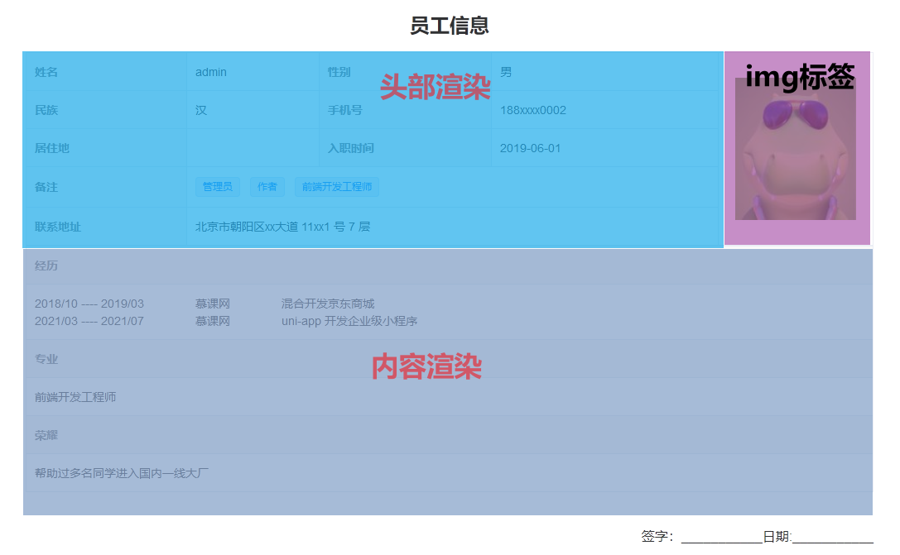

# 第七章：权限架构处理之用户权限处理

## 7-01：开篇

在处理完成了 **个人中心**之后， 那么接下来我们就需要来处理 **用户** 相关的模块了

整个用户相关的模块分为三部分：

1. 员工管理
2. 角色列表
3. 权限列表

这三部分的内容我们会分成两个大章来进行处理。

那么这一大章我们要来处理的就是 **员工管理** 模块的内容，整个 **员工管理** 模块可以分为以下功能：

1. 用户列表分页展示
2. `excel` 导入用户
3. 用户列表导出为 `excel`
4. 用户详情的表格展示
5. 用户详情表格打印
6. 用户删除
7. 用户角色分配（需要在完成角色列表之后处理）

那么明确好了这样的内容之后，接下来我们就进入到 **员工管理** 模块的开发之中

## 7-02：用户列表分页展示

首先我们先来处理最基础的 **用户列表分页展示** 功能，整个功能大体可以分为两步：

1. 获取分页数据
2. 利用 [el-table](https://element-plus.org/zh-CN/component/table.html) 和 [el-pagination](https://element-plus.org/zh-CN/component/pagination.html) 渲染数据

那么下面我们就根据这个步骤进行一个实现即可：

1. 创建 `api/user-manage` 文件，用于定义接口

   ```js
   import request from '@/utils/request'

   /**
    * 获取用户列表数据
    */
   export const getUserManageList = data => {
     return request({
       url: '/user-manage/list',
       params: data
     })
   }
   ```

2. 在 `user-manage` 中获取对应数据

   ```vue
   <script setup>
     import { ref } from 'vue'
     import { getUserManageList } from '@/api/user-manage'
     import { watchSwitchLang } from '@/utils/i18n'

     // 数据相关
     const tableData = ref([])
     const total = ref(0)
     const page = ref(1)
     const size = ref(2)
     // 获取数据的方法
     const getListData = async () => {
       const result = await getUserManageList({
         page: page.value,
         size: size.value
       })
       tableData.value = result.list
       total.value = result.total
     }
     getListData()
     // 监听语言切换
     watchSwitchLang(getListData)
   </script>
   ```

3. 根据数据利用 [el-table](https://element-plus.org/zh-CN/component/table.html) 和 [el-pagination](https://element-plus.org/zh-CN/component/pagination.html) 渲染视图

   ```vue
   <template>
     <div class="user-manage-container">
       <el-card class="header">
         <div>
           <el-button type="primary"> {{ $t('msg.excel.importExcel') }}</el-button>
           <el-button type="success">
             {{ $t('msg.excel.exportExcel') }}
           </el-button>
         </div>
       </el-card>
       <el-card>
         <el-table :data="tableData" border style="width: 100%">
           <el-table-column label="#" type="index" />
           <el-table-column prop="username" :label="$t('msg.excel.name')"> </el-table-column>
           <el-table-column prop="mobile" :label="$t('msg.excel.mobile')"> </el-table-column>
           <el-table-column :label="$t('msg.excel.avatar')" align="center">
             <template v-slot="{ row }">
               <el-image
                 class="avatar"
                 :src="row.avatar"
                 :preview-src-list="[row.avatar]"
               ></el-image>
             </template>
           </el-table-column>
           <el-table-column :label="$t('msg.excel.role')">
             <template #default="{ row }">
               <div v-if="row.role && row.role.length > 0">
                 <el-tag v-for="item in row.role" :key="item.id" size="mini">{{
                   item.title
                 }}</el-tag>
               </div>
               <div v-else>
                 <el-tag size="mini">{{ $t('msg.excel.defaultRole') }}</el-tag>
               </div>
             </template>
           </el-table-column>
           <el-table-column prop="openTime" :label="$t('msg.excel.openTime')"> </el-table-column>
           <el-table-column :label="$t('msg.excel.action')" fixed="right" width="260">
             <template #default>
               <el-button type="primary" size="mini">{{ $t('msg.excel.show') }}</el-button>
               <el-button type="info" size="mini">{{ $t('msg.excel.showRole') }}</el-button>
               <el-button type="danger" size="mini">{{ $t('msg.excel.remove') }}</el-button>
             </template>
           </el-table-column>
         </el-table>

         <el-pagination
           class="pagination"
           @size-change="handleSizeChange"
           @current-change="handleCurrentChange"
           :current-page="page"
           :page-sizes="[2, 5, 10, 20]"
           :page-size="size"
           layout="total, sizes, prev, pager, next, jumper"
           :total="total"
         >
         </el-pagination>
       </el-card>
     </div>
   </template>

   <script setup>
     import { ref } from 'vue'
     import { getUserManageList } from '@/api/user-manage'
     import { watchSwitchLang } from '@/utils/i18n'

     // 数据相关
     const tableData = ref([])
     const total = ref(0)
     const page = ref(1)
     const size = ref(2)
     // 获取数据的方法
     const getListData = async () => {
       const result = await getUserManageList({
         page: page.value,
         size: size.value
       })
       tableData.value = result.list
       total.value = result.total
     }
     getListData()
     // 监听语言切换
     watchSwitchLang(getListData)

     // 分页相关
     /**
      * size 改变触发
      */
     const handleSizeChange = currentSize => {
       size.value = currentSize
       getListData()
     }

     /**
      * 页码改变触发
      */
     const handleCurrentChange = currentPage => {
       page.value = currentPage
       getListData()
     }
   </script>

   <style lang="scss" scoped>
     .user-manage-container {
       .header {
         margin-bottom: 22px;
         text-align: right;
       }
       ::v-deep .avatar {
         width: 60px;
         height: 60px;
         border-radius: 50%;
       }

       ::v-deep .el-tag {
         margin-right: 6px;
       }

       .pagination {
         margin-top: 20px;
         text-align: center;
       }
     }
   </style>
   ```

## 7-03：全局属性处理时间展示问题

在 `Vue3`中取消了 [过滤器的概念](https://v3.cn.vuejs.org/guide/migration/filters.html)，其中：

1. 局部过滤器被完全删除
2. 全局过滤器虽然被移除，但是可以使用 [全局属性](https://v3.cn.vuejs.org/api/application-config.html#globalproperties) 进行替代

那么在列表中的时间处理部分，在 `vue2` 时代通常我们都是通过 **全局过滤器** 来进行实现的，所以在 `vue3` 中我们就顺理成章的通过 [全局属性](https://v3.cn.vuejs.org/api/application-config.html#globalproperties) 替代实现

1. 时间处理部分我们通过 [Day.js](https://day.js.org/) 进行处理

2. 下载 [Day.js](https://day.js.org/)

   ```
   npm i dayjs@1.10.6
   ```

3. 创建 `src/filter` 文件夹，用于定义 [全局属性](https://v3.cn.vuejs.org/api/application-config.html#globalproperties)

   ```js
   import dayjs from 'dayjs'

   const dateFilter = (val, format = 'YYYY-MM-DD') => {
     if (!isNaN(val)) {
       val = parseInt(val)
     }

     return dayjs(val).format(format)
   }

   export default app => {
     app.config.globalProperties.$filters = {
       dateFilter
     }
   }
   ```

4. 在 `main.js` 中导入

   ```js
   // filter
   import installFilter from '@/filters'

   installFilter(app)
   ```

5. 在 `user-manage` 中使用全局属性处理时间解析

   ```html
   <el-table-column :label="$t('msg.excel.openTime')">
     <template #default="{ row }"> {{ $filters.dateFilter(row.openTime) }} </template>
   </el-table-column>
   ```

## 7-04：excel 导入原理与实现分析

在处理完成这些基础的内容展示之后，接下来我们来看 **excel 导入** 功能

对于 **excel 导入** 首先我们先来明确一下它的业务流程：

1. 点击 **excel 导入** 按钮进入 **excel 导入页面**
2. 页面提供了两种导入形式
   1. 点击按钮上传 `excel`
   2. 把 `excel` 拖入指定区域
3. 选中文件，进行两步操作
   1. 解析 `excel` 数据
   2. 上传解析之后的数据
4. 上传成功之后，返回 **员工管理（用户列表）** 页面，进行数据展示

所以根据这个业务我们可以看出，整个 `excel` 导入核心的原理部分在于 **选中文件之后，上传成功之前** 的操作，即：

1. 解析 `excel` 数据（**最重要**）
2. 上传解析之后的数据

对于解析部分，我们回头再去详细说明，在这里我们只需要明确大的实现流程即可。

根据上面所说，整个的实现流程我们也可以很轻松得出：

1. 创建 `excel` 导入页面
2. 点击 `excel` 导入按钮，进入该页面
3. 该页面提供两种文件导入形式
4. 选中文件之后，解析 `excel` 数据（核心）
5. 上传解析之后的数据
6. 返回 员工管理（用户列表） 页面

那么明确好了这样的流程之后，接下来我们就可以实现对应的代码了。

## 7-05：业务落地：提供两种文件导入形式

`excel` 页面我们在之前已经创建过了，就是 `views/import/index` 。

所以此处，我们只需要在按钮处完成页面跳转即可，在 `user-manage` 中：

```js
<el-button type="primary" @click="onImportExcelClick">
          {{ $t('msg.excel.importExcel') }}</el-button
        >

const router = useRouter()
/**
 * excel 导入点击事件
 */
const onImportExcelClick = () => {
  router.push('/user/import')
}
```

这样我们就已经完成了前面两步，那么接下来我们就来实现 **提供两种文件导入形式**

1. 创建 `components/UploadExcel` 组件，用于处理上传 `excel` 相关的问题

2. 在 `import` 中导入该组件

   ```vue
   <template>
     <upload-excel></upload-excel>
   </template>

   <script setup>
     import UploadExcel from '@/components/UploadExcel'
   </script>
   ```

3. 整个 `UploadExcel` 组件的内容可以分成两部分：

   1. 样式
   2. 逻辑

4. 那么首先我们先处理样式内容

   ```vue
   <template>
     <div class="upload-excel">
       <div class="btn-upload">
         <el-button :loading="loading" type="primary" @click="handleUpload">
           {{ $t('msg.uploadExcel.upload') }}
         </el-button>
       </div>

       <input
         ref="excelUploadInput"
         class="excel-upload-input"
         type="file"
         accept=".xlsx, .xls"
         @change="handleChange"
       />
       <!-- https://developer.mozilla.org/zh-CN/docs/Web/API/HTML_Drag_and_Drop_API -->
       <div
         class="drop"
         @drop.stop.prevent="handleDrop"
         @dragover.stop.prevent="handleDragover"
         @dragenter.stop.prevent="handleDragover"
       >
         <i class="el-icon-upload" />
         <span>{{ $t('msg.uploadExcel.drop') }}</span>
       </div>
     </div>
   </template>

   <script setup>
     import {} from 'vue'
   </script>

   <style lang="scss" scoped>
     .upload-excel {
       display: flex;
       justify-content: center;
       margin-top: 100px;
       .excel-upload-input {
         display: none;
         z-index: -9999;
       }
       .btn-upload,
       .drop {
         border: 1px dashed #bbb;
         width: 350px;
         height: 160px;
         text-align: center;
         line-height: 160px;
       }
       .drop {
         line-height: 60px;
         display: flex;
         flex-direction: column;
         justify-content: center;
         color: #bbb;
         i {
           font-size: 60px;
           display: block;
         }
       }
     }
   </style>
   ```

## 7-06：业务落地：文件选择之后的数据解析处理

那么接下来我们来处理整个业务中最核心的一块内容 **选中文件之后，解析 `excel` 数据**

解析的方式根据我们的导入形式的不同也可以分为两种：

1. 文件选择（选择隐藏域）导入
2. 文件拖拽导入

那么这一小节，我们先来处理第一种。

处理之前我们需要先来做一件事情：

1. 解析 `excel` 数据我们需要使用 [xlsx](https://www.npmjs.com/package/xlsx) ，所以我们需要先下载它

   ```
   npm i xlsx@0.17.0
   ```

[xlsx](https://www.npmjs.com/package/xlsx) 安装完成之后，接下来我们就可以来去实现对应代码了：

```vue
<script setup>
  import XLSX from 'xlsx'
  import { defineProps, ref } from 'vue'
  import { getHeaderRow } from './utils'

  const props = defineProps({
    // 上传前回调
    beforeUpload: Function,
    // 成功回调
    onSuccess: Function
  })

  /**
   * 点击上传触发
   */
  const loading = ref(false)
  const excelUploadInput = ref(null)
  const handleUpload = () => {
    excelUploadInput.value.click()
  }
  const handleChange = e => {
    const files = e.target.files
    const rawFile = files[0] // only use files[0]
    if (!rawFile) return
    upload(rawFile)
  }

  /**
   * 触发上传事件
   */
  const upload = rawFile => {
    excelUploadInput.value.value = null
    // 如果没有指定上传前回调的话
    if (!props.beforeUpload) {
      readerData(rawFile)
      return
    }
    // 如果指定了上传前回调，那么只有返回 true 才会执行后续操作
    const before = props.beforeUpload(rawFile)
    if (before) {
      readerData(rawFile)
    }
  }

  /**
   * 读取数据（异步）
   */
  const readerData = rawFile => {
    loading.value = true
    return new Promise((resolve, reject) => {
      // https://developer.mozilla.org/zh-CN/docs/Web/API/FileReader
      const reader = new FileReader()
      // 该事件在读取操作完成时触发
      // https://developer.mozilla.org/zh-CN/docs/Web/API/FileReader/onload
      reader.onload = e => {
        // 1. 获取解析到的数据
        const data = e.target.result
        // 2. 利用 XLSX 对数据进行解析
        const workbook = XLSX.read(data, { type: 'array' })
        // 3. 获取第一张表格(工作簿)名称
        const firstSheetName = workbook.SheetNames[0]
        // 4. 只读取 Sheet1（第一张表格）的数据
        const worksheet = workbook.Sheets[firstSheetName]
        // 5. 解析数据表头
        const header = getHeaderRow(worksheet)
        // 6. 解析数据体
        const results = XLSX.utils.sheet_to_json(worksheet)
        // 7. 传入解析之后的数据
        generateData({ header, results })
        // 8. loading 处理
        loading.value = false
        // 9. 异步完成
        resolve()
      }
      // 启动读取指定的 Blob 或 File 内容
      reader.readAsArrayBuffer(rawFile)
    })
  }

  /**
   * 根据导入内容，生成数据
   */
  const generateData = excelData => {
    props.onSuccess && props.onSuccess(excelData)
  }
</script>
```

`getHeaderRow` 为 `xlsx` 解析表头数据的通用方法，直接使用即可

```js
import XLSX from 'xlsx'
/**
 * 获取表头（通用方式）
 */
export const getHeaderRow = sheet => {
  const headers = []
  const range = XLSX.utils.decode_range(sheet['!ref'])
  let C
  const R = range.s.r
  /* start in the first row */
  for (C = range.s.c; C <= range.e.c; ++C) {
    /* walk every column in the range */
    const cell = sheet[XLSX.utils.encode_cell({ c: C, r: R })]
    /* find the cell in the first row */
    let hdr = 'UNKNOWN ' + C // <-- replace with your desired default
    if (cell && cell.t) hdr = XLSX.utils.format_cell(cell)
    headers.push(hdr)
  }
  return headers
}
```

在 `import` 组件中传入 `onSuccess` 事件，获取解析成功之后的 `excel` 数据

```vue
<template>
  <upload-excel :onSuccess="onSuccess"></upload-excel>
</template>

<script setup>
  import UploadExcel from '@/components/UploadExcel'

  /**
   * 数据解析成功之后的回调
   */
  const onSuccess = excelData => {
    console.log(excelData)
  }
</script>
、
```

## 7-07：业务落地：文件拖入之后的数据解析处理

想要了解 **文件拖入**，那么我们就必须要先能够了解 [HTML_Drag_and_Drop（HTML 拖放 API）](https://developer.mozilla.org/zh-CN/docs/Web/API/HTML_Drag_and_Drop_API) 事件，我们这里主要使用到其中三个事件：

1. [drop (en-US)](https://developer.mozilla.org/en-US/docs/Web/API/Document/drop_event)：当元素或选中的文本在可释放目标上被释放时触发
2. [dragover (en-US)](https://developer.mozilla.org/en-US/docs/Web/API/Document/dragover_event)：当元素或选中的文本被拖到一个可释放目标上时触发
3. [dragenter (en-US)](https://developer.mozilla.org/en-US/docs/Web/API/Document/dragenter_event)：当拖拽元素或选中的文本到一个可释放目标时触发

那么明确好了这三个事件之后，我们就可以实现对应的拖入代码逻辑了

```vue
<script setup>
  ...
  import { getHeaderRow, isExcel } from './utils'
  import { ElMessage } from 'element-plus'

  ...
  /**
   * 拖拽文本释放时触发
   */
  const handleDrop = e => {
    // 上传中跳过
    if (loading.value) return
    const files = e.dataTransfer.files
    if (files.length !== 1) {
      ElMessage.error('必须要有一个文件')
      return
    }
    const rawFile = files[0]
    if (!isExcel(rawFile)) {
      ElMessage.error('文件必须是 .xlsx, .xls, .csv 格式')
      return false
    }
    // 触发上传事件
    upload(rawFile)
  }

  /**
   * 拖拽悬停时触发
   */
  const handleDragover = e => {
    // https://developer.mozilla.org/zh-CN/docs/Web/API/DataTransfer/dropEffect
    // 在新位置生成源项的副本
    e.dataTransfer.dropEffect = 'copy'
  }

  。。。
</script>
```

在 `utils` 中生成 `isExcel` 方法

```js
export const isExcel = file => {
  return /\.(xlsx|xls|csv)$/.test(file.name)
}
```

## 7-08：业务落地：传递解析后的 excel 数据

那么到现在我们已经处理好了 `excel` 的数据解析操作。

接下来就可以实现对应的数据上传，完成 `excel` 导入功能了

1. 定义 `api/user-manage` 上传接口

   ```js
   /**
    * 批量导入
    */
   export const userBatchImport = data => {
     return request({
       url: '/user-manage/batch/import',
       method: 'POST',
       data
     })
   }
   ```

2. 在 `onSuccess` 中调用接口上传数据，但是此处大家要注意两点内容：

   1. `header` 头不需要上传
   2. `results` 中 `key` 为中文，我们必须要按照接口要求进行上传

3. 所以我们需要处理 `results` 中的数据结构

4. 创建 `import/utils` 文件

   ```js
   /**
    * 导入数据对应表
    */
   export const USER_RELATIONS = {
     姓名: 'username',
     联系方式: 'mobile',
     角色: 'role',
     开通时间: 'openTime'
   }
   ```

5. 创建数据解析方法，生成新数组

   ```js
   /**
    * 筛选数据
    */
   const generateData = results => {
     const arr = []
     results.forEach(item => {
       const userInfo = {}
       Object.keys(item).forEach(key => {
         userInfo[USER_RELATIONS[key]] = item[key]
       })
       arr.push(userInfo)
     })
     return arr
   }
   ```

6. 完成数据上传即可

   ```js
   /**
    * 数据解析成功之后的回调
    */
   const onSuccess = async ({ header, results }) => {
     const updateData = generateData(results)
     await userBatchImport(updateData)
     ElMessage.success({
       message: results.length + i18n.t('msg.excel.importSuccess'),
       type: 'success'
     })
     router.push('/user/manage')
   }
   ```

## 7-09：业务落地：处理剩余 bug

截止到目前整个 `excel` 上传我们就已经处理完成了，只不过目前还存在两个小 bug 需要处理：

1. 上传之后的时间解析错误
2. 返回用户列表之后，数据不会自动刷新

那么这一小节我们就针对这两个问题进行分别处理

**上传之后的时间解析错误：**

导致该问题出现的原因是因为 **excel 导入解析时间会出现错误，** 处理的方案也很简单，是一个固定方案，我们只需要进行固定的时间解析处理即可：

1. 在 `import/utils` 中新增事件处理方法（固定方式直接使用即可）

   ```js
   /**
    * 解析 excel 导入的时间格式
    */
   export const formatDate = numb => {
     const time = new Date((numb - 1) * 24 * 3600000 + 1)
     time.setYear(time.getFullYear() - 70)
     const year = time.getFullYear() + ''
     const month = time.getMonth() + 1 + ''
     const date = time.getDate() - 1 + ''
     return year + '-' + (month < 10 ? '0' + month : month) + '-' + (date < 10 ? '0' + date : date)
   }
   ```

2. 在 `generateData` 中针对 `openTime` 进行单独处理

   ```js
   /**
    * 筛选数据
    */
   const generateData = results => {
     ...
       Object.keys(item).forEach(key => {
         if (USER_RELATIONS[key] === 'openTime') {
           userInfo[USER_RELATIONS[key]] = formatDate(item[key])
           return
         }
         userInfo[USER_RELATIONS[key]] = item[key]
       })
       ...
     })
     return arr
   }
   ```

**返回用户列表之后，数据不会自动刷新：**

出现该问题的原因是因为：**`appmain` 中使用 `keepAlive` 进行了组件缓存**。

解决的方案也很简单，只需要：**监听 [onActivated](https://v3.cn.vuejs.org/api/options-lifecycle-hooks.html#activated) 事件，重新获取数据即可**

在 `user-manage` 中：

```js
import { ref, onActivated } from 'vue'

// 处理导入用户后数据不重新加载的问题
onActivated(getListData)
```

## 7-10：excel 导入功能总结

那么到这里我们的 `excel` 导入功能我们就已经实现完成了，再来回顾一下我们整体的流程：

1. 创建 `excel` 导入页面
2. 点击 `excel` 导入按钮，进入该页面
3. 该页面提供两种文件导入形式
4. 选中文件之后，解析 `excel` 数据（核心）
5. 上传解析之后的数据
6. 返回 员工管理（用户列表） 页面

游离于这些流程之外的，还包括额外的两个小 bug 的处理，特别是 **`excel` 的时间格式问题，** 大家要格外注意，因为这是一个必然会出现的错误，当然处理方案也是固定的。

## 7-11：辅助业务之用户删除

完成了 `excel` 的用户导入之后，那么我们肯定会产生很多的无用数据，所以说接下来我们来完成一个辅助功能：**删除用户（希望大家都可以在完成 `excel` 导入功能之后，删除掉无用数据，以方便其他的同学进行功能测试）**

删除用户的功能比较简单，我们只需要 **调用对应的接口即可**

1. 在 `api/user-manage` 中指定删除接口

   ```js
   /**
    * 删除指定数据
    */
   export const deleteUser = id => {
     return request({
       url: `/user-manage/detele/${id}`
     })
   }
   ```

2. 在 `views/user-manage` 中调用删除接口接口

   ```html
   <el-button type="danger" size="mini" @click="onRemoveClick(row)"
     >{{ $t('msg.excel.remove') }}</el-button
   >
   ```

   ```js
   /**
    * 删除按钮点击事件
    */
   const i18n = useI18n()
   const onRemoveClick = row => {
     ElMessageBox.confirm(
       i18n.t('msg.excel.dialogTitle1') + row.username + i18n.t('msg.excel.dialogTitle2'),
       {
         type: 'warning'
       }
     ).then(async () => {
       await deleteUser(row._id)
       ElMessage.success(i18n.t('msg.excel.removeSuccess'))
       // 重新渲染数据
       getListData()
     })
   }
   ```

## 7-12：excel 导出原理与实现分析

对于 `excel` 导出而言我们还是先来分析一下它的业务逻辑：

1. 点击 `excel` 导出按钮
2. 展示 `dialog` 弹出层
3. 确定导出的 `excel` 文件名称
4. 点击导出按钮
5. 获取 **所有用户列表数据**
6. 将 `json` 结构数据转化为 `excel` 数据，并下载

有了 `excel` 导入的经验之后，再来看这样的一套业务逻辑，相信大家应该可以直接根据这样的一套业务逻辑得出 `excel` 导出的核心原理了：**将 `json` 结构数据转化为 `excel` 数据，并下载**

那么我们对应的实现方案也可以直接得出了：

1. 创建 `excel` 导出弹出层
2. 处理弹出层相关的业务
3. 点击导出按钮，将 `json` 结构数据转化为 `excel` 数据，并下载（核心）

## 7-13：业务落地：Export2Excel 组件

那么首先我们先去创建 `excel` 弹出层组件 `Export2Excel `

1. 创建 `views/user-manage/components/Export2Excel `

   ```vue
   <template>
     <el-dialog
       :title="$t('msg.excel.title')"
       :model-value="modelValue"
       @close="closed"
       width="30%"
     >
       <el-input :placeholder="$t('msg.excel.placeholder')"></el-input>
       <template #footer>
         <span class="dialog-footer">
           <el-button @click="closed">{{ $t('msg.excel.close') }}</el-button>
           <el-button type="primary" @click="onConfirm">{{ $t('msg.excel.confirm') }}</el-button>
         </span>
       </template>
     </el-dialog>
   </template>

   <script setup>
     import { defineProps, defineEmits } from 'vue'

     defineProps({
       modelValue: {
         type: Boolean,
         required: true
       }
     })
     const emits = defineEmits(['update:modelValue'])

     /**
      * 导出按钮点击事件
      */
     const onConfirm = async () => {
       closed()
     }

     /**
      * 关闭
      */
     const closed = () => {
       emits('update:modelValue', false)
     }
   </script>
   ```

2. 在 `user-manage` 中进行导入 `dialog` 组件

   1. 指定 `excel`按钮 点击事件

      ```html
      <el-button type="success" @click="onToExcelClick">
        {{ $t('msg.excel.exportExcel') }}
      </el-button>
      ```

   2. 导入 `ExportToExcel` 组件

      ```vue
      <export-to-excel v-model="exportToExcelVisible"></export-to-excel> import ExportToExcel from
      './components/Export2Excel.vue'
      ```

   3. 点击事件处理函数

      ```js
      /**
       * excel 导出点击事件
       */
      const exportToExcelVisible = ref(false)
      const onToExcelClick = () => {
        exportToExcelVisible.value = true
      }
      ```

## 7-14：业务落地：导出前置业务处理

那么这一小节我们来处理一些实现 `excel` 导出时的前置任务，具体有：

1. 指定 `input` 默认导出文件名称
2. 定义 **获取全部用户** 列表接口，并调用

那么下面我们先来处理第一步：**指定 `input` 默认导出文件名称**

1. 指定 `input` 的双向绑定

   ```html
   <el-input v-model="excelName" :placeholder="$t('msg.excel.placeholder')"></el-input>
   ```

2. 指定默认文件名

   ```js
   const i18n = useI18n()
   let exportDefaultName = i18n.t('msg.excel.defaultName')
   const excelName = ref('')
   excelName.value = exportDefaultName
   watchSwitchLang(() => {
     exportDefaultName = i18n.t('msg.excel.defaultName')
     excelName.value = exportDefaultName
   })
   ```

**定义获取全部用户列表接口，并调用：**

1. 在 `user-manage` 中定义获取全部数据接口

   ```js
   /**
    * 获取所有用户列表数据
    */
   export const getUserManageAllList = () => {
     return request({
       url: '/user-manage/all-list'
     })
   }
   ```

2. 调用接口数据，并指定 `loading`

   ```html
   <el-button type="primary" @click="onConfirm" :loading="loading"
     >{{ $t('msg.excel.confirm') }}</el-button
   >
   ```

   ```js
   import { getUserManageAllList } from '@/api/user-manage'

   /**
    * 导出按钮点击事件
    */
   const loading = ref(false)
   const onConfirm = async () => {
     loading.value = true
     const allUser = (await getUserManageAllList()).list

     closed()
   }

   /**
    * 关闭
    */
   const closed = () => {
     loading.value = false
     emits('update:modelValue', false)
   }
   ```

## 7-15：业务落地：实现 excel 导出逻辑

那么万事俱备，到此时我们就可以来实现整个业务逻辑的最后步骤：

1. 将 `json` 结构数据转化为 `excel` 数据
2. 下载对应的 `excel` 数据

对于这两步的逻辑而言，最复杂的莫过于 **将 `json` 结构数据转化为 `excel` 数据** 这一步的功能，不过万幸的是对于该操作的逻辑是 **通用处理逻辑**，搜索 **Export2Excel** 我们可以得到巨多的解决方案，所以此处我们 **没有必要** 手写对应的转换逻辑

该转化逻辑我已经把它放置到 `课程资料/Export2Excel.js` 文件中，大家可以直接把该代码复制到 `utils` 文件夹下

> PS：如果大家想要了解该代码的话，那么对应的业务逻辑我们也已经全部标出，大家可以直接查看

那么有了 `Export2Excel.js` 的代码之后 ，接下来我们还需要导入两个依赖库：

1.  [xlsx](https://www.npmjs.com/package/xlsx) （已下载）：`excel` 解析器和编译器
2.  [file-saver](https://www.npmjs.com/package/file-saver)：文件下载工具，通过 `npm i file-saver@2.0.5` 下载

那么一切准备就绪，我们去实现 `excel` 导出功能：

1. 动态导入 `Export2Excel.js`

   ```js
   // 导入工具包
   const excel = await import('@/utils/Export2Excel')
   ```

2. 因为从服务端获取到的为 `json 数组对象` 结构，但是导出时的数据需要为 **二维数组**，所以我们需要有一个方法来把 **`json` 结构转化为 二维数组**

3. 创建转化方法

   1. 创建 `views/user-manage/components/Export2ExcelConstants.js` 中英文对照表

      ```js
      /**
       * 导入数据对应表
       */
      export const USER_RELATIONS = {
        姓名: 'username',
        联系方式: 'mobile',
        角色: 'role',
        开通时间: 'openTime'
      }
      ```

   2. 创建数据解析方法

      ```js
      // 该方法负责将数组转化成二维数组
      const formatJson = (headers, rows) => {
        // 首先遍历数组
        // [{ username: '张三'},{},{}]  => [[’张三'],[],[]]
        return rows.map(item => {
          return Object.keys(headers).map(key => {
            // 角色特殊处理
            if (headers[key] === 'role') {
              const roles = item[headers[key]]

              return JSON.stringify(roles.map(role => role.title))
            }
            return item[headers[key]]
          })
        })
      }
      ```

4. 调用该方法，获取导出的二维数组数据

   ```js
   import { USER_RELATIONS } from './Export2ExcelConstants'

   const data = formatJson(USER_RELATIONS, allUser)
   ```

5. 调用 `export_json_to_excel` 方法，完成 `excel` 导出

   ```js
   excel.export_json_to_excel({
     // excel 表头
     header: Object.keys(USER_RELATIONS),
     // excel 数据（二维数组结构）
     data,
     // 文件名称
     filename: excelName.value || exportDefaultName,
     // 是否自动列宽
     autoWidth: true,
     // 文件类型
     bookType: 'xlsx'
   })
   ```

## 7-16：业务落地：excel 导出时的时间逻辑处理

因为服务端返回的 `openTime` 格式问题，所以我们需要在 `excel` 导出时对时间格式进行单独处理

2. 导入时间格式处理工具

   ```js
   import { dateFormat } from '@/filters'
   ```

3. 对时间格式进行单独处理

   ```js
   // 时间特殊处理
   if (headers[key] === 'openTime') {
     return dateFormat(item[headers[key]])
   }
   ```

## 7-17：excel 导出功能总结

那么到这里我们的整个 `excel` 导出就算是实现完成了。

整个 `excel` 导出遵循以下业务逻辑：

1. 创建 `excel` 导出弹出层
2. 处理弹出层相关的业务
3. 点击导出按钮，将 `json` 结构数据转化为 `excel` 数据
   1. `json` 数据转化为 **二维数组**
   2. 时间处理
   3. 角色数组处理
4. 下载 `excel` 数据

其中 **将 `json` 结构数据转化为 `excel` 数据** 部分因为有通用的实现方式，所以我们没有必要进行手动的代码书写，毕竟 **“程序猿是最懒的群体嘛”**

但是如果大家想要了解一下这个业务逻辑中所进行的事情，我们也对代码进行了完整的备注，大家可以直接进行查看

## 7-18：局部打印详情原理与实现分析

那么接下来就是我们本章中最后一个功能 **员工详情打印**

整个员工详情的打印逻辑分为两部分：

1. 以表格的形式展示员工详情
2. 打印详情表格

其中 **以表格的形式展示员工详情** 部分我们需要使用到 [el-descriptions](https://element-plus.org/zh-CN/component/descriptions.html) 组件，并且想要利用该组件实现详情的表格效果还需要一些小的技巧，这个具体的我们到时候再去说

而 **打印详情表格** 的功能就是建立在展示详情页面之上的

大家知道，当我们在浏览器右键时，其实可以直接看到对应的 **打印** 选项，但是这个打印选项是直接打印整个页面，不能指定打印页面中的某一部分的。

所以说 **打印是浏览器本身的功能**，但是这个功能存在一定的小缺陷，那就是 **只能打印整个页面**

而我们想要实现 **详情打印**，那么就需要在这个功能的基础之上做到指定打印具体的某一块视图，而这个功能已经有一个第三方的包 [vue-print-nb](https://github.com/Power-kxLee/vue-print-nb#vue3-version) 帮助我们进行了实现，所以我们只需要使用这个包即可完成打印功能

那么明确好了原理之后，接下来步骤就呼之欲出了：

1. 获取员工详情数据
2. 在员工详情页面，渲染详情数据
3. 利用 [vue-print-nb](https://github.com/Power-kxLee/vue-print-nb#vue3-version) 进行局部打印

## 7-19：业务落地：获取展示数据

首先我们来获取对应的展示数据

1. 在 `api/user-manage` 中定义获取用户详情接口

   ```js
   /**
    * 获取用户详情
    */
   export const userDetail = id => {
     return request({
       url: `/user-manage/detail/${id}`
     })
   }
   ```

2. 在 `views/user-info` 中根据 `id` 获取接口详情数据，并进行国际化处理

   ```vue
   <script setup>
     import { userDetail } from '@/api/user-manage'
     import { watchSwitchLang } from '@/utils/i18n'
     import { defineProps, ref } from 'vue'

     const props = defineProps({
       id: {
         type: String,
         required: true
       }
     })

     // 数据相关
     const detailData = ref({})
     const getUserDetail = async () => {
       detailData.value = await userDetail(props.id)
     }
     getUserDetail()
     // 语言切换
     watchSwitchLang(getUserDetail)
   </script>
   ```

3. 因为用户详情可以会以组件的形式进行呈现，所以对于此处我们需要得到的 `id` ，可以通过 [vue-router Props 传参](https://next.router.vuejs.org/zh/guide/essentials/passing-props.html#%E5%B8%83%E5%B0%94%E6%A8%A1%E5%BC%8F) 的形式进行

4. 指定路由表

   ```js
   {
           path: '/user/info/:id',
           name: 'userInfo',
           component: () => import('@/views/user-info/index'),
           props: true,
           meta: {
             title: 'userInfo'
           }
         }
   ```

5. 在 `views/user-manage` 中传递用户 `id`

   ```vue
   <el-button type="primary" size="mini" @click="onShowClick(row._id)">
   	{{ $t('msg.excel.show') }}
   </el-button>

   /** * 查看按钮点击事件 */ const onShowClick = id => { router.push(`/user/info/${id}`) }
   ```

## 7-20：业务落地：渲染详情结构

渲染用户详情结构我们需要借助 [el-descriptions](https://element-plus.org/zh-CN/component/descriptions.html) 组件，只不过使用该组件时我们需要一些小的技巧

因为 [el-descriptions](https://element-plus.org/zh-CN/component/descriptions.html) 组件作用为：渲染描述列表。但是我们想要的包含头像的用户详情样式，直接利用一个 [el-descriptions](https://element-plus.org/zh-CN/component/descriptions.html) 组件并无法进行渲染，所以此时我们需要对多个 [el-descriptions](https://element-plus.org/zh-CN/component/descriptions.html) 组件 与 `img` 标签进行配合使用



如果得出渲染代码

```vue
<template>
  <div class="user-info-container">
    <el-card class="print-box">
      <el-button type="primary">{{ $t('msg.userInfo.print') }}</el-button>
    </el-card>
    <el-card>
      <div class="user-info-box">
        <!-- 标题 -->
        <h2 class="title">{{ $t('msg.userInfo.title') }}</h2>

        <div class="header">
          <!-- 头部渲染表格 -->
          <el-descriptions :column="2" border>
            <el-descriptions-item :label="$t('msg.userInfo.name')">{{
              detailData.username
            }}</el-descriptions-item>
            <el-descriptions-item :label="$t('msg.userInfo.sex')">{{
              detailData.gender
            }}</el-descriptions-item>
            <el-descriptions-item :label="$t('msg.userInfo.nation')">{{
              detailData.nationality
            }}</el-descriptions-item>
            <el-descriptions-item :label="$t('msg.userInfo.mobile')">{{
              detailData.mobile
            }}</el-descriptions-item>
            <el-descriptions-item :label="$t('msg.userInfo.province')">{{
              detailData.province
            }}</el-descriptions-item>
            <el-descriptions-item :label="$t('msg.userInfo.date')">{{
              $filters.dateFilter(detailData.openTime)
            }}</el-descriptions-item>
            <el-descriptions-item :label="$t('msg.userInfo.remark')" :span="2">
              <el-tag
                class="remark"
                size="small"
                v-for="(item, index) in detailData.remark"
                :key="index"
                >{{ item }}</el-tag
              >
            </el-descriptions-item>
            <el-descriptions-item :label="$t('msg.userInfo.address')" :span="2">{{
              detailData.address
            }}</el-descriptions-item>
          </el-descriptions>
          <!-- 头像渲染 -->
          <el-image
            class="avatar"
            :src="detailData.avatar"
            :preview-src-list="[detailData.avatar]"
          ></el-image>
        </div>
        <div class="body">
          <!-- 内容渲染表格 -->
          <el-descriptions direction="vertical" :column="1" border>
            <el-descriptions-item :label="$t('msg.userInfo.experience')">
              <ul>
                <li v-for="(item, index) in detailData.experience" :key="index">
                  <span>
                    {{ $filters.dateFilter(item.startTime, 'YYYY/MM') }}
                    ----
                    {{ $filters.dateFilter(item.endTime, 'YYYY/MM') }}</span
                  >
                  <span>{{ item.title }}</span>
                  <span>{{ item.desc }}</span>
                </li>
              </ul>
            </el-descriptions-item>
            <el-descriptions-item :label="$t('msg.userInfo.major')">
              {{ detailData.major }}
            </el-descriptions-item>
            <el-descriptions-item :label="$t('msg.userInfo.glory')">
              {{ detailData.glory }}
            </el-descriptions-item>
          </el-descriptions>
        </div>
        <!-- 尾部签名 -->
        <div class="foot">{{ $t('msg.userInfo.foot') }}</div>
      </div>
    </el-card>
  </div>
</template>

<style lang="scss" scoped>
  .print-box {
    margin-bottom: 20px;
    text-align: right;
  }
  .user-info-box {
    width: 1024px;
    margin: 0 auto;
    .title {
      text-align: center;
      margin-bottom: 18px;
    }
    .header {
      display: flex;
      ::v-deep .el-descriptions {
        flex-grow: 1;
      }
      .avatar {
        width: 187px;
        box-sizing: border-box;
        padding: 30px 20px;
        border: 1px solid #ebeef5;
        border-left: none;
      }
      .remark {
        margin-right: 12px;
      }
    }
    .body {
      ul {
        list-style: none;
        li {
          span {
            margin-right: 62px;
          }
        }
      }
    }
    .foot {
      margin-top: 42px;
      text-align: right;
    }
  }
</style>
```

## 7-21：业务落地：局部打印功能实现

局部详情打印功能我们需要借助 [vue-print-nb](https://github.com/Power-kxLee/vue-print-nb#vue3-version)，所以首先我们需要下载该插件

```
npm i vue3-print-nb@0.1.4
```

然后利用该工具完成下载功能：

1. 指定 `printLoading`

   ```
   <el-button type="primary" :loading="printLoading">{{
           $t('msg.userInfo.print')
         }}</el-button>

   // 打印相关
   const printLoading = ref(false)
   ```

2. 创建打印对象

   ```js
   const printObj = {
     // 打印区域
     id: 'userInfoBox',
     // 打印标题
     popTitle: 'imooc-vue-element-admin',
     // 打印前
     beforeOpenCallback(vue) {
       printLoading.value = true
     },
     // 执行打印
     openCallback(vue) {
       printLoading.value = false
     }
   }
   ```

3. 指定打印区域 `id` 匹配

   ```html
   <div id="userInfoBox" class="user-info-box"></div>
   ```

4. [vue-print-nb](https://github.com/Power-kxLee/vue-print-nb#vue3-version) 以指令的形式存在，所以我们需要创建对应指令

5. 新建 `directives` 文件夹，创建 `index.js`

6. 写入如下代码

   ```js
   import print from 'vue3-print-nb'

   export default app => {
     app.use(print)
   }
   ```

7. 在 `main.js` 中导入该指令

   ```js
   import installDirective from '@/directives'
   installDirective(app)
   ```

8. 将打印指令挂载到 `el-button` 中

   ```html
   <el-button type="primary" v-print="printObj" :loading="printLoading"
     >{{ $t('msg.userInfo.print') }}</el-button
   >
   ```

## 7-22：局部打印功能总结

整个局部打印详情功能，整体的核心逻辑就是这么两块：

1. 以表格的形式展示员工详情
2. 打印详情表格

其中第一部分使用 [el-descriptions](https://element-plus.org/zh-CN/component/descriptions.html) 组件配合一些小技巧即可实现

而局部打印功能则需要借助 [vue-print-nb](https://github.com/Power-kxLee/vue-print-nb#vue3-version) 这个第三方库进行实现

所以整个局部打印功能应该并不算复杂，掌握这两部分即可轻松实现

## 7-23：总结

那么到这里我们整个章节就全部完成了，最后的 **为用户分配角色** 功能需要配合 **角色列表** 进行实现，所以我们需要等到后面进行

那么整个章节所实现的功能有：

1. 用户列表分页展示
2. `excel` 导入用户
3. 用户列表导出为 `excel`
4. 用户详情的表格展示
5. 用户详情表格打印
6. 用户删除

这么六个

其中比较复杂的应该就是 **`excel` 导入 & 导出** 了，所以针对这两个功能我们花费了最多的篇幅进行讲解

但是这里有一点大家不要忘记，我们在本章开篇的时候说过，**员工管理** 是 **用户权限中的一个前置！** 比如我们的分配角色功能就需要配合其他的业务实现，那么具体的整个用户权限都包含了哪些内容呢？

想要知道快来看下一章节吧！
