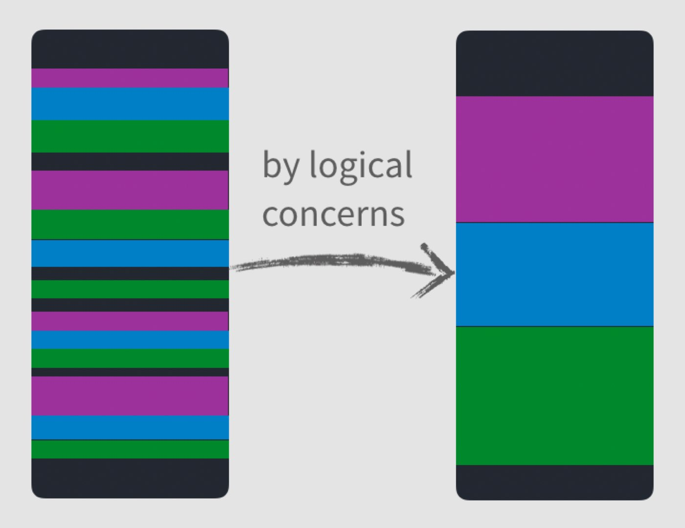
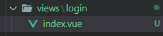
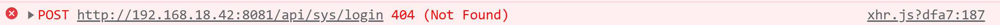

# 第三章：项目架构之搭建登录架构解决方案与实现

## 3-01：前言

在上一章中，我们处理了基本的编码规范，那么接下来我们就可以实现对应的项目开发了。

那么在之后的项目开发中，我们将会使用最新的 `vue3 script setup` 语法。

所以说在本章节中我们需要做两件事情：

1. `vue3` 最新特性及最新语法

   2. 登录功能开发

不过大家放心，我们不会把大量的时间花费到 **枯燥的语法学习之中**，而是会在实际的项目开发中和大家一起逐渐深入学习 `script setup` 语法，毕竟 **学以致用** 才是我们遵循的唯一目标。

那么明确好了我们接下来要做的事情之后，咱们就开始新的篇章吧！

## 3-02：vue3 项目结构解析

想要进行项目的开发，那么首先我们需要先去了解一下 `vue3` 项目的初始结构

在这里我们把它和 `vue2` 的项目进行对比来去说明

1. `main.js`
   1. 通过 **按需导入**的 `createApp` 方法来来构建 `vue` 实例
   2. 通过 `vue实例.use` 方法来挂载插件（`router`、`vuex`）
   3. 没有了 `Vue` 构造方法，无法再挂载原型
2. `App.vue`
   1. 组件内部结构无变化，依然是
      1. `tempalte`
      2. `script`
      3. `style`
   2. `<template>` 标签中支持多个根标签
3. `store/index.js`
   1. 通过 **按需导入**的 `createStore` 方法来来构建 `store` 实例
   2. 无需再通过 `Vue.use(Vuex)` 的形式进行挂载
4. `router/index.js`
   1. 通过 **按需导入**的 `createRouter` 方法来构建 `router` 实例
   2. 通过 **按需导入**的 `createWebHashHistory` 方法来创建 **`hash` 模式对象**，进行路由模式指定
   3. 无需再通过 `Vue.use(VueRouter)` 的形式进行挂载
   4. `routes` 路由表的定义无差别

综上所述，在 `vue3` 的初始化项目中，与 `vue2` 对比的最大差异其实就是两点：

1. `vue3` 使用 **按需导入的形式** 进行初始化操作
2. `<template>` 标签中支持多个根标签

那么这一小节我们主要了解了 `vue3` 项目的初始结构，通过了解我们也可以发现现在的项目中，存在很多的 **无用代码**，那么下一小节我们就需要 **删除掉这些无用的默认代码**，也就是进行 **初始化项目** 操作。

## 3-03：初始化项目结构（图文）

本章节为 **图文节**，请点击 [这里](./图文课程/3-03：初始化项目结构.md) 查看对应文档

## 3-04：vue3 新特性介绍

在开始本小节的内容之前，我必须要先声明一点：

**我们不会在课程中专门开辟出一段内容讲解 `vue3` 的知识。而是会在项目开发的过程中，通过实际场景逐步解锁对应的知识点，以达到学以致用的目的！**

所以说本小节的 **`vue3` 新特性介绍** ，我们只会概述性的来介绍一下 `vue3` 中新增的主要内容。

那么明确好了我们的目标之后，`vue3` 中到底新增了哪些比较核心的东西呢？：

1. `composition API`
2. 使用了 `Proxy` 代替 `Object.defineProperty()` 实现响应式
3. 全新的全家桶
4. 全新的 `TS` 支持
5. `vite`

### Composition API：组合式 API

想要了解 **组合式 API**，那么首先我们需要先了解 `options API`，也就是 `vue2` 中的开发形式。

`vue2` 中的开发形式被称为 `options API`，`options API` 存在

- 方便
- 易学
- 清晰

等一些特点，但是也存在着一些问题。

而其中最主要的一个问题就是：**当你的组件变得越来越复杂时，组件的可读性会变得越来越差。**

不知道大家有没有遇到过一种情况，那就是：**你在完成一个组件代码时，总是需要不停的上下滚动滚轮，来查看 `data` 、`methods`、`computed` 之间的配合使用，就像下面一样**


这个截图中的代码大家不需要深究。

在这个动图中我们定义的两个数据 `optionsData` 和 `selectOption`，然后我们在多个方法中都使用到了它们，但是大家可以发现，我们在使用或查看的过程中，得一直不停的翻动页面！

因为我们的整体组件代码结构是这样的：


**定义数据与使用数据被分割在组件的各个位置，导致我们需要不断地翻滚页面来查看具体的业务逻辑！**

并且这种现象随着组件越来越复杂，这种情况会变得越来越严重！

而这个就是 `options API` 所存在的问题：**当你的组件变得越来越复杂时，组件的可读性会变得越来越差。**

而 `Composition API` 所期望解决的就是这么一个问题



**把定义数据与使用数据的逻辑放在一起进行处理，以达到更加易读，更加方便扩展的目的！**

那么具体怎么去做的，我们会在后面的课程中通过最新的 `RFC -> script setup` 语法为大家进行解读。

### 使用了 `Proxy` 代替 `Object.defineProperty()` 实现响应式

在 [vue 2 的文档中](https://cn.vuejs.org/v2/guide/reactivity.html#%E6%A3%80%E6%B5%8B%E5%8F%98%E5%8C%96%E7%9A%84%E6%B3%A8%E6%84%8F%E4%BA%8B%E9%A1%B9) 有这么一段话：

> 由于 JavaScript 的限制，Vue **不能检测**数组和对象的变化。

这里所谓的 **`JavaScript` 的限制**，所指的就是 [Object.defineProperty()](https://developer.mozilla.org/zh-CN/docs/Web/JavaScript/Reference/Global_Objects/Object/defineProperty) 的限制。

因为 [Object.defineProperty()](https://developer.mozilla.org/zh-CN/docs/Web/JavaScript/Reference/Global_Objects/Object/defineProperty) 是通过：**为对象属性指定描述符** 的方式来监听 **对象中某个属性的 `get` 和 `set`**。

所以在以下两种情况下，新的属性是 **非响应式的**：

1. [对于对象](https://cn.vuejs.org/v2/guide/reactivity.html#对于对象)：

   ```js
   var vm = new Vue({
     data: {
       a: 1
     }
   })

   // `vm.a` 是响应式的

   vm.b = 2
   // `vm.b` 是非响应式的
   ```

2. [对于数组](https://cn.vuejs.org/v2/guide/reactivity.html#对于数组)：

   ```js
   var vm = new Vue({
     data: {
       items: ['a', 'b', 'c']
     }
   })
   vm.items[1] = 'x' // 不是响应性的
   vm.items.length = 2 // 不是响应性的
   ```

这也是为什么会存在 [Vue.set](https://cn.vuejs.org/v2/api/#Vue-set) 这个 `API` 的原因。

但是，这样的一种情况其实一直都是不合理的，因为这只是无意义的增加了复杂度而已，但是一直以来因为 [Object.defineProperty()](https://developer.mozilla.org/zh-CN/docs/Web/JavaScript/Reference/Global_Objects/Object/defineProperty) 这个 `API` 本身的限制，所以一直无法处理。

直到 [Proxy](https://developer.mozilla.org/zh-CN/docs/Web/JavaScript/Reference/Global_Objects/Proxy) 被广泛支持，这种情况才发生了变化。

[Proxy](https://developer.mozilla.org/zh-CN/docs/Web/JavaScript/Reference/Global_Objects/Proxy) 用于：**为对象创建一个代理，从而实现基本操作的拦截。** 那么这样就从根本上解决了 [Object.defineProperty()](https://developer.mozilla.org/zh-CN/docs/Web/JavaScript/Reference/Global_Objects/Object/defineProperty) 所面临的那么两个问题。这也是为什么 `vue3` 中不再有 `Vue.set` 方法的原因。

关于 `proxy` 的详细介绍，大家可以查看这一篇博客 [Vue 3 深入响应式原理 - 聊一聊响应式构建的那些经历](https://www.imooc.com/article/320582)，在视频中，我们就不过多赘述了

### 全新的全家桶

`vue` 被称为是 **渐进式框架**，就是因为，对于 `vue` 而言，它不仅仅只有 `vue.js` 这一个核心库，还有其他的比如 [vue-router](https://next.router.vuejs.org/zh/)，[vuex](https://next.vuex.vuejs.org/zh/index.html) 等一些周边库。这些周边库和 `vue.js` 一起共同组成了 `vue` 。

所以说当 `vue3` 发布之后，`vue-router`、`vuex` 等全家桶也迎来了一波更新。在前面的 **vue3 项目结构解析** 这一小节，大家应该也能看到对应的代码变化。

那么关于全家桶的更新内容，我们会在后面的课程中进行详细的讲解，所以就不在这里进行赘述了。

### 全新的 `TS` 支持

`vue 3` 使用 `TypeScript` 进行了重构，其目的是 **为了防止随着应用的增长，而产生的许多潜在的运行时静态类型的错误** 。同时这也意味着以后在 `vue` 中使用 `TypeScript` 不再需要其他的任何工具。

但是有一点我需要提醒大家，虽然 `vue` 对 `TypeScript` 进行全面支持，这并不代表我们应该在任何情况下都**无条件**的使用 `TypeScript`（后面我们简称 `TypeScript` 为 `TS`）。

`TS` 的优势主要在于 **静态类型检查和环境声明**，但同时它也会为你的项目增加复杂度。如果你的项目需要使用到以上两点，那么我推荐你使用 `TS` 。否则只是增加了无谓的复杂度而已。

**决定我们应该使用哪种技术的唯一条件，就是我们的目标。** 我们需要做的是在可以 **完成目标** 的基础上，寻找最简单的实现方案。

所以，基于以上原因，我们项目中并**没有**使用 `TS` 进行项目的开发。如果在后续的过程中，发现大家有这方面的需要，那么我会考虑专门针对 `TS` 的特性来开发一个对应的项目。

### vite

最后就是一个新的打包工具 [vite](https://cn.vitejs.dev/)，[vite](https://cn.vitejs.dev/) 严格来说不能算是 `vue3` 的内容，只不过它跟随 `vue3` 进行了发布所以我们这里就把它算到了新特性里面。

[vite](https://cn.vitejs.dev/) 的作用其实和 [webpack](https://webpack.docschina.org/) 是一样的，都是一个 **前端构建工具**。它区别于 `webpack` 的地方在于它完全使用了 `ES Module` 的特性，可以无需预先打包，而是采用实时编译的方式。这样让它具备了远高于 `webpack` 的启动速度和热更新速度。

但是 **成也萧何，败也萧何** 因为 `vite` 完全依赖 `ES Module` 就导致了 它无法直接对 `commonJS` 的模块化方式进行支持，必须得采用 [依赖预构建](https://cn.vitejs.dev/guide/dep-pre-bundling.html) 的形式。

目前 `vite` 还不够稳定到足够支持商用，所以如果大家只是想要尝鲜，那么没有问题。如果大家希望创建一个商用的大型项目，那么个人还是推荐更加成熟的 `webpack` 方案。

而我们当前的项目旨在构建一个 **后台前端解决方案系统**，所以我们这里依然选择了 `webpack` ，而不是 `vite`。

## 3-05：全新的提案语法：script setup

如果大家使用过 早期的 `composition API` ，那么应该会对 `setup 函数` 感触颇深，它的语法是反人类的。

所以在 `vue3` 正式发布 40 天 之后， 也就是 `2020年10月28日` （`vue3` 正式发布日期为 `2020年9月18日`）提出了新的 [script setup](https://github.com/vuejs/rfcs/blob/master/active-rfcs/0040-script-setup.md) 提案，该提案的目的只有一个：**那就是让大家可以更爽的使用 `composition API` 语法**！

该提案在 `2021年8月9日` 正式定稿，并伴随着最新的 `vue3` 版本进行了发布，这也是为什么前面我们需要升级到最新的 `vue` 版本的原因。

下面两张截图为对比 `原setup函数` 与 `script setup`：

1. `原 setup`函数
   
2. `script setup`
   

从截图中可以看出 `script setup` 语法更加符合我们开发者书写 `JS` 代码的习惯，它让我们书写 `vue` 就像再写普通的 `js` 一样。

所以以后的 `composition API` 将是 `script setup` 语法的时代，`原setup函数` 将会逐渐退出历史舞台。

而我们的项目也将会全部使用最新的 `script setup` 语法，让大家紧抓时代脉搏！

## 3-06：导入 element-plus （图文）

本章节为 **图文节**，请点击 [这里](./图文课程/3-06：导入 element-plus.md) 查看对应文档

## 3-07：构建登录页面 UI 结构

1. 在 `views` 中 `login` 文件夹，创建 `index.vue` 文件
   

2. 在 `router/index.js` 中增加以下路由配置

   ```js
   /**
    * 公开路由表
    */
   const publicRoutes = [
     {
       path: '/login',
       component: () => import('@/views/login/index')
     }
   ]

   const router = createRouter({
     history: createWebHashHistory(),
     routes: publicRoutes
   })
   ```

3. 在 `login/index.vue` 中，生成基本页面结构

   ```vue
   <template>
     <div class=""></div>
   </template>

   <script setup>
     import {} from 'vue'
   </script>

   <style lang="scss" scoped></style>
   ```

4. 创建登录页面基本结构

   ```vue
   <template>
     <div class="login-container">
       <el-form class="login-form">
         <div class="title-container">
           <h3 class="title">用户登录</h3>
         </div>

         <el-form-item prop="username">
           <span class="svg-container">
             <el-icon>
               <avatar />
             </el-icon>
           </span>
           <el-input placeholder="username" name="username" type="text" />
         </el-form-item>

         <el-form-item prop="password">
           <span class="svg-container">
             <el-icon>
               <avatar />
             </el-icon>
           </span>
           <el-input placeholder="password" name="password" />
           <span class="show-pwd">
             <el-icon>
               <avatar />
             </el-icon>
           </span>
         </el-form-item>

         <el-button type="primary" style="width: 100%; margin-bottom: 30px">登录</el-button>
       </el-form>
     </div>
   </template>

   <script setup>
     // 导入组件之后无需注册可直接使用
     import { Avatar } from '@element-plus/icons'
     import {} from 'vue'
   </script>
   ```

## 3-08：美化登录页面样式

1. 创建全局的 `style`

   1. 在 `src` 下创建 `styles/index.scss` 文件，并写入以下内容：

      ```scss
      html,
      body {
        height: 100%;
        margin: 0;
        padding: 0;
        -moz-osx-font-smoothing: grayscale;
        -webkit-font-smoothing: antialiased;
        text-rendering: optimizeLegibility;
        font-family: Helvetica Neue, Helvetica, PingFang SC, Hiragino Sans GB, Microsoft YaHei,
          Arial, sans-serif;
      }

      #app {
        height: 100%;
      }

      *,
      *:before,
      *:after {
        box-sizing: inherit;
        margin: 0;
        padding: 0;
      }

      a:focus,
      a:active {
        outline: none;
      }

      a,
      a:focus,
      a:hover {
        cursor: pointer;
        color: inherit;
        text-decoration: none;
      }

      div:focus {
        outline: none;
      }

      .clearfix {
        &:after {
          visibility: hidden;
          display: block;
          font-size: 0;
          content: ' ';
          clear: both;
          height: 0;
        }
      }
      ```

   2. 在 `main.js` 中导入全局样式

      ```js
      ...
      // 导入全局样式
      import './styles/index.scss'
      ...
      ```

   3. 在 `views/login/index.vue` 中写入以下样式

      ```vue
      <style lang="scss" scoped>
        $bg: #2d3a4b;
        $dark_gray: #889aa4;
        $light_gray: #eee;
        $cursor: #fff;

        .login-container {
          min-height: 100%;
          width: 100%;
          background-color: $bg;
          overflow: hidden;

          .login-form {
            position: relative;
            width: 520px;
            max-width: 100%;
            padding: 160px 35px 0;
            margin: 0 auto;
            overflow: hidden;

            ::v-deep .el-form-item {
              border: 1px solid rgba(255, 255, 255, 0.1);
              background: rgba(0, 0, 0, 0.1);
              border-radius: 5px;
              color: #454545;
            }

            ::v-deep .el-input {
              display: inline-block;
              height: 47px;
              width: 85%;

              input {
                background: transparent;
                border: 0px;
                -webkit-appearance: none;
                border-radius: 0px;
                padding: 12px 5px 12px 15px;
                color: $light_gray;
                height: 47px;
                caret-color: $cursor;
              }
            }
          }

          .svg-container {
            padding: 6px 5px 6px 15px;
            color: $dark_gray;
            vertical-align: middle;
            display: inline-block;
          }

          .title-container {
            position: relative;

            .title {
              font-size: 26px;
              color: $light_gray;
              margin: 0px auto 40px auto;
              text-align: center;
              font-weight: bold;
            }
          }

          .show-pwd {
            position: absolute;
            right: 10px;
            top: 7px;
            font-size: 16px;
            color: $dark_gray;
            cursor: pointer;
            user-select: none;
          }
        }
      </style>
      ```

## 3-09：Icon 图标处理方案：SvgIcon

在上一小节中我们完成了登陆页面的基本样式 。但是现在在登录页面中，还存在着最后一个样式问题，那就是 `icon` 图标。

在我们的项目中所使用的 `icon` 图标，一共分为两类：

1. `element-plus` 的图标
2. 自定义的 `svg` 图标

这也是通常情况下企业级项目开发时，所遇到的一种常见情况。

对于 `element-plus` 的图标我们可以直接通过 `el-icon` 来进行显示，但是自定义图标的话，我们暂时还缺少显示的方式，所以说我们需要一个自定义的组件，来显示我们自定义的 `svg` 图标。

那么这种自定义组件处理 **自定义 `svg` 图标的形式**，就是我们在面临这种问题时的通用解决方案。

那么对于这个组件的话，它就需要拥有两种能力：

1. 显示外部 `svg` 图标
2. 显示项目内的 `svg` 图标

基于以上概念，我们可以创建出以下对应代码：

创建 `components/SvgIcon/index.vue`：

```vue
<template>
  <div
    v-if="isExternal"
    :style="styleExternalIcon"
    class="svg-external-icon svg-icon"
    :class="className"
  />
  <svg v-else class="svg-icon" :class="className" aria-hidden="true">
    <use :xlink:href="iconName" />
  </svg>
</template>

<script setup>
  import { isExternal as external } from '@/utils/validate'
  import { defineProps, computed } from 'vue'
  const props = defineProps({
    // icon 图标
    icon: {
      type: String,
      required: true
    },
    // 图标类名
    className: {
      type: String,
      default: ''
    }
  })

  /**
   * 判断是否为外部图标
   */
  const isExternal = computed(() => external(props.icon))
  /**
   * 外部图标样式
   */
  const styleExternalIcon = computed(() => ({
    mask: `url(${props.icon}) no-repeat 50% 50%`,
    '-webkit-mask': `url(${props.icon}) no-repeat 50% 50%`
  }))
  /**
   * 项目内图标
   */
  const iconName = computed(() => `#icon-${props.icon}`)
</script>

<style scoped>
  .svg-icon {
    width: 1em;
    height: 1em;
    vertical-align: -0.15em;
    fill: currentColor;
    overflow: hidden;
  }

  .svg-external-icon {
    background-color: currentColor;
    mask-size: cover !important;
    display: inline-block;
  }
</style>
```

创建 `utils/validate.js`：

```js
/**
 * 判断是否为外部资源
 */
export function isExternal(path) {
  return /^(https?:|mailto:|tel:)/.test(path)
}
```

在 `views/login/index.vue` 中使用 **外部 `svg` （`https://res.lgdsunday.club/user.svg`）：**

```html
<span class="svg-container">
  <svg-icon icon="https://res.lgdsunday.club/user.svg"></svg-icon>
</span>
```

外部图标可正常展示。

那么在本小节中，我们创建了 `SvgIcon` 组件，用来处理了 **外部图标** 的展示，但是对于内部图标而言，我们此时依然无法进行展示。所以在下一小节中，我们就需要看一下，如何处理内部的 `svg` 图标。

## 3-10：处理内部 svg 图标显示

在上一章中，我们创建了 `SvgIcon` 组件用于显示 **非 Element-ui** 的图标。但是目前我们只处理了 **外部 `svg` 的图标展示**，内部的图标还无法展示。

所以这一小节，我们就需要处理 **内部的 `svg` 图标展示。**

1.  首先导入所有的 `svg` 图标（大家可以从 讲师源代码 -> `src -> icons -> svg` 处，获取所有 `svg` 图标），导入到 `src -> icons -> svg` 处

2.  在 `icons` 下创建 `index.js` 文件，该文件中需要完成两件事情：

    1.  导入所有的 `svg` 图标
    2.  完成 `SvgIcon` 的全局注册

3.  得出以下代码：

    ```js
    import SvgIcon from '@/components/SvgIcon'

    // https://webpack.docschina.org/guides/dependency-management/#requirecontext
    // 通过 require.context() 函数来创建自己的 context
    const svgRequire = require.context('./svg', false, /\.svg$/)
    // 此时返回一个 require 的函数，可以接受一个 request 的参数，用于 require 的导入。
    // 该函数提供了三个属性，可以通过 require.keys() 获取到所有的 svg 图标
    // 遍历图标，把图标作为 request 传入到 require 导入函数中，完成本地 svg 图标的导入
    svgRequire.keys().forEach(svgIcon => svgRequire(svgIcon))

    export default app => {
      app.component('svg-icon', SvgIcon)
    }
    ```

4.  在 `main.js` 中引入该文件

    ```js
    ...
    // 导入 svgIcon
    import installIcons from '@/icons'
    ...
    installIcons(app)
    ...

    ```

5.  删除 `views/login` 下 局部导入 `SvgIcon` 的代码

6.  在 `login/index.vue` 中使用 `SvgIcon` 引入本地 `svg`

    ```html
    // 用户名
    <svg-icon icon="user" />
    // 密码
    <svg-icon icon="password" />
    // 眼睛
    <svg-icon icon="eye" />
    ```

7.  此时 **处理内容 `svg` 图标的代码** 已经完成

打开浏览器，我们发现 **图标依然无法展示！** 这又是因为什么原因呢？

来看下一节 《使用 svg-sprite-loader 处理 svg 图标》

## 3-11：使用 svg-sprite-loader 处理 svg 图标

[svg-sprite-loader](https://www.npmjs.com/package/svg-sprite-loader) 是 `webpack` 中专门用来处理 `svg` 图标的一个 `loader` ，在上一节中我们的图标之所有没有展示，就是因为我们缺少该 `loader`。

那么想要使用该 `loader` 我们需要做两件事情：

1. 下载该 `laoder`，执行：`npm i --save-dev svg-sprite-loader@6.0.9`

2. 创建 `vue.config.js` 文件，新增如下配置：

   ```js
   const path = require('path')
   function resolve(dir) {
     return path.join(__dirname, dir)
   }
   // https://cli.vuejs.org/zh/guide/webpack.html#%E7%AE%80%E5%8D%95%E7%9A%84%E9%85%8D%E7%BD%AE%E6%96%B9%E5%BC%8F
   module.exports = {
     chainWebpack(config) {
       // 设置 svg-sprite-loader
       config.module.rule('svg').exclude.add(resolve('src/icons')).end()
       config.module
         .rule('icons')
         .test(/\.svg$/)
         .include.add(resolve('src/icons'))
         .end()
         .use('svg-sprite-loader')
         .loader('svg-sprite-loader')
         .options({
           symbolId: 'icon-[name]'
         })
         .end()
     }
   }
   ```

处理完以上配置之后，重新启动项目，图标即可显示！

## 3-12：Vue3.2 响应式优化对应用层的改变

在处理好了 `SvgIcon` 图标之后，接下来我们就需要处理登陆页面的逻辑问题了。不过在处理这个逻辑之前，我们需要先来明确一点 `vue3` 新的更新内容。

如果大家之前有过了解 `Vue3` 代码的话，那么会知道 `Vue3` 中声明响应式数据的方式有两种：

1. [ref](https://v3.cn.vuejs.org/api/refs-api.html#ref)
2. [reactive](https://v3.cn.vuejs.org/api/basic-reactivity.html#reactive)

对于这两种使用方式而言，它们在应用层上并没有明确的界限，也就是说我们可能很难仅通过官网的介绍来判断我应该在什么情况下使用什么。

但是这种情况在现在已经不存在了。

2020 年 10 月 29 日，社区大佬 [basvanmeurs](https://github.com/basvanmeurs) 提出了一个新的 [PR](https://github.com/vuejs/vue-next/pull/2345)，大概的意思是说：他重构了响应式的部分内容，大大增加了性能。

详细的介绍如下：

> - Big runtime performance improvement for ref, computed, watch and watchEffect (30%-80% depending on the amount of dependencies)
> - Memory usage decreased by about 30% when creating ref, computed, watch and watchEffect
> - Creation time performance improvement, most notably for watchers and watchEffects
>
> ---
>
> ref、calculated、watch 和 watchEffect 的运行时性能大幅提升（30%-80% 取决于依赖项的数量）
> 创建 ref、calculated、watch 和 watchEffect 时内存使用量减少了约 30%
> 创建时间性能改进，最显著的是 watchers 和 watchEffects

这是一个非常强大的变化，同时又因为这个变化过于庞大，所以一直等待到 `2021年8月5日` 伴随着 [vue 3.2 发布](https://blog.vuejs.org/posts/vue-3.2.html)，尤大才合并对应的代码，并在这次变化中对该性能改进进行了如下的介绍：

> - [More efficient ref implementation (~260% faster read / ~50% faster write)](https://github.com/vuejs/vue-next/pull/3995)
> - [~40% faster dependency tracking](https://github.com/vuejs/vue-next/pull/4017)
> - [~17% less memory usage](https://github.com/vuejs/vue-next/pull/4001)
>
> ---
>
> 更高效的 ref 实现（约 260% 的读取速度/约 50% 的写入速度）
> 依赖项跟踪速度提高约 40%
> 内存使用量减少约 17%

毫无疑问，这绝对是一个伟大的变化。

那么针对于这个变化，在应用层中最大的体现就是 `ref` 这个 `API` ，性能得到了大幅度的提升。

所以说，拥抱新的变化吧！

在之后能使用 `ref` 的地方就使用 `ref` 吧。毕竟现在它的性能得到了大幅的提升！

那么在咱们之后的代码中，我们同样也会全部使用 `ref` 来作为响应式数据构建的方式，无论是 **基本数据类型** 或者是 **复杂数据类型**， 毕竟这样做本身并没有什么问题，对不对？

## 3-13：完善登录表单校验

表单校验是表单使用的一个通用能力，在 `element-plus` 中想要为表单进行表单校验那么我们需要关注以下三点：

1. 为 `el-form` 绑定 `model` 属性
2. 为 `el-form` 绑定 `rules` 属性
3. 为 `el-form-item` 绑定 `prop` 属性

保证以上三点即可为 `el-from` 添加表单校验功能。

因为这一块是比较简单的功能，只要有过 `element-ui` 使用经验的同学，应该对这里都不陌生，所以这里就不对这块内容进行过多赘述了。对这里不是很了解的同学可以参考下 [element-plus 中 from 表单部分](https://element-plus.org/#/zh-CN/component/form)

以下为对应的代码实现：

**views/login**

```vue
<template>
  <div class="login-container">
    <el-form class="login-form" :model="loginForm" :rules="loginRules">
      ...
      <el-form-item prop="username">
        ...
        <el-input ... v-model="loginForm.username" />
      </el-form-item>

      <el-form-item prop="password">
        ...
        <el-input ... v-model="loginForm.password" />
        ...
      </el-form-item>
      ...
    </el-form>
  </div>
</template>

<script setup>
  import { ref } from 'vue'
  import { validatePassword } from './rules'

  // 数据源
  const loginForm = ref({
    username: 'super-admin',
    password: '123456'
  })
  // 验证规则
  const loginRules = ref({
    username: [
      {
        required: true,
        trigger: 'blur',
        message: '用户名为必填项'
      }
    ],
    password: [
      {
        required: true,
        trigger: 'blur',
        validator: validatePassword()
      }
    ]
  })
</script>
```

**views/login/rules.js**

```js
export const validatePassword = () => {
  return (rule, value, callback) => {
    if (value.length < 6) {
      callback(new Error('密码不能少于6位'))
    } else {
      callback()
    }
  }
}
```

## 3-14：密码框状态通用处理

对于密码框存在两种状态：

1. 密文状态
2. 明文状态

点击 **眼睛** 可以进行切换。

该功能实现为通用的处理方案，只需要动态修改 `input` 的 `type` 类型即可，其中：

1.  `password` 为密文显示
2.  `text` 为明文显示

根据以上理论，即可得出以下代码：

```vue
<template>
  <div class="login-container">
    <el-form class="login-form" :model="loginForm" :rules="loginRules">
      ...
      <el-input ... :type="passwordType" />
      <span class="show-pwd">
        <svg-icon
          :icon="passwordType === 'password' ? 'eye' : 'eye-open'"
          @click="onChangePwdType"
        />
      </span>
      ...
    </el-form>
  </div>
</template>

<script setup>
  import { ref } from 'vue'
  ...

  // 处理密码框文本显示状态
  const passwordType = ref('password')
  const onChangePwdType = () => {
    if (passwordType.value === 'password') {
      passwordType.value = 'text'
    } else {
      passwordType.value = 'password'
    }
  }
</script>
```

## 3-15：通用后台登录方案解析

处理完了表单的基本操作之后，接下来就是登录操作的实现了。

对于登录操作在后台项目中是一个通用的解决方案，具体可以分为以下几点：

1. 封装 `axios` 模块
2. 封装 接口请求 模块
3. 封装登录请求动作
4. 保存服务端返回的 `token`
5. 登录鉴权

这些内容就共同的组成了一套 **后台登录解决方案** 。那么在后面的章节中，我们就分别来去处理这些内容。

## 3-16：配置环境变量封装 axios 模块

首先我们先去完成第一步：封装 `axios` 模块。

在当前这个场景下，我们希望封装出来的 `axios` 模块，至少需要具备一种能力，那就是：**根据当前模式的不同，设定不同的 `BaseUrl`** ，因为通常情况下企业级项目在 **开发状态** 和 **生产状态** 下它的 `baseUrl` 是不同的。

对于 `@vue/cli` 来说，它具备三种不同的模式：

1. `development`
2. `test`
3. `production`

具体可以点击 [这里](https://cli.vuejs.org/zh/guide/mode-and-env.html#%E6%A8%A1%E5%BC%8F) 进行参考。

根据我们前面所提到的 **开发状态和生产状态** 那么此时我们的 `axios` 必须要满足：**在 开发 || 生产 状态下，可以设定不同 `BaseUrl` 的能力**

那么想要解决这个问题，就必须要使用到 `@vue/cli` 所提供的 [环境变量](https://cli.vuejs.org/zh/guide/mode-and-env.html#%E6%A8%A1%E5%BC%8F) 来去进行实现。

我们可以在项目中创建两个文件：

1. `.env.development`
2. `.env.production`

它们分别对应 **开发状态** 和 **生产状态**。

我们可以在上面两个文件中分别写入以下代码：

**`.env.development`**：

```
# 标志
ENV = 'development'

# base api
VUE_APP_BASE_API = '/api'
```

**`.env.production`：**

```
# 标志
ENV = 'production'

# base api
VUE_APP_BASE_API = '/prod-api'
```

有了这两个文件之后，我们就可以创建对应的 `axios` 模块

创建 `utils/request.js` ，写入如下代码：

```js
import axios from 'axios'

const service = axios.create({
  baseURL: process.env.VUE_APP_BASE_API,
  timeout: 5000
})

export default service
```

## 3-17：封装请求动作

有了 `axios` 模块之后，接下来我们就可以

1. 封装接口请求模块
2. 封装登录请求动作

**封装接口请求模块：**

创建 `api` 文件夹，创建 `sys.js`：

```js
import request from '@/utils/request'

/**
 * 登录
 */
export const login = data => {
  return request({
    url: '/sys/login',
    method: 'POST',
    data
  })
}
```

**封装登录请求动作：**

该动作我们期望把它封装到 `vuex` 的 `action` 中

在 `store` 下创建 `modules` 文件夹，创建 `user.js` 模块，用于处理所有和 **用户相关** 的内容（此处需要使用第三方包 `md5` ）：

```js
import { login } from '@/api/sys'
import md5 from 'md5'
export default {
  namespaced: true,
  state: () => ({}),
  mutations: {},
  actions: {
    login(context, userInfo) {
      const { username, password } = userInfo
      return new Promise((resolve, reject) => {
        login({
          username,
          password: md5(password)
        })
          .then(data => {
            resolve()
          })
          .catch(err => {
            reject(err)
          })
      })
    }
  }
}
```

在 `store/index` 中完成注册：

```js
import { createStore } from 'vuex'
import user from './modules/user.js'
export default createStore({
  modules: {
    user
  }
})
```

## 3-18：登录触发动作

在 `login` 中，触发定义的 `action`

```vue
<template>
  <el-button
    type="primary"
    style="width: 100%; margin-bottom: 30px"
    :loading="loading"
    @click="handleLogin"
    >登录</el-button
  >
</template>
<script setup>
  import { ref } from 'vue'
  import { validatePassword } from './rules'
  import { useStore } from 'vuex'
  ...

  // 登录动作处理
  const loading = ref(false)
  const loginFromRef = ref(null)
  const store = useStore()
  const handleLogin = () => {
    loginFromRef.value.validate(valid => {
      if (!valid) return

      loading.value = true
      store
        .dispatch('user/login', loginForm.value)
        .then(() => {
          loading.value = false
          // TODO: 登录后操作
        })
        .catch(err => {
          console.log(err)
          loading.value = false
        })
    })
  }
</script>
```

触发之后会得到以下错误：



该错误表示，我们当前请求的接口不存在。

出现这个问题的原因，是因为我们在前面配置环境变量时指定了 **开发环境下**，请求的 `BaseUrl` 为 `/api` ，所以我们真实发出的请求为：`/api/sys/login` 。

这样的一个请求会被自动键入到当前前端所在的服务中，所以我们最终就得到了 `http://192.168.18.42:8081/api/sys/login` 这样的一个请求路径。

而想要处理这个问题，那么可以通过指定 [webpack DevServer 代理](https://webpack.docschina.org/configuration/dev-server/) 的形式，代理当前的 `url` 请求。

而指定这个代理非常简单，是一种近乎固定的配置方案。

在 `vue.config.js` 中，加入以下代码：

```js
module.exports = {
  devServer: {
    // 配置反向代理
    proxy: {
      // 当地址中有/api的时候会触发代理机制
      '/api': {
        // 要代理的服务器地址  这里不用写 api
        target: 'https://api.imooc-admin.lgdsunday.club/',
        changeOrigin: true // 是否跨域
      }
    }
  },
  ...
}

```

重新启动服务，再次进行请求，即可得到返回数据


## 3-19：本地缓存处理方案

通常情况下，在获取到 `token` 之后，我们会把 `token` 进行缓存，而缓存的方式将会分为两种：

1. 本地缓存：`LocalStorage`
2. 全局状态管理：`Vuex`

保存在 `LocalStorage` 是为了方便实现 **自动登录功能**

保存在 `vuex` 中是为了后面在其他位置进行使用

那么下面我们就分别来实现对应的缓存方案：

**LocalStorage：**

1. 创建 `utils/storage.js` 文件，封装三个对应方法：

   ```js
   /**
    * 存储数据
    */
   export const setItem = (key, value) => {
     // 将数组、对象类型的数据转化为 JSON 字符串进行存储
     if (typeof value === 'object') {
       value = JSON.stringify(value)
     }
     window.localStorage.setItem(key, value)
   }

   /**
    * 获取数据
    */
   export const getItem = key => {
     const data = window.localStorage.getItem(key)
     try {
       return JSON.parse(data)
     } catch (err) {
       return data
     }
   }

   /**
    * 删除数据
    */
   export const removeItem = key => {
     window.localStorage.removeItem(key)
   }

   /**
    * 删除所有数据
    */
   export const removeAllItem = key => {
     window.localStorage.clear()
   }
   ```

2. 在 `vuex` 的 `user` 模块下，处理 `token` 的保存

   ```js
   import { login } from '@/api/sys'
   import md5 from 'md5'
   import { setItem, getItem } from '@/utils/storage'
   import { TOKEN } from '@/constant'
   export default {
     namespaced: true,
     state: () => ({
       token: getItem(TOKEN) || ''
     }),
     mutations: {
       setToken(state, token) {
         state.token = token
         setItem(TOKEN, token)
       }
     },
     actions: {
       login(context, userInfo) {
         ...
             .then(data => {
               this.commit('user/setToken', data.data.data.token)
               resolve()
             })
             ...
         })
       }
     }
   }

   ```

3. 处理保存的过程中，需要创建 `constant` 常量目录 `constant/index.js`

   ```js
   export const TOKEN = 'token'
   ```

此时，当点击登陆时，即可把 `token` 保存至 `vuex` 与 `localStorage` 中

## 3-20：响应数据的统一处理

在上一小节中，我们保存了服务端返回的 `token` 。但是有一个地方比较难受，那就是在 `vuex 的 user 模块` 中，我们获取数据端的 `token` 数据，通过 `data.data.data.token` 的形式进行获取。

一路的 `data.` 确实让人比较难受，如果有过 `axios` 拦截器处理经验的同学应该知道，对于这种问题，我们可以通过 [axios 响应拦截器](http://axios-js.com/zh-cn/docs/index.html#%E6%8B%A6%E6%88%AA%E5%99%A8) 进行处理。

在 `utils/request.js` 中实现以下代码：

```js
import axios from 'axios'
import { ElMessage } from 'element-plus'

...
// 响应拦截器
service.interceptors.response.use(
  response => {
    const { success, message, data } = response.data
    //   要根据success的成功与否决定下面的操作
    if (success) {
      return data
    } else {
      // 业务错误
      ElMessage.error(message) // 提示错误消息
      return Promise.reject(new Error(message))
    }
  },
  error => {
    // TODO: 将来处理 token 超时问题
    ElMessage.error(error.message) // 提示错误信息
    return Promise.reject(error)
  }
)

export default service

```

此时，对于 `vuex 中的 user 模块` 就可以进行以下修改了：

```js
this.commit('user/setToken', data.token)
```

## 3-21：登录后操作

那么截止到此时，我们距离登录操作还差最后一个功能就是 **登录鉴权** 。

只不过在进行 **登录鉴权** 之前我们得先去创建一个登录后的页面，也就是我们所说的登录后操作。

1. 创建 `layout/index.vue` ，写入以下代码：

   ```vue
   <template>
     <div class="">Layout 页面</div>
   </template>

   <script setup>
     import {} from 'vue'
   </script>

   <style lang="scss" scoped></style>
   ```

2. 在 `router/index` 中，指定对应路由表：

   ```js
   const publicRoutes = [
     ...{
       path: '/',
       component: () => import('@/layout/index')
     }
   ]
   ```

3. 在登录成功后，完成跳转

   ```js
   // 登录后操作
   router.push('/')
   ```

## 3-22：登录鉴权解决方案

在处理了登陆后操作之后，接下来我们就来看一下最后的一个功能，也就是 **登录鉴权**

首先我们先去对 **登录鉴权** 进行一个定义，什么是 **登录鉴权** 呢？

> 当用户未登陆时，不允许进入除 `login` 之外的其他页面。
>
> 用户登录后，`token` 未过期之前，不允许进入 `login` 页面

而想要实现这个功能，那么最好的方式就是通过 [路由守卫](https://router.vuejs.org/zh/guide/advanced/navigation-guards.html#%E5%85%A8%E5%B1%80%E5%89%8D%E7%BD%AE%E5%AE%88%E5%8D%AB) 来进行实现。

那么明确好了 **登录鉴权** 的概念之后，接下来就可以去实现一下

在 `main.js` 平级，创建 `permission` 文件

```js
import router from './router'
import store from './store'

// 白名单
const whiteList = ['/login']
/**
 * 路由前置守卫
 */
router.beforeEach(async (to, from, next) => {
  // 存在 token ，进入主页
  // if (store.state.user.token) {
  // 快捷访问
  if (store.getters.token) {
    if (to.path === '/login') {
      next('/')
    } else {
      next()
    }
  } else {
    // 没有token的情况下，可以进入白名单
    if (whiteList.indexOf(to.path) > -1) {
      next()
    } else {
      next('/login')
    }
  }
})
```

在此处我们使用到了 `vuex 中的 getters` ，此时的 `getters` 被当作 **快捷访问** 的形式进行访问

所以我们需要声明对应的模块，创建 `store/getters`

```js
const getters = {
  token: state => state.user.token
}
export default getters
```

在 `store/index` 中进行导入：

```js
import getters from './getters'
export default createStore({
  getters,
  ...
})

```

## 3-23：总结

那么到这里我们整个的第三章就算是全部讲解完成了。

整个第三章讲解了两个大部分：

1. `vue3` 的一些基本概念
   1. `vue3` 的新特性
   2. 全新的 `script setup` 语法
   3. 最新的 `ref` 优化
2. 登录方案相关的业务代码
   1. `element-plus` 相关
      1. `el-form` 表单
      2. 密码框状态处理
   2. 后台登录解决方案
      1. 封装 `axios` 模块
      2. 封装 接口请求 模块
      3. 封装登录请求动作
      4. 保存服务端返回的 `token`
      5. 登录鉴权

那么从下一章开始，我们就会进入到项目内部业务的处理过程。在项目内部的业务处理中，我们又会遇到什么样的业务需求，以及提出什么样的对应解决方案呢？

敬请期待吧！
