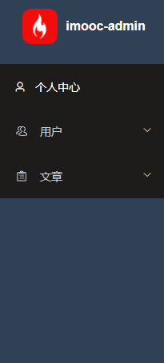

# 第五章：后台项目前端综合解决方案之通用功能开发

## 5-01：开篇

在后台项目的前端开发之中，存在着很多的通用业务功能，并且存在着一定的技术难度。

所以说就有很多同学在面临这些功能的时候，大多数时都是采用 `ctrl + c || v` 的形式来进行实现。这就导致了虽然做过类似的功能，但是对这些功能的实现原理一知半解。

那么针对于这样的问题，就有了咱们这一章。

在本章中我们列举出了常见的一些通用功能，具体如下：

1. 国际化
2. 动态换肤
3. `screenfull`
4. `headerSearch`
5. `tagView`
6. `guide`

来为大家进行讲解。

相信大家完成了本章的学习之后，对于这些功能无论是从 **原理上** 还是从 **实现上** 都可以做到 **了然于胸** 的目标

## 5-02：国际化实现原理

先来看一个需求：

> 我们有一个变量 `msg` ，但是这个 `msg` 有且只能有两个值：
>
> 1. hello world
> 2. 你好世界
>
> 要求：根据需要切换 `msg` 的值

这样的一个需求就是 国际化 的需求，那么我们可以通过以下代码来实现这个需求

```js
<script>
  // 1. 定义 msg 值的数据源
  const messages = {
    en: {
      msg: 'hello world'
    },
    zh: {
      msg: '你好世界'
    }
  }
  // 2. 定义切换变量
  let locale = 'en'
  // 3. 定义赋值函数
  function t(key) {
    return messages[locale][key]
  }
  // 4. 为 msg 赋值
  let msg = t('msg')
  console.log(msg);
  // 修改 locale， 重新执行 t 方法，获取不同语言环境下的值

</script>
```

总结：

1. 通过一个变量来 **控制** 语言环境
2. 所有语言环境下的数据源要 **预先** 定义好
3. 通过一个方法来获取 **当前语言** 下 **指定属性** 的值
4. 该值即为国际化下展示值

## 5-03：基于 vue-i18n V9 的国际化实现方案分析

在 `vue` 的项目中，我们不需要手写这么复杂的一些基础代码，可以直接使用 [vue-i18n](https://vue-i18n.intlify.dev/) 进行实现（注意：**`vue3` 下需要使用 `V 9.x` 的 `i18n`**）

[vue-i18n](https://vue-i18n.intlify.dev/guide/) 的使用可以分为四个部分：

1. 创建 `messages` 数据源
2. 创建 `locale` 语言变量
3. 初始化 `i18n` 实例
4. 注册 `i18n` 实例

那么接下来我们就去实现以下：

1. 安装 `vue-i18n`

   ```
   npm install vue-i18n@next
   ```

2. 创建 `i18n/index.js` 文件

3. 创建 `messages` 数据源

   ```js
   const messages = {
     en: {
       msg: {
         test: 'hello world'
       }
     },
     zh: {
       msg: {
         test: '你好世界'
       }
     }
   }
   ```

4. 创建 `locale` 语言变量

   ```js
   const locale = 'en'
   ```

5. 初始化 `i18n` 实例

   ```js
   import { createI18n } from 'vue-i18n'

   const i18n = createI18n({
     // 使用 Composition API 模式，则需要将其设置为false
     legacy: false,
     // 全局注入 $t 函数
     globalInjection: true,
     locale,
     messages
   })
   ```

6. 把 `i18n` 注册到 `vue` 实例

   ```js
   export default i18n
   ```

7. 在 `main.js` 中导入

   ```js
   // i18n （PS：导入放到 APP.vue 导入之前，因为后面我们会在 app.vue 中使用国际化内容）
   import i18n from '@/i18n'
   ...
   app.use(i18n)
   ```

8. 在 `layout/components/Sidebar/index.vue` 中使用 `i18n`

   ```html
   <h1 class="logo-title" v-if="$store.getters.sidebarOpened"> {{ $t('msg.test') }} </h1>
   ```

9. 修改 `locale` 的值，即可改变展示的内容

截止到现在我们已经实现了 `i18n` 的最基础用法，那么解下来我们就可以在项目中使用 `i18n` 完成国际化。

项目中完成国际化分成以下几步进行:

1. 封装 `langSelect` 组件用于修改 `locale`
2. 导入 `el-locale` 语言包
3. 创建自定义语言包

## 5-04：方案落地：封装 langSelect 组件

1. 定义 `store/app.js`

   ```js
   import { LANG } from '@/constant'
   import { getItem, setItem } from '@/utils/storage'
   export default {
     namespaced: true,
     state: () => ({
       ...
       language: getItem(LANG) || 'zh'
     }),
     mutations: {
       ...
       /**
        * 设置国际化
        */
       setLanguage(state, lang) {
         setItem(LANG, lang)
         state.language = lang
       }
     },
     actions: {}
   }

   ```

2. 在 `constant` 中定义常量

   ```js
   // 国际化
   export const LANG = 'language'
   ```

3. 创建 `components/LangSelect/index`

   ```vue
   <template>
     <el-dropdown trigger="click" class="international" @command="handleSetLanguage">
       <div>
         <el-tooltip content="国际化" :effect="effect">
           <svg-icon icon="language" />
         </el-tooltip>
       </div>
       <template #dropdown>
         <el-dropdown-menu>
           <el-dropdown-item :disabled="language === 'zh'" command="zh"> 中文 </el-dropdown-item>
           <el-dropdown-item :disabled="language === 'en'" command="en"> English </el-dropdown-item>
         </el-dropdown-menu>
       </template>
     </el-dropdown>
   </template>

   <script setup>
     import { useI18n } from 'vue-i18n'
     import { defineProps, computed } from 'vue'
     import { useStore } from 'vuex'
     import { ElMessage } from 'element-plus'

     defineProps({
       effect: {
         type: String,
         default: 'dark',
         validator: function (value) {
           // 这个值必须匹配下列字符串中的一个
           return ['dark', 'light'].indexOf(value) !== -1
         }
       }
     })

     const store = useStore()
     const language = computed(() => store.getters.language)

     // 切换语言的方法
     const i18n = useI18n()
     const handleSetLanguage = lang => {
       i18n.locale.value = lang
       store.commit('app/setLanguage', lang)
       ElMessage.success('更新成功')
     }
   </script>
   ```

4. 在 `navbar` 中导入 `LangSelect`

   ```vue
   <template>
     <div class="navbar">
       ...
       <div class="right-menu">
         <lang-select class="right-menu-item hover-effect" />
         <!-- 头像 -->
         ...
       </div>
     </div>
   </template>

   <script setup>
     import LangSelect from '@/components/LangSelect'
     ...
   </script>

   <style lang="scss" scoped>
     .navbar {
       ...

       .right-menu {
         ...

         ::v-deep .right-menu-item {
           display: inline-block;
           padding: 0 18px 0 0;
           font-size: 24px;
           color: #5a5e66;
           vertical-align: text-bottom;

           &.hover-effect {
             cursor: pointer;
           }
         }

         ...
     }
   </style>
   ```

## 5-05：方案落地：element-plus 国际化处理

截止到目前，我们的国际化内容已经基本功能已经处理完成了。接下来需要处理的就是对应的语言包，有了语言包就可以实现整个项目中的所有国际化处理了。

那么对于语言包来说，我们整个项目中会分成两部分：

1. `element-plus` 语言包：用来处理 `element` 组件的国际化功能
2. 自定义语言包：用来处理 **非**`element` 组件的国际化功能

那么首先我们先来处理 `element-plus` 语言包：

**按照正常的逻辑，我们是可以通过 `element-ui` 配合 `vue-i18n`来实现国际化功能的，但是目前的 `element-plus` 尚未提供配合 `vue-i18n` 实现国际化的方式！ **

所以说，我们暂时只能先去做临时处理，等到 `element-plus` 支持 `vue-i18n` 功能之后，我们再进行对接实现

那么临时处理我们怎么去做呢？

1. 升级 `element-plus` 到最新版本

   ```
   npm i element-plus
   ```

   目前课程中使用的最新版本为：`^1.1.0-beta.15`

2. 升级版本之后，左侧 `menu` 菜单无法正常显示，这是因为 `element-plus` 修改了 `el-submenu` 的组件名称

3. 到 `layout/components/Sidebar/SidebarItem` 中，修改 `el-submenu` 为 `el-sub-menu`

4. 接下来实现国际化

5. 在 `plugins/index` 中导入 `element` 的中文、英文语言包：

```js
import zhCn from 'element-plus/es/locale/lang/zh-cn'
import en from 'element-plus/lib/locale/lang/en'
```

6. 注册 `element` 时，根据当前语言选择使用哪种语言包

   ```js
   import store from '@/store'

   export default app => {
     app.use(ElementPlus, {
       locale: store.getters.language === 'en' ? en : zhCn
     })
   }
   ```

## 5-06：方案落地：自定义语言包国际化处理

处理完 `element` 的国际化内容之后，接下来我们来处理 **自定义语言包**。

自定义语言包我们使用了 `commonJS` 导出了一个对象，这个对象就是所有的 **自定义语言对象**

> 大家可以在 **资料/lang** 中获取到所有的语言包

1.  复制 `lang` 文件夹到 `i18n` 中

2.  在 `lang/index` 中，导入语言包

    ```js
    import mZhLocale from './lang/zh'
    import mEnLocale from './lang/en'
    ```

3.  在 `messages` 中注册到语言包

    ```js
    const messages = {
      en: {
        msg: {
          ...mEnLocale
        }
      },
      zh: {
        msg: {
          ...mZhLocale
        }
      }
    }
    ```

## 5-07：方案落地：处理项目国际化内容

在处理好了国际化的语言包之后，接下来我们就可以应用国际化功能到我们的项目中

对于我们目前的项目而言，需要进行国际化处理的地方主要分为：

1. 登录页面
2. `navbar` 区域
3. `sidebar` 区域
4. 面包屑区域

那么这一小节，我们先来处理前两个

**登录页面：**

`login/index`

```vue
<template>
  <div class="login-container">
    ...
      <div class="title-container">
        <h3 class="title">{{ $t('msg.login.title') }}</h3>
          <lang-select class="lang-select" effect="light"></lang-select>
      </div>

      ...

      <el-button
        type="primary"
        style="width: 100%; margin-bottom: 30px"
        :loading="loading"
        @click="handleLogin"
        >{{ $t('msg.login.loginBtn') }}</el-button
      >

      <div class="tips" v-html="$t('msg.login.desc')"></div>
    </el-form>
  </div>
</template>

<script setup>
import { useI18n } from 'vue-i18n'
...
// 验证规则
const i18n = useI18n()
const loginRules = ref({
  username: [
    {
      ...
      message: i18n.t('msg.login.usernameRule')
    }
  ],
  ...
})
...
</script>


```

`login/rules`

```js
import i18n from '@/i18n'
export const validatePassword = () => {
  return (rule, value, callback) => {
    if (value.length < 6) {
      callback(new Error(i18n.global.t('msg.login.passwordRule')))
    } else {
      callback()
    }
  }
}
```

**`navbar` 区域**

`layout/components/navbar`

```vue
<template>
  <div class="navbar">
    ...
        <template #dropdown>
          <el-dropdown-menu class="user-dropdown">
            <router-link to="/">
              <el-dropdown-item> {{ $t('msg.navBar.home') }} </el-dropdown-item>
            </router-link>
            <a target="_blank" href="">
              <el-dropdown-item>{{ $t('msg.navBar.course') }}</el-dropdown-item>
            </a>
            <el-dropdown-item divided @click="logout">
              {{ $t('msg.navBar.logout') }}
            </el-dropdown-item>
          </el-dropdown-menu>
        </template>
      </el-dropdown>
    </div>
  </div>
</template>
```

`components/LangSelect/index`

```vue
<el-tooltip :content="$t('msg.navBar.lang')" :effect="effect"></el-tooltip>
```

## 5-08：方案落地：sidebar 与 面包屑 区域的国际化处理

**sidebar 区域**

目前对于 `sidebar` 而言，显示的文本是我们在定义路由表时的 `title`

```html
<span>{{ title }}</span>
```

我们可以 **把 `title` 作为语言包内容的 `key` 进行处理**

创建 `utils/i18n` 工具模块，用于 **将 `title` 转化为国际化内容**

```js
import i18n from '@/i18n'
export function generateTitle(title) {
  return i18n.global.t('msg.route.' + title)
}
```

在 `layout/components/Sidebar/MenuItem.vue` 中导入该方法：

```vue
<template>
  ...
  <span>{{ generateTitle(title) }}</span>
</template>

<script setup>
  import { generateTitle } from '@/utils/i18n'
  ...
</script>
```

最后修改下 `sidebarHeader` 的内容

```php+HTML
<h1 class="logo-title" v-if="$store.getters.sidebarOpened">
	imooc-admin
</h1>
```

**面包屑区域：**

在 `components/Breadcrumb/index`

```vue
<template>
  ...
  <!-- 不可点击项 -->
  <span v-if="index === breadcrumbData.length - 1" class="no-redirect">{{
    generateTitle(item.meta.title)
  }}</span>
  <!-- 可点击项 -->
  <a v-else class="redirect" @click.prevent="onLinkClick(item)">{{
    generateTitle(item.meta.title)
  }}</a>
  ...
</template>

<script setup>
  import { generateTitle } from '@/utils/i18n'
  ...
</script>
```

## 5-09：方案落地：国际化缓存处理

我们希望在 **刷新页面后，当前的国际化选择可以被保留**，所以想要实现这个功能，那么就需要进行 **国际化的缓存处理**

此处的缓存，我们依然通过两个方面进行：

1. `vuex` 缓存
2. `LocalStorage` 缓存

只不过这里的缓存，我们已经在处理 **`langSelect` 组件时** 处理完成了，所以此时我们只需要使用缓存下来的数据即可。

在 `i18n/index` 中，创建 `getLanguage` 方法：

```js
import store from '@/store'
/**
 * 返回当前 lang
 */
function getLanguage() {
  return store && store.getters && store.getters.language
}
```

修改 `createI18n` 的 `locale` 为 `getLanguage()`

```js
const i18n = createI18n({
  ...
  locale: getLanguage()
})
```

## 5-10：国际化方案总结

国际化是前端项目中的一个非常常见的功能，那么在前端项目中实现国际化主要依靠的就是 `vue-i18n` 这个第三方的包。

关于国际化的实现原理大家可以参照 **国际化实现原理** 这一小节，这里我们就不再赘述了。

而 `i18n` 的使用，整体来说就分为这么四步：

1. 创建 `messages` 数据源
2. 创建 `locale` 语言变量
3. 初始化 `i18n` 实例
4. 注册 `i18n` 实例

核心的内容其实就是 数据源的部分，但是大家需要注意，如果你的项目中使用了 **第三方组件库** ，那么不要忘记 **第三方组件库的数据源** 需要 **单独** 进行处理！

##

接下来我们来处理 **动态换肤** 功能。

关于 **动态换肤** 我们之前已经提到过了，在 `layout/components/Sidebar/SidebarMenu.vue` 中，我们实现 `el-menu` 的背景色时，说过：**此处将来会实现换肤功能，所以我们不能直接写死，而需要通过一个动态的值，来进行指定**

```vue
<el-menu
  :default-active="activeMenu"
  :collapse="!$store.getters.sidebarOpened"
  :background-color="$store.getters.cssVar.menuBg"
  :text-color="$store.getters.cssVar.menuText"
  :active-text-color="$store.getters.cssVar.menuActiveText"
  :unique-opened="true"
  router
>x'z
    ...
  </el-menu>
```

那么换句话而言，想要实现 **动态换肤** 的一个前置条件就是：**色值不可以写死！**

那么为什么会有这个前置条件呢？动态换肤又是如何来去实现的呢？这一小节我们来看一下这个问题。

首先我们先来说一下动态换肤的实现方式。

在 `scss` 中，我们可以通过 `$变量名:变量值` 的方式定义 `css 变量`，然后通过该 `css 变量` 来去指定某一块 `DOM` 对应的颜色。

那么大家可以想一下，如果我此时改变了该 `css 变量` 的值，那么所对应的 `DOM` 颜色是不是也会同步发生变化？

当大量的 `DOM` 都依赖于这个 `css 变量` 设置颜色时，我们是不是只需要改变这个 `css 变量`，那么所有 `DOM` 的颜色是不是都会发生变化，所谓的 **动态换肤** 是不是就可以实现了！

这个就是实现 **动态换肤** 的原理。

而在我们的项目中想要实现动态换肤，需要同时处理两个方面的内容：

1. `element-plus` 主题
2. 非 `element-plus` 主题

那么下面我们就分别来去处理这两块主题对应的内容

## 5-11：动态换肤原理分析

接下来我们来处理 **动态换肤** 功能

关于 **动态换肤** 我们之前已经提到过了，在 `layout/components/SidebarMenu.vue` 中，我们实现 `el-menu` 的背景色时，说过 **此处将来会实现换肤功能，所以我们不能直接写死，而需要通过一个动态的值进行指定**

```html
<el-menu
  :default-active="activeMenu"
  :collapse="!$store.getters.sidebarOpened"
  :background-color="$store.getters.cssVar.menuBg"
  :text-color="$store.getters.cssVar.menuText"
  :active-text-color="$store.getters.cssVar.menuActiveText"
  :unique-opened="true"
  router
></el-menu>
```

那么换句话而言，想要实现 **动态换肤** 的一个前置条件就是：**色值不可以写死！**

那么为什么会有这个前置条件呢？动态换肤又是如何去进行实现的呢？这一小节我们来看一下这个问题。

首先我们先来说一下动态换肤的实现方式。

在 `scss` 中，我们可以通过 `$变量名:变量值` 的方式定义 `css 变量` ，然后通过该 `css` 来去指定某一块 `DOM` 对应的颜色。

那么大家可以想一下，如果我此时改变了该 `css` 变量的值，那么对应的 `DOM` 颜色是不是也会同步发生变化。

当大量的 `DOM` 都依赖这个 `css 变量` 设置颜色时，我们是不是只需要改变这个 `css 变量` ，那么所有 `DOM` 的颜色是不是都会发生变化，所谓的 **动态换肤** 是不是就可以实现了！

这个就是 **动态换肤** 的实现原理

而在我们的项目中想要实现动态换肤，需要同时处理两个方面的内容：

1. `element-plus` 主题
2. 非 `element-plus` 主题

那么下面我们就分别来去处理这两块主题对应的内容

## 5-12：动态换肤实现方案分析

明确好了原理之后，接下来我们就来理一下咱们的实现思路。

从原理中我们可以得到以下两个关键信息：

1. 动态换肤的关键是修改 `css 变量` 的值
2. 换肤需要同时兼顾
   1. `element-plus`
   2. 非 `element-plus`

那么根据以上关键信息，我们就可以得出对应的实现方案

1. 创建一个组件 `ThemeSelect` 用来处理修改之后的 `css 变量` 的值
2. 根据新值修改 `element-plus` 主题色
3. 根据新值修改非 `element-plus` 主题色

## 5-13：方案落地：创建 ThemeSelect 组件

查看完成之后的项目我们可以发现，`ThemeSelect` 组件将由两部分组成：

1. `navbar` 中的展示图标
2. 选择颜色的弹出层

那么本小节我们就先来处理第一个 **`navbar` 中的展示图标**

创建 `components/ThemeSelect/index` 组件

```js
<template>
  <!-- 主题图标
  v-bind：https://v3.cn.vuejs.org/api/instance-properties.html#attrs -->
  <el-dropdown
    v-bind="$attrs"
    trigger="click"
    class="theme"
    @command="handleSetTheme"
  >
    <div>
      <el-tooltip :content="$t('msg.navBar.themeChange')">
        <svg-icon icon="change-theme" />
      </el-tooltip>
    </div>
    <template #dropdown>
      <el-dropdown-menu>
        <el-dropdown-item command="color">
          {{ $t('msg.theme.themeColorChange') }}
        </el-dropdown-item>
      </el-dropdown-menu>
    </template>
  </el-dropdown>
  <!-- 展示弹出层 -->
  <div></div>
</template>

<script setup>
const handleSetTheme = command => {}
</script>

<style lang="scss" scoped></style>

```

在 `layout/components/navbar` 中进行引用

```vue
<div class="right-menu"></div>
```

## 5-14：方案落地：创建 SelectColor 组件

在有了 `ThemeSelect ` 之后，接下来我们来去处理颜色选择的组件 `SelectColor`，在这里我们会用到 `element` 中的 `el-color-picker` 组件

对于 `SelectColor` 的处理，我们需要分成两步进行：

1. 完成 `SelectColor` 弹窗展示的双向数据绑定
2. 把选中的色值进行本地缓存

那么下面咱们先来看第一步：**完成 `SelectColor` 弹窗展示的双向数据绑定**

创建 `components/ThemePicker/components/SelectColor.vue`

```vue
<template>
  <el-dialog title="提示" :model-value="modelValue" @close="closed" width="22%">
    <div class="center">
      <p class="title">{{ $t('msg.theme.themeColorChange') }}</p>
      <el-color-picker v-model="mColor" :predefine="predefineColors"></el-color-picker>
    </div>
    <template #footer>
      <span class="dialog-footer">
        <el-button @click="closed">{{ $t('msg.universal.cancel') }}</el-button>
        <el-button type="primary" @click="comfirm">{{ $t('msg.universal.confirm') }}</el-button>
      </span>
    </template>
  </el-dialog>
</template>

<script setup>
  import { defineProps, defineEmits, ref } from 'vue'
  defineProps({
    modelValue: {
      type: Boolean,
      required: true
    }
  })
  const emits = defineEmits(['update:modelValue'])

  // 预定义色值
  const predefineColors = [
    '#ff4500',
    '#ff8c00',
    '#ffd700',
    '#90ee90',
    '#00ced1',
    '#1e90ff',
    '#c71585',
    'rgba(255, 69, 0, 0.68)',
    'rgb(255, 120, 0)',
    'hsv(51, 100, 98)',
    'hsva(120, 40, 94, 0.5)',
    'hsl(181, 100%, 37%)',
    'hsla(209, 100%, 56%, 0.73)',
    '#c7158577'
  ]
  // 默认色值
  const mColor = ref('#00ff00')

  /**
   * 关闭
   */
  const closed = () => {
    emits('update:modelValue', false)
  }
  /**
   * 确定
   * 1. 修改主题色
   * 2. 保存最新的主题色
   * 3. 关闭 dialog
   */
  const comfirm = async () => {
    // 3. 关闭 dialog
    closed()
  }
</script>

<style lang="scss" scoped>
  .center {
    text-align: center;
    .title {
      margin-bottom: 12px;
    }
  }
</style>
```

在 `ThemePicker/index` 中使用该组件

```vue
<template>
  ...
  <!-- 展示弹出层 -->
  <div>
    <select-color v-model="selectColorVisible"></select-color>
  </div>
</template>

<script setup>
  import SelectColor from './components/SelectColor.vue'
  import { ref } from 'vue'

  const selectColorVisible = ref(false)
  const handleSetTheme = command => {
    selectColorVisible.value = true
  }
</script>
```

完成双向数据绑定之后，我们来处理第二步：**把选中的色值进行本地缓存**

缓存的方式分为两种：

1. `vuex`
2. 本地存储

在 `constants/index` 下新建常量值

```js
// 主题色保存的 key
export const MAIN_COLOR = 'mainColor'
// 默认色值
export const DEFAULT_COLOR = '#409eff'
```

创建 `store/modules/theme` 模块，用来处理 **主题色** 相关内容

```js
import { getItem, setItem } from '@/utils/storage'
import { MAIN_COLOR, DEFAULT_COLOR } from '@/constant'
export default {
  namespaced: true,
  state: () => ({
    mainColor: getItem(MAIN_COLOR) || DEFAULT_COLOR
  }),
  mutations: {
    /**
     * 设置主题色
     */
    setMainColor(state, newColor) {
      state.mainColor = newColor
      setItem(MAIN_COLOR, newColor)
    }
  }
}
```

在 `store/getters` 下指定快捷访问

```js
mainColor: state => state.theme.mainColor
```

在 `store/index` 中导入 `theme`

```js
...
import theme from './modules/theme.js'

export default createStore({
  getters,
  modules: {
    ...
    theme
  }
})
```

在 `selectColor` 中，设置初始色值 和 缓存色值

```vue
...

<script setup>
  import { defineProps, defineEmits, ref } from 'vue'
  import { useStore } from 'vuex'
  ...
  const store = useStore()
  // 默认色值
  const mColor = ref(store.getters.mainColor)
  ...
  /**
   * 确定
   * 1. 修改主题色
   * 2. 保存最新的主题色
   * 3. 关闭 dialog
   */
  const comfirm = async () => {
    // 2. 保存最新的主题色
    store.commit('theme/setMainColor', mColor.value)
    // 3. 关闭 dialog
    closed()
  }
</script>
```

## 5-15：方案落地：处理 element-plus 主题变更原理与步骤分析

对于 `element-plus` 的主题变更，相对比较复杂，所以说整个过程我们会分为三部分：

1. 实现原理
2. 实现步骤
3. 实现过程

**实现原理：**

在之前我们分析主题变更的实现原理时，我们说过，核心的原理是：**通过修改 `scss` 变量 ** 的形式修改主题色完成主题变更

但是对于 `element-plus` 而言，我们怎么去修改这样的主题色呢？

其实整体的原理非常简单，分为三步：

1. 获取当前 `element-plus` 的所有样式
2. 找到我们想要替换的样式部分，通过正则完成替换
3. 把替换后的样式写入到 `style` 标签中，利用样式优先级的特性，替代固有样式

**实现步骤：**

那么明确了原理之后，我们的实现步骤也就呼之欲出了，对应原理总体可分为四步：

1. 获取当前 `element-plus` 的所有样式
2. 定义我们要替换之后的样式
3. 在原样式中，利用正则替换新样式
4. 把替换后的样式写入到 `style` 标签中

## 5-16：方案落地：处理 element-plus 主题变更

创建 `utils/theme` 工具类，写入两个方法

```js
/**
 * 写入新样式到 style
 * @param {*} elNewStyle  element-plus 的新样式
 * @param {*} isNewStyleTag 是否生成新的 style 标签
 */
export const writeNewStyle = elNewStyle => {}

/**
 * 根据主色值，生成最新的样式表
 */
export const generateNewStyle = primaryColor => {}
```

那么接下来我们先实现第一个方法 `generateNewStyle`，在实现的过程中，我们需要安装两个工具类：

1. [rgb-hex](https://www.npmjs.com/package/rgb-hex)：转换 RGB(A)颜色为十六进制
2. [css-color-function](https://www.npmjs.com/package/css-color-function)：在 CSS 中提出的颜色函数的解析器和转换器

然后还需要写入一个 **颜色转化计算器 `formula.json`**

创建 `constants/formula.json` （https://gist.github.com/benfrain/7545629）

```json
{
  "shade-1": "color(primary shade(10%))",
  "light-1": "color(primary tint(10%))",
  "light-2": "color(primary tint(20%))",
  "light-3": "color(primary tint(30%))",
  "light-4": "color(primary tint(40%))",
  "light-5": "color(primary tint(50%))",
  "light-6": "color(primary tint(60%))",
  "light-7": "color(primary tint(70%))",
  "light-8": "color(primary tint(80%))",
  "light-9": "color(primary tint(90%))",
  "subMenuHover": "color(primary tint(70%))",
  "subMenuBg": "color(primary tint(80%))",
  "menuHover": "color(primary tint(90%))",
  "menuBg": "color(primary)"
}
```

准备就绪后，我们来实现 `generateNewStyle` 方法：

```js
import color from 'css-color-function'
import rgbHex from 'rgb-hex'
import formula from '@/constant/formula.json'
import axios from 'axios'

/**
 * 根据主色值，生成最新的样式表
 */
export const generateNewStyle = async primaryColor => {
  const colors = generateColors(primaryColor)
  let cssText = await getOriginalStyle()

  // 遍历生成的样式表，在 CSS 的原样式中进行全局替换
  Object.keys(colors).forEach(key => {
    cssText = cssText.replace(new RegExp('(:|\\s+)' + key, 'g'), '$1' + colors[key])
  })

  return cssText
}

/**
 * 根据主色生成色值表
 */
export const generateColors = primary => {
  if (!primary) return
  const colors = {
    primary
  }
  Object.keys(formula).forEach(key => {
    const value = formula[key].replace(/primary/g, primary)
    colors[key] = '#' + rgbHex(color.convert(value))
  })
  return colors
}

/**
 * 获取当前 element-plus 的默认样式表
 */
const getOriginalStyle = async () => {
  const version = require('element-plus/package.json').version
  const url = `https://unpkg.com/element-plus@${version}/dist/index.css`
  const { data } = await axios(url)
  // 把获取到的数据筛选为原样式模板
  return getStyleTemplate(data)
}

/**
 * 返回 style 的 template
 */
const getStyleTemplate = data => {
  // element-plus 默认色值
  const colorMap = {
    '#3a8ee6': 'shade-1',
    '#409eff': 'primary',
    '#53a8ff': 'light-1',
    '#66b1ff': 'light-2',
    '#79bbff': 'light-3',
    '#8cc5ff': 'light-4',
    '#a0cfff': 'light-5',
    '#b3d8ff': 'light-6',
    '#c6e2ff': 'light-7',
    '#d9ecff': 'light-8',
    '#ecf5ff': 'light-9'
  }
  // 根据默认色值为要替换的色值打上标记
  Object.keys(colorMap).forEach(key => {
    const value = colorMap[key]
    data = data.replace(new RegExp(key, 'ig'), value)
  })
  return data
}
```

接下来处理 `writeNewStyle` 方法：

```js
/**
 * 写入新样式到 style
 * @param {*} elNewStyle  element-plus 的新样式
 * @param {*} isNewStyleTag 是否生成新的 style 标签
 */
export const writeNewStyle = elNewStyle => {
  const style = document.createElement('style')
  style.innerText = elNewStyle
  document.head.appendChild(style)
}
```

最后在 `SelectColor.vue` 中导入这两个方法：

```vue
...

<script setup>
  ...
  import { generateNewStyle, writeNewStyle } from '@/utils/theme'
  ...
  /**
   * 确定
   * 1. 修改主题色
   * 2. 保存最新的主题色
   * 3. 关闭 dialog
   */

  const comfirm = async () => {
    // 1.1 获取主题色
    const newStyleText = await generateNewStyle(mColor.value)
    // 1.2 写入最新主题色
    writeNewStyle(newStyleText)
    // 2. 保存最新的主题色
    store.commit('theme/setMainColor', mColor.value)
    // 3. 关闭 dialog
    closed()
  }
</script>
```

一些处理完成之后，我们可以在 `profile` 中通过一些代码进行测试：

```html
<el-row>
  <el-button>Default</el-button>
  <el-button type="primary">Primary</el-button>
  <el-button type="success">Success</el-button>
  <el-button type="info">Info</el-button>
  <el-button type="warning">Warning</el-button>
  <el-button type="danger">Danger</el-button>
</el-row>
```

## 5-17：方案落地：element-plus 新主题的立即生效

到目前我们已经完成了 `element-plus` 的主题变更，但是当前的主题变更还有一个小问题，那就是：**在刷新页面后，新主题会失效**

那么出现这个问题的原因，非常简单：**因为没有写入新的 `style`**

所以我们只需要在 **应用加载后，写入 `style` 即可**

那么写入的时机，我们可以放入到 `app.vue` 中

```vue
<script setup>
  import { useStore } from 'vuex'
  import { generateNewStyle, writeNewStyle } from '@/utils/theme'

  const store = useStore()
  generateNewStyle(store.getters.mainColor).then(newStyleText => {
    writeNewStyle(newStyleText)
  })
</script>
```

## 5-18：方案落地：自定义主题变更

自定义主题变更相对来说比较简单，因为 **自己的代码更加可控**。

目前在我们的代码中，需要进行 **自定义主题变更** 为 **`menu` 菜单背景色**

而目前指定 `menu` 菜单背景色的位置在 `layout/components/sidebar/SidebarMenu.vue` 中

```js
  <el-menu
    :default-active="activeMenu"
    :collapse="!$store.getters.sidebarOpened"
    :background-color="$store.getters.cssVar.menuBg"
    :text-color="$store.getters.cssVar.menuText"
    :active-text-color="$store.getters.cssVar.menuActiveText"
    :unique-opened="true"
    router
  >
```

此处的 背景色是通过 `getters` 进行指定的，该 `cssVar` 的 `getters` 为：

```js
cssVar: state => variables,
```

所以，我们想要修改 **自定义主题** ，只需要从这里入手即可。

**根据当前保存的 `mainColor` 覆盖原有的默认色值**

```js
import variables from '@/styles/variables.scss'
import { MAIN_COLOR } from '@/constant'
import { getItem } from '@/utils/storage'
import { generateColors } from '@/utils/theme'

const getters = {
  ...
  cssVar: state => {
    return {
      ...variables,
      ...generateColors(getItem(MAIN_COLOR))
    }
  },
  ...
}
export default getters

```

但是我们这样设定之后，整个自定义主题变更，还存在两个问题：

1. `menuBg` 背景颜色没有变化
   

这个问题是因为咱们的 `sidebar` 的背景色未被替换，所以我们可以在 `layout/index` 中设置 `sidebar` 的 `backgroundColor`

```html
<sidebar
  id="guide-sidebar"
  class="sidebar-container"
  :style="{ backgroundColor: $store.getters.cssVar.menuBg }"
/>
```

2. 主题色替换之后，需要刷新页面才可响应

这个是因为 `getters` 中没有监听到 **依赖值的响应变化**，所以我们希望修改依赖值

在 `store/modules/theme` 中

```js
...
import variables from '@/styles/variables.scss'
export default {
  namespaced: true,
  state: () => ({
    ...
    variables
  }),
  mutations: {
    /**
     * 设置主题色
     */
    setMainColor(state, newColor) {
      ...
      state.variables.menuBg = newColor
      ...
    }
  }
}

```

在 `getters` 中

```js
....

const getters = {
 ...
  cssVar: state => {
    return {
      ...state.theme.variables,
      ...generateColors(getItem(MAIN_COLOR))
    }
  },
  ...
}
export default getters

```

## 5-19：自定义主题方案总结

那么到这里整个自定义主题我们就处理完成了。

对于 **自定义主题而言**，核心的原理其实就是 **修改`scss`变量来进行实现主题色变化**

明确好了原理之后，对后续实现的步骤就具体情况具体分析了。

1. 对于 `element-plus`：因为 `element-plus` 是第三方的包，所以它 **不是完全可控** 的，那么对于这种最简单直白的方案，就是直接拿到它编译后的 `css` 进行色值替换，利用 `style` **内部样式表** 优先级高于 **外部样式表** 的特性，来进行主题替换
2. 对于自定义主题：因为自定义主题是 **完全可控** 的，所以我们实现起来就轻松很多，只需要修改对应的 `scss`变量即可

那么在之后大家遇到 **自定义主题** 的处理时，就可以按照我们所梳理的方案进行处理了。

## 5-20：screenfull 原理及方案分析

接下来我们来看 `screenfull （全屏）` 功能实现

对于 `screenfull ` 和之前一样 ，我们还是先分析它的原理，然后在制定对应的方案实现

**原理：**

对于 `screenfull ` 而言，浏览器本身已经提供了对用的 `API`，[点击这里即可查看](https://developer.mozilla.org/zh-CN/docs/Web/API/Fullscreen_API)，这个 `API` 中，主要提供了两个方法：

1. [`Document.exitFullscreen()`](https://developer.mozilla.org/zh-CN/docs/Web/API/Document/exitFullscreen)：该方法用于请求从全屏模式切换到窗口模式
2. [`Element.requestFullscreen()`](https://developer.mozilla.org/zh-CN/docs/Web/API/Element/requestFullScreen)：该方法用于请求浏览器（user agent）将特定元素（甚至延伸到它的后代元素）置为全屏模式
   1. 比如我们可以通过 `document.getElementById('app').requestFullscreen()` 在获取 `id=app` 的 `DOM` 之后，把该区域置为全屏

但是该方法存在一定的小问题，比如：

1. `appmain` 区域背景颜色为黑色

所以通常情况下我们不会直接使用该 `API` 来去实现全屏效果，而是会使用它的包装库 [screenfull](https://www.npmjs.com/package/screenfull)

**方案：**

那么明确好了原理之后，接下来实现方案就比较容易了。

整体的方案实现分为两步：

1. 封装 `screenfull` 组件
   1. 展示切换按钮
   2. 基于 [screenfull](https://www.npmjs.com/package/screenfull) 实现切换功能
2. 在 `navbar` 中引入该组件

## 5-21：方案落地：screenfull

明确好了方案之后，接下来我们就落地该方案

**封装 `screenfull` 组件：**

1. 下来依赖包 [screenfull](https://www.npmjs.com/package/screenfull)

   ```
   npm i screenfull@5.1.0
   ```

2. 创建 `components/Screenfull/index`

   ```vue
   <template>
     <div>
       <svg-icon :icon="isFullscreen ? 'exit-fullscreen' : 'fullscreen'" @click="onToggle" />
     </div>
   </template>

   <script setup>
     import { ref, onMounted, onUnmounted } from 'vue'
     import screenfull from 'screenfull'

     // 是否全屏
     const isFullscreen = ref(false)

     // 监听变化
     const change = () => {
       isFullscreen.value = screenfull.isFullscreen
     }

     // 切换事件
     const onToggle = () => {
       screenfull.toggle()
     }

     // 设置侦听器
     onMounted(() => {
       screenfull.on('change', change)
     })

     // 删除侦听器
     onUnmounted(() => {
       screenfull.off('change', change)
     })
   </script>

   <style lang="scss" scoped></style>
   ```

**在 `navbar` 中引入该组件：**

```
<screenfull class="right-menu-item hover-effect" />
import Screenfull from '@/components/Screenfull'
```

## 5-22：headerSearch 原理及方案分析

> 所谓 `headerSearch` 指 **页面搜索**

**原理：**

`headerSearch` 是复杂后台系统中非常常见的一个功能，它可以：**在指定搜索框中对当前应用中所有页面进行检索，以 `select` 的形式展示出被检索的页面，以达到快速进入的目的**

那么明确好了 `headerSearch` 的作用之后，接下来我们来看一下对应的实现原理

根据前面的目的我们可以发现，整个 `headerSearch` 其实可以分为三个核心的功能点：

1. 根据指定内容对所有页面进行检索
2. 以 `select` 形式展示检索出的页面
3. 通过检索页面可快速进入对应页面

那么围绕着这三个核心的功能点，我们想要分析它的原理就非常简单了：**根据指定内容检索所有页面，把检索出的页面以 `select` 展示，点击对应 `option` 可进入**

**方案：**

对照着三个核心功能点和原理，想要指定对应的实现方案是非常简单的一件事情了

1. 创建 `headerSearch` 组件，用作样式展示和用户输入内容获取
2. 获取所有的页面数据，用作被检索的数据源
3. 根据用户输入内容在数据源中进行 [模糊搜索](https://fusejs.io/)
4. 把搜索到的内容以 `select` 进行展示
5. 监听 `select` 的 `change` 事件，完成对应跳转

## 5-23：方案落地：创建 headerSearch 组件

创建 `components/headerSearch/index` 组件：

```vue
<template>
  <div :class="{ show: isShow }" class="header-search">
    <svg-icon class-name="search-icon" icon="search" @click.stop="onShowClick" />
    <el-select
      ref="headerSearchSelectRef"
      class="header-search-select"
      v-model="search"
      filterable
      default-first-option
      remote
      placeholder="Search"
      :remote-method="querySearch"
      @change="onSelectChange"
    >
      <el-option v-for="option in 5" :key="option" :label="option" :value="option"></el-option>
    </el-select>
  </div>
</template>

<script setup>
  import { ref } from 'vue'

  // 控制 search 显示
  const isShow = ref(false)
  // el-select 实例
  const headerSearchSelectRef = ref(null)
  const onShowClick = () => {
    isShow.value = !isShow.value
    headerSearchSelectRef.value.focus()
  }

  // search 相关
  const search = ref('')
  // 搜索方法
  const querySearch = () => {
    console.log('querySearch')
  }
  // 选中回调
  const onSelectChange = () => {
    console.log('onSelectChange')
  }
</script>

<style lang="scss" scoped>
  .header-search {
    font-size: 0 !important;
    .search-icon {
      cursor: pointer;
      font-size: 18px;
      vertical-align: middle;
    }
    .header-search-select {
      font-size: 18px;
      transition: width 0.2s;
      width: 0;
      overflow: hidden;
      background: transparent;
      border-radius: 0;
      display: inline-block;
      vertical-align: middle;

      ::v-deep .el-input__inner {
        border-radius: 0;
        border: 0;
        padding-left: 0;
        padding-right: 0;
        box-shadow: none !important;
        border-bottom: 1px solid #d9d9d9;
        vertical-align: middle;
      }
    }
    &.show {
      .header-search-select {
        width: 210px;
        margin-left: 10px;
      }
    }
  }
</style>
```

在 `navbar` 中导入该组件

```
<header-search class="right-menu-item hover-effect"></header-search>
import HeaderSearch from '@/components/HeaderSearch'
```

##

在有了 `headerSearch` 之后，接下来就可以来处理对应的 **检索数据源了**

**检索数据源** 表示：**有哪些页面希望检索**

那么对于我们当前的业务而言，我们希望被检索的页面其实就是左侧菜单中的页面，那么我们检索数据源即为：**左侧菜单对应的数据源**

根据以上原理，我们可以得出以下代码：

```vue
<script setup>
  import { ref, computed } from 'vue'
  import { filterRouters, generateMenus } from '@/utils/route'
  import { useRouter } from 'vue-router'
  ...
  // 检索数据源
  const router = useRouter()
  const searchPool = computed(() => {
    const filterRoutes = filterRouters(router.getRoutes())
    console.log(generateMenus(filterRoutes))
    return generateMenus(filterRoutes)
  })
  console.log(searchPool)
</script>
```

## 5-25：方案落地：对检索数据源进行模糊搜索

如果我们想要进行 [模糊搜索](https://fusejs.io/) 的话，那么需要依赖一个第三方的库 [fuse.js](https://fusejs.io/)

1. 安装 [fuse.js](https://fusejs.io/)

   ```
   npm install --save fuse.js@6.4.6
   ```

2. 初始化 `Fuse`，更多初始化配置项 [可点击这里](https://fusejs.io/api/options.html)

   ```js
   import Fuse from 'fuse.js'

   /**
    * 搜索库相关
    */
   const fuse = new Fuse(list, {
     // 是否按优先级进行排序
     shouldSort: true,
     // 匹配长度超过这个值的才会被认为是匹配的
     minMatchCharLength: 1,
     // 将被搜索的键列表。 这支持嵌套路径、加权搜索、在字符串和对象数组中搜索。
     // name：搜索的键
     // weight：对应的权重
     keys: [
       {
         name: 'title',
         weight: 0.7
       },
       {
         name: 'path',
         weight: 0.3
       }
     ]
   })
   ```

3. 参考 [Fuse Demo](https://fusejs.io/demo.html) 与 最终效果，可以得出，我们最终期望得到如下的检索数据源结构

   ```json
   [
     {
       "path": "/my",
       "title": ["个人中心"]
     },
     {
       "path": "/user",
       "title": ["用户"]
     },
     {
       "path": "/user/manage",
       "title": ["用户", "用户管理"]
     },
     {
       "path": "/user/info",
       "title": ["用户", "用户信息"]
     },
     {
       "path": "/article",
       "title": ["文章"]
     },
     {
       "path": "/article/ranking",
       "title": ["文章", "文章排名"]
     },
     {
       "path": "/article/create",
       "title": ["文章", "创建文章"]
     }
   ]
   ```

4. 所以我们之前处理了的数据源并不符合我们的需要，所以我们需要对数据源进行重新处理

## 5-26：方案落地：数据源重处理，生成 searchPool

在上一小节，我们明确了最终我们期望得到数据源结构，那么接下来我们就对重新计算数据源，生成对应的 `searchPoll`

创建 `compositions/HeaderSearch/FuseData.js`

```js
import path from 'path'
import i18n from '@/i18n'
/**
 * 筛选出可供搜索的路由对象
 * @param routes 路由表
 * @param basePath 基础路径，默认为 /
 * @param prefixTitle
 */
export const generateRoutes = (routes, basePath = '/', prefixTitle = []) => {
  // 创建 result 数据
  let res = []
  // 循环 routes 路由
  for (const route of routes) {
    // 创建包含 path 和 title 的 item
    const data = {
      path: path.resolve(basePath, route.path),
      title: [...prefixTitle]
    }
    // 当前存在 meta 时，使用 i18n 解析国际化数据，组合成新的 title 内容
    // 动态路由不允许被搜索
    // 匹配动态路由的正则
    const re = /.*\/:.*/
    if (route.meta && route.meta.title && !re.exec(route.path)) {
      const i18ntitle = i18n.global.t(`msg.route.${route.meta.title}`)
      data.title = [...data.title, i18ntitle]
      res.push(data)
    }

    // 存在 children 时，迭代调用
    if (route.children) {
      const tempRoutes = generateRoutes(route.children, data.path, data.title)
      if (tempRoutes.length >= 1) {
        res = [...res, ...tempRoutes]
      }
    }
  }
  return res
}
```

在 `headerSearch` 中导入 `generateRoutes`

```vue
<script setup>
  import { computed, ref } from 'vue'
  import { generateRoutes } from './FuseData'
  import Fuse from 'fuse.js'
  import { filterRouters } from '@/utils/route'
  import { useRouter } from 'vue-router'

  ...

  // 检索数据源
  const router = useRouter()
  const searchPool = computed(() => {
    const filterRoutes = filterRouters(router.getRoutes())
    return generateRoutes(filterRoutes)
  })
  /**
   * 搜索库相关
   */
  const fuse = new Fuse(searchPool.value, {
    ...
  })
</script>
```

通过 `querySearch` 测试搜索结果

```js
// 搜索方法
const querySearch = query => {
  console.log(fuse.search(query))
}
```

## 5-27：方案落地：渲染检索数据

数据源处理完成之后，最后我们就只需要完成:

1. 渲染检索出的数据
2. 完成对应跳转

那么下面我们按照步骤进行实现：

1. 渲染检索出的数据

   ```vue
   <template>
     <el-option
       v-for="option in searchOptions"
       :key="option.item.path"
       :label="option.item.title.join(' > ')"
       :value="option.item"
     ></el-option>
   </template>

   <script setup>
     ...
     // 搜索结果
     const searchOptions = ref([])
     // 搜索方法
     const querySearch = query => {
       if (query !== '') {
         searchOptions.value = fuse.search(query)
       } else {
         searchOptions.value = []
       }
     }
     ...
   </script>
   ```

2. 完成对应跳转

   ```js
   // 选中回调
   const onSelectChange = val => {
     router.push(val.path)
   }
   ```

## 5-28：方案落地：剩余问题处理

到这里我们的 `headerSearch` 功能基本上就已经处理完成了，但是还存在一些小 `bug` ，那么最后这一小节我们就处理下这些剩余的 `bug`

1. 在 `search` 打开时，点击 `body` 关闭 `search`
2. 在 `search` 关闭时，清理 `searchOptions`
3. `headerSearch` 应该具备国际化能力

明确好问题之后，接下来我们进行处理

首先我们先处理前前面两个问题：

```js
/**
 * 关闭 search 的处理事件
 */
const onClose = () => {
  headerSearchSelectRef.value.blur()
  isShow.value = false
  searchOptions.value = []
}
/**
 * 监听 search 打开，处理 close 事件
 */
watch(isShow, val => {
  if (val) {
    document.body.addEventListener('click', onClose)
  } else {
    document.body.removeEventListener('click', onClose)
  }
})
```

接下来是国际化的问题，想要处理这个问题非常简单，我们只需要：**监听语言变化，重新计算数据源初始化 `fuse` 即可**

1. 在 `utils/i18n` 下，新建方法 `watchSwitchLang`

   ```js
   import { watch } from 'vue'
   import store from '@/store'

   /**
    *
    * @param  {...any} cbs 所有的回调
    */
   export function watchSwitchLang(...cbs) {
     watch(
       () => store.getters.language,
       () => {
         cbs.forEach(cb => cb(store.getters.language))
       }
     )
   }
   ```

2. 在 `headerSearch` 监听变化，重新赋值

   ```vue
   <script setup>
     ...
     import { watchSwitchLang } from '@/utils/i18n'

     ...

     // 检索数据源
     const router = useRouter()
     let searchPool = computed(() => {
       const filterRoutes = filterRouters(router.getRoutes())
       return generateRoutes(filterRoutes)
     })
     /**
      * 搜索库相关
      */
     let fuse
     const initFuse = searchPool => {
       fuse = new Fuse(searchPool, {
         ...
     }
     initFuse(searchPool.value)

     ...

     // 处理国际化
     watchSwitchLang(() => {
       searchPool = computed(() => {
         const filterRoutes = filterRouters(router.getRoutes())
         return generateRoutes(filterRoutes)
       })
       initFuse(searchPool.value)
     })
   </script>
   ```

## 5-29：headerSearch 方案总结

那么到这里整个的 `headerSearch` 我们就已经全部处理完成了，整个 `headerSearch` 我们只需要把握住三个核心的关键点

1. 根据指定内容对所有页面进行检索
2. 以 `select` 形式展示检索出的页面
3. 通过检索页面可快速进入对应页面

保证大方向没有错误，那么具体的细节处理我们具体分析就可以了。

关于细节的处理，可能比较复杂的地方有两个：

1. 模糊搜索
2. 检索数据源

对于这两块，我们依赖于 `fuse.js` 进行了实现，大大简化了我们的业务处理流程。

## 5-30：tagsView 原理及方案分析

所谓 `tagsView` 可以分成两部分来去看：

1. tags
2. view

好像和废话一样是吧。那怎么分开看呢？

首先我们先来看 `tags`：

所谓 `tgas` 指的是：**位于 `appmain` 之上的标签**

那么现在我们忽略掉 `view`，现在只有一个要求：

> 在 `view` 之上渲染这个 `tag`

仅看这一个要求，很简单吧。

**views：**

明确好了 `tags` 之后，我们来看 `views`。

脱离了 `tags` 只看 `views` 就更简单了，所谓 `views` ：**指的就是一个用来渲染组件的位置**，就像我们之前的 `Appmain` 一样，只不过这里的 `views` 可能稍微复杂一点，因为它需要在渲染的基础上增加：

1. 动画
2. 缓存

这两个额外的功能。

加上这两个功能之后可能会略显复杂，但是 [官网已经帮助我们处理了这个问题](https://next.router.vuejs.org/zh/guide/advanced/transitions.html#%E5%9F%BA%E4%BA%8E%E8%B7%AF%E7%94%B1%E7%9A%84%E5%8A%A8%E6%80%81%E8%BF%87%E6%B8%A1)

所以 单看 `views` 也是一个很简单的功能。

那么接下来我们需要做的就是把 `tags` 和 `view` 合并起来而已。

那么明确好了原理之后，我们就来看 **实现方案：**

1. 创建 `tagsView` 组件：用来处理 `tags` 的展示
2. 处理基于路由的动态过渡，在 `AppMain` 中进行：用于处理 `view` 的部分

整个的方案就是这么两大部，但是其中我们还需要处理一些细节相关的，**完整的方案为**：

1. 监听路由变化，组成用于渲染 `tags` 的数据源
2. 创建 `tags` 组件，根据数据源渲染 `tag`，渲染出来的 `tags` 需要同时具备
   1. 国际化 `title`
   2. 路由跳转
3. 处理鼠标右键效果，根据右键处理对应数据源
4. 处理基于路由的动态过渡

那么明确好了方案之后，接下来我们根据方案进行处理即可。

## 5-31：方案落地：创建 tags 数据源

`tags` 的数据源分为两部分：

1. 保存数据：`appmain` 组件中进行
2. 展示数据：`tags` 组件中进行

所以 `tags` 的数据我们最好把它保存到 `vuex` 中。

1. 在 `constant` 中新建常量

   ```js
   // tags
   export const TAGS_VIEW = 'tagsView'
   ```

2. 在 `store/app` 中创建 `tagsViewList`

   ```js
   import { LANG, TAGS_VIEW } from '@/constant'
   import { getItem, setItem } from '@/utils/storage'
   export default {
     namespaced: true,
     state: () => ({
       ...
       tagsViewList: getItem(TAGS_VIEW) || []
     }),
     mutations: {
       ...
       /**
        * 添加 tags
        */
       addTagsViewList(state, tag) {
         const isFind = state.tagsViewList.find(item => {
           return item.path === tag.path
         })
       // 处理重复
         if (!isFind) {
           state.tagsViewList.push(tag)
           setItem(TAGS_VIEW, state.tagsViewList)
         }
       }
     },
     actions: {}
   }

   ```

3. 在 `appmain` 中监听路由的变化

   ```vue
   <script setup>
     import { watch } from 'vue'
     import { isTags } from '@/utils/tags'
     import { generateTitle } from '@/utils/i18n'
     import { useRoute } from 'vue-router'
     import { useStore } from 'vuex'

     const route = useRoute()

     /**
      * 生成 title
      */
     const getTitle = route => {
       let title = ''
       if (!route.meta) {
         // 处理无 meta 的路由
         const pathArr = route.path.split('/')
         title = pathArr[pathArr.length - 1]
       } else {
         title = generateTitle(route.meta.title)
       }
       return title
     }

     /**
      * 监听路由变化
      */
     const store = useStore()
     watch(
       route,
       (to, from) => {
         if (!isTags(to.path)) return
         const { fullPath, meta, name, params, path, query } = to
         store.commit('app/addTagsViewList', {
           fullPath,
           meta,
           name,
           params,
           path,
           query,
           title: getTitle(to)
         })
       },
       {
         immediate: true
       }
     )
   </script>
   ```

4. 创建 `utils/tags`

   ```js
   const whiteList = ['/login', '/import', '/404', '/401']

   /**
    * path 是否需要被缓存
    * @param {*} path
    * @returns
    */
   export function isTags(path) {
     return !whiteList.includes(path)
   }
   ```

## 5-32：方案落地：生成 tagsView

目前数据已经被保存到 `store` 中，那么接下来我们就依赖数据渲染 `tags`

1. 创建 `store/app` 中 `tagsViewList` 的快捷访问

   ```js
   tagsViewList: state => state.app.tagsViewList
   ```

2. 创建 `components/tagsview`

   ```vue
   <template>
     <div class="tags-view-container">
       <router-link
         class="tags-view-item"
         :class="isActive(tag) ? 'active' : ''"
         :style="{
           backgroundColor: isActive(tag) ? $store.getters.cssVar.menuBg : '',
           borderColor: isActive(tag) ? $store.getters.cssVar.menuBg : ''
         }"
         v-for="(tag, index) in $store.getters.tagsViewList"
         :key="tag.fullPath"
         :to="{ path: tag.fullPath }"
       >
         {{ tag.title }}
         <i
           v-show="!isActive(tag)"
           class="el-icon-close"
           @click.prevent.stop="onCloseClick(index)"
         />
       </router-link>
     </div>
   </template>

   <script setup>
     import { useRoute } from 'vue-router'
     const route = useRoute()

     /**
      * 是否被选中
      */
     const isActive = tag => {
       return tag.path === route.path
     }

     /**
      * 关闭 tag 的点击事件
      */
     const onCloseClick = index => {}
   </script>

   <style lang="scss" scoped>
     .tags-view-container {
       height: 34px;
       width: 100%;
       background: #fff;
       border-bottom: 1px solid #d8dce5;
       box-shadow: 0 1px 3px 0 rgba(0, 0, 0, 0.12), 0 0 3px 0 rgba(0, 0, 0, 0.04);
       .tags-view-item {
         display: inline-block;
         position: relative;
         cursor: pointer;
         height: 26px;
         line-height: 26px;
         border: 1px solid #d8dce5;
         color: #495060;
         background: #fff;
         padding: 0 8px;
         font-size: 12px;
         margin-left: 5px;
         margin-top: 4px;
         &:first-of-type {
           margin-left: 15px;
         }
         &:last-of-type {
           margin-right: 15px;
         }
         &.active {
           color: #fff;
           &::before {
             content: '';
             background: #fff;
             display: inline-block;
             width: 8px;
             height: 8px;
             border-radius: 50%;
             position: relative;
             margin-right: 4px;
           }
         }
         // close 按钮
         .el-icon-close {
           width: 16px;
           height: 16px;
           line-height: 10px;
           vertical-align: 2px;
           border-radius: 50%;
           text-align: center;
           transition: all 0.3s cubic-bezier(0.645, 0.045, 0.355, 1);
           transform-origin: 100% 50%;
           &:before {
             transform: scale(0.6);
             display: inline-block;
             vertical-align: -3px;
           }
           &:hover {
             background-color: #b4bccc;
             color: #fff;
           }
         }
       }
     }
   </style>
   ```

3. 在 `layout/index` 中导入

   ```vue
   <div class="fixed-header">
       <!-- 顶部的 navbar -->
       <navbar />
       <!-- tags -->
       <tags-view></tags-view>
   </div>

   import TagsView from '@/components/TagsView'
   ```

## 5-33：方案落地：tagsView 国际化处理

`tagsView` 的国际化处理可以理解为修改现有 `tags` 的 `title`。

所以我们只需要：

1. 监听到语言变化
2. 国际化对应的 `title` 即可

根据方案，可生成如下代码：

1. 在 `store/app` 中，创建修改 `ttile` 的 `mutations`

   ```js
   /**
   * 为指定的 tag 修改 title
   */
   changeTagsView(state, { index, tag }) {
       state.tagsViewList[index] = tag
       setItem(TAGS_VIEW, state.tagsViewList)
   }
   ```

2. 在 `appmain` 中监听语言变化

   ```js
   import { generateTitle, watchSwitchLang } from '@/utils/i18n'

   /**
    * 国际化 tags
    */
   watchSwitchLang(() => {
     store.getters.tagsViewList.forEach((route, index) => {
       store.commit('app/changeTagsView', {
         index,
         tag: {
           ...route,
           title: getTitle(route)
         }
       })
     })
   })
   ```

## 5-34：方案落地：contextMenu 展示处理

> [contextMenu](https://developer.mozilla.org/zh-CN/docs/Web/API/Element/contextmenu_event) 为 鼠标右键事件

[contextMenu](https://developer.mozilla.org/zh-CN/docs/Web/API/Element/contextmenu_event) 事件的处理分为两部分：

1. `contextMenu` 的展示
2. 右键项对应逻辑处理

那么这一小节我们先处理第一部分：`contextMenu` 的展示：

1. 创建 `components/TagsView/ContextMenu` 组件，作为右键展示部分

   ```vue
   <template>
     <ul class="context-menu-container">
       <li @click="onRefreshClick">
         {{ $t('msg.tagsView.refresh') }}
       </li>
       <li @click="onCloseRightClick">
         {{ $t('msg.tagsView.closeRight') }}
       </li>
       <li @click="onCloseOtherClick">
         {{ $t('msg.tagsView.closeOther') }}
       </li>
     </ul>
   </template>

   <script setup>
     import { defineProps } from 'vue'
     defineProps({
       index: {
         type: Number,
         required: true
       }
     })

     const onRefreshClick = () => {}

     const onCloseRightClick = () => {}

     const onCloseOtherClick = () => {}
   </script>

   <style lang="scss" scoped>
     .context-menu-container {
       position: fixed;
       background: #fff;
       z-index: 3000;
       list-style-type: none;
       padding: 5px 0;
       border-radius: 4px;
       font-size: 12px;
       font-weight: 400;
       color: #333;
       box-shadow: 2px 2px 3px 0 rgba(0, 0, 0, 0.3);
       li {
         margin: 0;
         padding: 7px 16px;
         cursor: pointer;
         &:hover {
           background: #eee;
         }
       }
     }
   </style>
   ```

2. 在 `tagsview ` 中控制 `contextMenu` 的展示

   ```vue
   <template>
     <div class="tags-view-container">
       <el-scrollbar class="tags-view-wrapper">
         <router-link
           ...
           @contextmenu.prevent="openMenu($event, index)"
         >
           ...
       </el-scrollbar>
       <context-menu
         v-show="visible"
         :style="menuStyle"
         :index="selectIndex"
       ></context-menu>
     </div>
   </template>

   <script setup>
   import ContextMenu from './ContextMenu.vue'
   import { ref, reactive, watch } from 'vue'
   import { useRoute } from 'vue-router'
   ...

   // contextMenu 相关
   const selectIndex = ref(0)
   const visible = ref(false)
   const menuStyle = reactive({
     left: 0,
     top: 0
   })
   /**
    * 展示 menu
    */
   const openMenu = (e, index) => {
     const { x, y } = e
     menuStyle.left = x + 'px'
     menuStyle.top = y + 'px'
     selectIndex.value = index
     visible.value = true
   }


   </script>
   ```

## 5-35：方案落地：contextMenu 事件处理

对于 `contextMenu` 的事件一共分为三个：

1. 刷新
2. 关闭右侧
3. 关闭所有

但是不要忘记，我们之前 **关闭单个 `tags`** 的事件还没有进行处理，所以这一小节我们一共需要处理 4 个对应的事件

1. 刷新事件

   ```js
   const router = useRouter()
   const onRefreshClick = () => {
     router.go(0)
   }
   ```

2. 在 `store/app` 中，创建删除 `tags` 的 `mutations`，该 `mutations` 需要同时具备以下三个能力：

   1. 删除 “右侧”
   2. 删除 “其他”
   3. 删除 “当前”

3. 根据以上理论得出以下代码：

   ```js
   /**
        * 删除 tag
        * @param {type: 'other'||'right'||'index', index: index} payload
        */
       removeTagsView(state, payload) {
         if (payload.type === 'index') {
           state.tagsViewList.splice(payload.index, 1)
           return
         } else if (payload.type === 'other') {
           state.tagsViewList.splice(
             payload.index + 1,
             state.tagsViewList.length - payload.index + 1
           )
           state.tagsViewList.splice(0, payload.index)
         } else if (payload.type === 'right') {
           state.tagsViewList.splice(
             payload.index + 1,
             state.tagsViewList.length - payload.index + 1
           )
         }
         setItem(TAGS_VIEW, state.tagsViewList)
       },
   ```

4. 关闭右侧事件

   ```js
   const store = useStore()
   const onCloseRightClick = () => {
     store.commit('app/removeTagsView', {
       type: 'right',
       index: props.index
     })
   }
   ```

5. 关闭其他

   ```js
   const onCloseOtherClick = () => {
     store.commit('app/removeTagsView', {
       type: 'other',
       index: props.index
     })
   }
   ```

6. 关闭当前（`tagsview`）

   ```js
   /**
    * 关闭 tag 的点击事件
    */
   const store = useStore()
   const onCloseClick = index => {
     store.commit('app/removeTagsView', {
       type: 'index',
       index: index
     })
   }
   ```

## 5-36：方案落地：处理 contextMenu 的关闭行为

```js
/**
 * 关闭 menu
 */
const closeMenu = () => {
  visible.value = false
}

/**
 * 监听变化
 */
watch(visible, val => {
  if (val) {
    document.body.addEventListener('click', closeMenu)
  } else {
    document.body.removeEventListener('click', closeMenu)
  }
})
```

## 5-37：方案落地：处理基于路由的动态过渡

[处理基于路由的动态过渡](https://next.router.vuejs.org/zh/guide/advanced/transitions.html#%E5%9F%BA%E4%BA%8E%E8%B7%AF%E7%94%B1%E7%9A%84%E5%8A%A8%E6%80%81%E8%BF%87%E6%B8%A1) 官方已经给出了示例代码，结合 `router-view` 和 `transition` 我们可以非常方便的实现这个功能

1. 在 `appmain` 中处理对应代码逻辑

   ```vue
   <template>
     <div class="app-main">
       <router-view v-slot="{ Component, route }">
         <transition name="fade-transform" mode="out-in">
           <keep-alive>
             <component :is="Component" :key="route.path" />
           </keep-alive>
         </transition>
       </router-view>
     </div>
   </template>
   ```

2. 增加了 `tags` 之后，`app-main` 的位置需要进行以下处理

   ```vue
   <style lang="scss" scoped>
     .app-main {
       min-height: calc(100vh - 50px - 43px);
       ...
       padding: 104px 20px 20px 20px;
       ...
     }
   </style>
   ```

3. 在 `styles/transition` 中增加动画渲染

   ```scss
   /* fade-transform */
   .fade-transform-leave-active,
   .fade-transform-enter-active {
     transition: all 0.5s;
   }

   .fade-transform-enter-from {
     opacity: 0;
     transform: translateX(-30px);
   }

   .fade-transform-leave-to {
     opacity: 0;
     transform: translateX(30px);
   }
   ```

## 5-38：tagsView 方案总结

那么到这里关于 `tagsView` 的内容我们就已经处理完成了。

整个 `tagsView` 就像我们之前说的，拆开来看之后，会显得明确很多。

整个 `tagsView` 整体来看就是三块大的内容：

1. `tags`：`tagsView` 组件
2. `contextMenu`：`contextMenu` 组件
3. `view`：`appmain` 组件

再加上一部分的数据处理即可。

最后关于 `tags` 的国际化部分，其实处理的方案有非常多，大家也可以在后面的 **讨论题** 中探讨一下关于 **此处国家化** 的实现，相信会有很多新的思路被打开的。

## 5-39：guide 原理及方案分析

所谓 `guide` 指的就是 **引导页**

引导页是软件中经常见到的一个功能，无论是在后台项目还是前台或者是移动端项目中。

那么对于引导页而言，它是如何实现的呢？我们来分析一下。

通常情况下引导页是通过 **聚焦** 的方式，高亮一块视图，然后通过文字解释的形式来告知用户该功能的作用。

所以说对于引导页而言，它的实现其实就是：**页面样式** 的实现。

我们只需要可以做到：

1. 高亮某一块指定的样式
2. 在高亮的样式处通过文本展示内容
3. 用户可以进行下一次高亮或者关闭事件

那么就可以实现对应的引导功能。

**方案：**

对于引导页来说，市面上有很多现成的轮子，所以我们不需要手动的去进行以上内容的处理，我们这里可以直接使用 [driver.js](https://kamranahmed.info/driver.js/) 进行引导页处理。

基于 [driver.js](https://kamranahmed.info/driver.js/) 我们的实现方案如下：

1. 创建 `Guide` 组件：用于处理 `icon` 展示
2. 初始化 [driver.js](https://kamranahmed.info/driver.js/)
3. 指定 [driver.js](https://kamranahmed.info/driver.js/) 的 `steps`

## 5-40：方案落地：生成 Guide

1.  创建`components/Guide`

```vue
<template>
  <div>
    <el-tooltip :content="$t('msg.navBar.guide')">
      <svg-icon icon="guide" />
    </el-tooltip>
  </div>
</template>

<script setup></script>

<style scoped></style>
```

2. 在 `navbar` 中导入该组件

   ```vue
   <guide class="right-menu-item hover-effect" />

   import Guide from '@/components/Guide'
   ```

## 5-41：方案落地：Guide 业务逻辑处理

1. 导入 [driver.js](https://kamranahmed.info/driver.js/)

   ```
   npm i driver.js@0.9.8
   ```

2. 在 `guide.vue` 中初始化 `driiver`

   ```vue
   <script setup>
     import Driver from 'driver.js'
     import 'driver.js/dist/driver.min.css'
     import { onMounted } from 'vue'
     import { useI18n } from 'vue-i18n'

     const i18n = useI18n()

     let driver = null
     onMounted(() => {
       driver = new Driver({
         // 禁止点击蒙版关闭
         allowClose: false,
         closeBtnText: i18n.t('msg.guide.close'),
         nextBtnText: i18n.t('msg.guide.next'),
         prevBtnText: i18n.t('msg.guide.prev')
       })
     })
   </script>
   ```

3. 创建 **步骤** `steps.js`

   ```js
   // 此处不要导入 @/i18n 使用 i18n.global ，因为我们在 router 中 layout 不是按需加载，所以会在 Guide 会在 I18n 初始化完成之前被直接调用。导致 i18n 为 undefined
   const steps = i18n => {
     return [
       {
         element: '#guide-start',
         popover: {
           title: i18n.t('msg.guide.guideTitle'),
           description: i18n.t('msg.guide.guideDesc'),
           position: 'bottom-right'
         }
       },
       {
         element: '#guide-hamburger',
         popover: {
           title: i18n.t('msg.guide.hamburgerTitle'),
           description: i18n.t('msg.guide.hamburgerDesc')
         }
       },
       {
         element: '#guide-breadcrumb',
         popover: {
           title: i18n.t('msg.guide.breadcrumbTitle'),
           description: i18n.t('msg.guide.breadcrumbDesc')
         }
       },
       {
         element: '#guide-search',
         popover: {
           title: i18n.t('msg.guide.searchTitle'),
           description: i18n.t('msg.guide.searchDesc'),
           position: 'bottom-right'
         }
       },
       {
         element: '#guide-full',
         popover: {
           title: i18n.t('msg.guide.fullTitle'),
           description: i18n.t('msg.guide.fullDesc'),
           position: 'bottom-right'
         }
       },
       {
         element: '#guide-theme',
         popover: {
           title: i18n.t('msg.guide.themeTitle'),
           description: i18n.t('msg.guide.themeDesc'),
           position: 'bottom-right'
         }
       },
       {
         element: '#guide-lang',
         popover: {
           title: i18n.t('msg.guide.langTitle'),
           description: i18n.t('msg.guide.langDesc'),
           position: 'bottom-right'
         }
       },
       {
         element: '#guide-tags',
         popover: {
           title: i18n.t('msg.guide.tagTitle'),
           description: i18n.t('msg.guide.tagDesc')
         }
       },
       {
         element: '#guide-sidebar',
         popover: {
           title: i18n.t('msg.guide.sidebarTitle'),
           description: i18n.t('msg.guide.sidebarDesc'),
           position: 'right-center'
         }
       }
     ]
   }
   export default steps
   ```

4. 在 `guide` 中导入“步骤”

   ```vue
   <template>
     ...
     <svg-icon icon="guide" @click="onClick" />
     ...
   </template>

   <script setup>
     ...
     import steps from './steps'
     ...
     const onClick = () => {
       driver.defineSteps(steps(i18n))
       driver.start()
     }
   </script>

   <style scoped></style>
   ```

5. 为 **引导高亮区域增加 ID**

6. 在 `components/Guide/index` 中增加

   ```html
   <svg-icon id="guide-start" icon="guide" @click="onClick" />
   ```

7. 在 `components/Hamburger/index` 增加

   ```html
   <svg-icon id="guide-hamburger" class="hamburger" :icon="icon"></svg-icon>
   ```

8. 在 `src/layout/components` 增加

   ```html
   <breadcrumb id="guide-breadcrumb" class="breadcrumb-container" />
   ```

9. 在 `components/HeaderSearch/index` 增加

   ```html
   <svg-icon id="guide-search" class-name="search-icon" icon="search" @click.stop="onShowClick" />
   ```

10. 在 `components/Screenfull/index` 增加

    ```html
    <svg-icon
      id="guide-full"
      :icon="isFullscreen ? 'exit-fullscreen' : 'fullscreen'"
      @click="onToggle"
    />
    ```

11. 在 `components/ThemePicker/index` 增加

    ```html
    <svg-icon id="guide-theme" icon="change-theme" />
    ```

12. 在 `components/LangSelect/index` 增加

    ```html
    <svg-icon id="guide-lang" icon="language" />
    ```

13. 在 `layout/index` 增加

    ```html
    <tags-view id="guide-tags"></tags-view>
    ```

14. 在 `layout/index` 增加

    ```html
    <sidebar
      id="guide-sidebar"
      class="sidebar-container"
      :style="{ backgroundColor: $store.getters.cssVar.menuBg }"
    />
    ```

## 5-42：总结

那么到这里我们整个的 **后台项目前端综合解决方案之通用功能开发** 这一章节就算是处理完成了。

在本章中我们对以下通用功能进行了处理：

1. 国际化
2. 动态换肤
3. `screenfull`
4. `headerSearch`
5. `tagView`
6. `guide`

其中除了 `screenfull` 和 `guide` 之外其他的功能都是具备一定的复杂度的。

但是只要我们可以根据功能分析出对应原理，就可以根据原理实现对应方案，有了方案就可以制定出对应的实现步骤。

只要大的步骤没有错误，那么具体的细节功能实现只需要具体情况具体分析即可。

不过大家要注意，对于这些实现方案而言，**并非** 只有我们课程中的这一种实现方式。大家也可以针对这些实现方案在咱们的 **群里** 或者 **讨论区** 中，和我们一起多多发言或者讨论。
