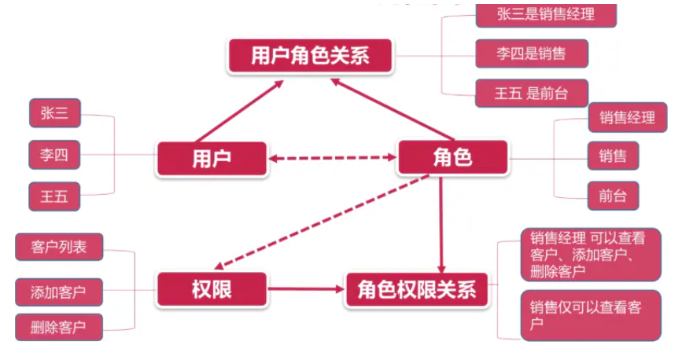

# 第八章：权限受控解决方案之分级分控权限管理

## 8-01：开篇

那么从这一章开始我们就来解决我们的权限控制问题。

本章以权限控制为主，整个章节会分成三部分来去讲解：

1. 权限理论：明确什么是 `RBAC` 权限控制体现
2. 辅助业务：完善 用户、角色、权限 三个页面功能
3. 核心功能：落地实现 `RBAC` 权限控制系统

列举出来这三部分的目的是为了让大家能够对本章的内容有个清楚的认知，那么接下来我们就先来看第一部分 **权限理论**

## 8-02：权限理论：RBAC 权限控制体系

权限控制在开发中一直是一个比较复杂的问题，甚至有很多同学对什么是权限控制还不是很了解。所以我们需要先来统一一下认知，明确项目中的权限控制系统。

在我们当前的项目中，我们可以通过：

1. 员工管理为用户指定角色
2. 通过角色列表为角色指定权限
3. 通过权限列表查看当前项目所有权限

那么换句话而言，以上三条就制定了一个用户由：**用户 -> 角色 -> 权限** 的一个分配关系。

当我们通过角色为某一个用户指定到不同的权限之后，那么该用户就会在 **项目中体会到不同权限的功能**

那么这样的一套关系就是我们的 **RBAC 权限控制体系**，也就是 **基于 角色的权限 控制 用户的访问**

通过以下图片可以很好的说明这种权限控制体系的含义：



## 8-03：辅助业务：角色列表展示

那么明确好了 `RBAC` 的概念之后，接下来我们就可以来去实现我们的辅助业务了，所谓辅助业务具体指的就是：

1. 员工管理（用户列表）
   1. 为用户分配角色
2. 角色列表
   1. 角色列表展示
   2. 为角色分配权限
3. 权限列表
   1. 权限列表展示

那么这一小节我们就先来实现其中的 **角色列表展示**

1. 创建 `api/role` 接口文件：

   ```js
   import request from '@/utils/request'

   /**
    * 获取所有角色
    */
   export const roleList = () => {
     return request({
       url: '/role/list'
     })
   }
   ```

2. 在 `views/role-list` 中获取数据

   ```js
   import { roleList } from '@/api/role'
   import { watchSwitchLang } from '@/utils/i18n'
   import { ref } from 'vue'

   const allRoles = ref([])
   const getRoleList = async () => {
     allRoles.value = await roleList()
   }
   getRoleList()
   watchSwitchLang(getRoleList)
   ```

3. 通过 [el-table](https://element-plus.org/zh-CN/component/table.html) 进行数据展示

   ```vue
   <template>
     <div class="">
       <el-card>
         <el-table :data="allRoles" border style="width: 100%">
           <el-table-column :label="$t('msg.role.index')" type="index" width="120">
           </el-table-column>
           <el-table-column :label="$t('msg.role.name')" prop="title"> </el-table-column>
           <el-table-column :label="$t('msg.role.desc')" prop="describe"> </el-table-column>
           <el-table-column :label="$t('msg.role.action')" prop="action" width="260">
             <el-button type="primary" size="mini">
               {{ $t('msg.role.assignPermissions') }}
             </el-button>
           </el-table-column>
         </el-table>
       </el-card>
     </div>
   </template>
   ```

## 8-04：辅助业务：权限列表展示

1. 创建 `api/permission` 文件

   ```js
   import request from '@/utils/request'

   /**
    * 获取所有权限
    */
   export const permissionList = () => {
     return request({
       url: '/permission/list'
     })
   }
   ```

2. 在 `views/permission-list` 获取数据

   ```vue
   <script setup>
     import { permissionList } from '@/api/permission'
     import { watchSwitchLang } from '@/utils/i18n'
     import { ref } from 'vue'
     /**
      * 权限分级：
      * 1. 一级权限为页面权限
      *  permissionMark 对应 路由名称
      * 2. 二级权限为功能权限
      *  permissionMark 对应 功能权限表
      */
     // 所有权限
     const allPermission = ref([])
     const getPermissionList = async () => {
       allPermission.value = await permissionList()
     }
     getPermissionList()
     watchSwitchLang(getPermissionList)
   </script>
   ```

3. 通过 [el-table](https://element-plus.org/zh-CN/component/table.html) 进行数据展示

   ```vue
   <template>
     <div class="">
       <el-card>
         <el-table
           :data="allPermission"
           style="width: 100%; margin-bottom: 20px"
           row-key="id"
           border
           default-expand-all
           :tree-props="{ children: 'children', hasChildren: 'hasChildren' }"
         >
           <el-table-column prop="permissionName" :label="$t('msg.permission.name')" width="180">
           </el-table-column>
           <el-table-column prop="permissionMark" :label="$t('msg.permission.mark')" width="180">
           </el-table-column>
           <el-table-column prop="permissionDesc" :label="$t('msg.permission.desc')">
           </el-table-column>
         </el-table>
       </el-card>
     </div>
   </template>
   ```

## 8-05：辅助业务：为用户分配角色

1. 创建为用户分配角色弹出层 `views/user-manage/components/roles`

   ```vue
   <template>
     <el-dialog :title="$t('msg.excel.roleDialogTitle')" :model-value="modelValue" @close="closed">
       内容

       <template #footer>
         <span class="dialog-footer">
           <el-button @click="closed">{{ $t('msg.universal.cancel') }}</el-button>
           <el-button type="primary" @click="onConfirm">{{
             $t('msg.universal.confirm')
           }}</el-button>
         </span>
       </template>
     </el-dialog>
   </template>

   <script setup>
     import { defineProps, defineEmits } from 'vue'
     defineProps({
       modelValue: {
         type: Boolean,
         required: true
       }
     })
     const emits = defineEmits(['update:modelValue'])

     /**
     确定按钮点击事件
    */
     const onConfirm = async () => {
       closed()
     }

     /**
      * 关闭
      */
     const closed = () => {
       emits('update:modelValue', false)
     }
   </script>

   <style lang="scss" scoped></style>
   ```

2. 在 `user-manage` 中点击查看，展示弹出层

   ```vue
   <roles-dialog v-model="roleDialogVisible"></roles-dialog>

   import RolesDialog from './components/roles.vue' /** * 查看角色的点击事件 */ const
   roleDialogVisible = ref(false) const onShowRoleClick = row => { roleDialogVisible.value = true }
   ```

3. 在弹出层中我们需要利用 [el-checkbox](https://element-plus.org/zh-CN/component/checkbox.html) 进行数据展示，此时数据分为两种：

   1. 所有角色（已存在）
   2. 用户当前角色

4. 所以我们需要先获取对应数据

5. 在 `api/user-manage` 中定义获取用户当前角色接口

   ```js
   /**
    * 获取指定用户角色
    */
   export const userRoles = id => {
     return request({
       url: `/user-manage/role/${id}`
     })
   }
   ```

6. 在 `roles` 组件中获取所有角色数据

   ```js
   import { defineProps, defineEmits, ref } from 'vue'
   import { roleList } from '@/api/role'
   import { watchSwitchLang } from '@/utils/i18n'
   ...

   // 所有角色
   const allRoleList = ref([])
   // 获取所有角色数据的方法
   const getListData = async () => {
     allRoleList.value = await roleList()
   }
   getListData()
   watchSwitchLang(getListData)

   // 当前用户角色
   const userRoleTitleList = ref([])
   ```

7. 利用 [el-checkbox](https://element-plus.org/zh-CN/component/checkbox.html) 渲染所有角色

   ```html
   <el-checkbox-group v-model="userRoleTitleList">
     <el-checkbox v-for="item in allRoleList" :key="item.id" :label="item.title"></el-checkbox>
   </el-checkbox-group>
   ```

8. 接下来渲染选中项，即：用户当前角色

9. 调用 `userRoles` 接口需要 **当前用户 ID**，所以我们需要定义对应的 `props`

   ```vue
   const props = defineProps({ ... userId: { type: String, required: true } })
   ```

10. 接下来我们可以根据 `userId` 获取数据，但是这里大家要注意：**因为该 `userId` 需要在 `user-manage` 用户点击之后获取当前点击行的 `id`。所以在 `roles` 组件的初始状态下，获取到的 `userId` 为 `null` 。** 因此我们想要根据 `userId` 获取用户当前角色数据，我们需要 `watch userId` 在 `userId` 有值的前提下，获取数据

    ```js
    // 当前用户角色
    const userRoleTitleList = ref([])
    // 获取当前用户角色
    const getUserRoles = async () => {
      const res = await userRoles(props.userId)
      userRoleTitleList.value = res.role.map(item => item.title)
    }
    watch(
      () => props.userId,
      val => {
        if (val) getUserRoles()
      }
    )
    ```

11. 在 `user-manage` 中传递数据

    ```vue
    <roles-dialog v-model="roleDialogVisible" :userId="selectUserId"></roles-dialog>

    const selectUserId = ref('') const onShowRoleClick = row => { selectUserId.value = row._id }
    ```

12. 在 `dialog` 关闭时重置 `selectUserId`

    ```js
    // 保证每次打开重新获取用户角色数据
    watch(roleDialogVisible, val => {
      if (!val) selectUserId.value = ''
    })
    ```

13. 在 `api/user-manage` 中定义分配角色接口

    ```js
    /**
     * 分用户分配角色
     */
    export const updateRole = (id, roles) => {
      return request({
        url: `/user-manage/update-role/${id}`,
        method: 'POST',
        data: {
          roles
        }
      })
    }
    ```

14. 点击确定调用接口

    ```js
    /**
      确定按钮点击事件
     */
    const i18n = useI18n()
    const onConfirm = async () => {
      // 处理数据结构
      const roles = userRoleTitleList.value.map(title => {
        return allRoleList.value.find(role => role.title === title)
      })

      await updateRole(props.userId, roles)

      ElMessage.success(i18n.t('msg.role.updateRoleSuccess'))
      closed()
    }
    ```

15. 修改成功后，发送事件

    ```js
    const emits = defineEmits(['update:modelValue', 'updateRole'])

    const onConfirm = async () => {
      ...
      // 角色更新成功
      emits('updateRole')
    }
    ```

16. 在 `user-manage` 中监听角色更新成功事件，重新获取数据

    ```html
    <roles-dialog
      v-model="roleDialogVisible"
      :userId="selectUserId"
      @updateRole="getListData"
    ></roles-dialog>
    ```

## 8-06：辅助业务：为角色指定权限

为角色指定权限通过 **弹出层中的 [树形控件](https://element-plus.org/zh-CN/component/tree.html) 处理**，整体的流程与上一小节相差无几。

1. 创建 为角色指定权限弹出层

   ```vue
   <template>
     <el-dialog :title="$t('msg.excel.roleDialogTitle')" :model-value="modelValue" @close="closed">
       内容

       <template #footer>
         <span class="dialog-footer">
           <el-button @click="closed">{{ $t('msg.universal.cancel') }}</el-button>
           <el-button type="primary" @click="onConfirm">{{
             $t('msg.universal.confirm')
           }}</el-button>
         </span>
       </template>
     </el-dialog>
   </template>

   <script setup>
     import { defineProps, defineEmits } from 'vue'
     defineProps({
       modelValue: {
         type: Boolean,
         required: true
       }
     })
     const emits = defineEmits(['update:modelValue'])

     /**
     确定按钮点击事件
    */
     const onConfirm = async () => {
       closed()
     }

     /**
      * 关闭
      */
     const closed = () => {
       emits('update:modelValue', false)
     }
   </script>
   ```

2. 在 `roles-list` 中点击查看，展示弹出层

   ```vue
   <template>
     <div class="">
       <el-card>
         <el-table :data="allRoles" border style="width: 100%">
           ...
           <el-table-column ... #default="{ row }">
             <el-button type="primary" size="mini" @click="onDistributePermissionClick(row)">
               {{ $t('msg.role.assignPermissions') }}
             </el-button>
           </el-table-column>
         </el-table>
       </el-card>

       <distribute-permission v-model="distributePermissionVisible"></distribute-permission>
     </div>
   </template>

   <script setup>
     ...
     import DistributePermission from './components/DistributePermission.vue'

     ...

     /**
      * 分配权限
      */
     const distributePermissionVisible = ref(false)
     const onDistributePermissionClick = row => {
       distributePermissionVisible.value = true
     }
   </script>
   ```

3. 在弹出层中我们需要利用 [el-tree](https://element-plus.org/zh-CN/component/tree.html) 进行数据展示，此时数据分为两种：

   1. 所有权限（已存在）
   2. 角色对应的权限

4. 所以我们需要先获取对应数据

5. 在 `api/role` 中定义获取角色当前权限

   ```js
   /**
    * 获取指定角色的权限
    */
   export const rolePermission = roleId => {
     return request({
       url: `/role/permission/${roleId}`
     })
   }
   ```

6. 在 `DistributePermission` 组件中获取所有权限数据

   ```vue
   <script setup>
     import { defineProps, defineEmits, ref } from 'vue'
     import { permissionList } from '@/api/permission'
     import { watchSwitchLang } from '@/utils/i18n'
     ...

     // 所有权限
     const allPermission = ref([])
     const getPermissionList = async () => {
       allPermission.value = await permissionList()
     }
     getPermissionList()
     watchSwitchLang(getPermissionList)

     ...
   </script>
   ```

7. 使用 [el-tree](https://element-plus.org/zh-CN/component/tree.html) 渲染权限数据

   ```vue
   <template>
     ...
     <el-tree
       ref="treeRef"
       :data="allPermission"
       show-checkbox
       check-strictly
       node-key="id"
       default-expand-all
       :props="defaultProps"
     >
     </el-tree>
     ...
   </template>

   <script setup>
     ...
     // 属性结构配置
     const defaultProps = {
       children: 'children',
       label: 'permissionName'
     }
     ...
   </script>
   ```

8. 接下来渲染选中项，即：角色当前权限

9. 调用 `rolePermission` 接口需要 **当前角色 ID**，所以我们需要定义对应的 `props`

   ```js
   const props = defineProps({
     modelValue: {
       type: Boolean,
       required: true
     },
     roleId: {
       type: String,
       required: true
     }
   })
   ```

10. 在 `role-list` 中传递角色 ID

    ```vue
    <distribute-permission
      v-model="distributePermissionVisible"
      :roleId="selectRoleId"
    ></distribute-permission>

    /** * 分配权限 */ const selectRoleId = ref('') const onDistributePermissionClick = row => {
    selectRoleId.value = row.id }
    ```

11. 调用 `rolePermission` 接口获取数据

    ```js
    import { rolePermission } from '@/api/role'

    // 获取当前用户角色的权限
    const getRolePermission = async () => {
      const checkedKeys = await rolePermission(props.roleId)
      console.log(checkedKeys)
    }

    watch(
      () => props.roleId,
      val => {
        if (val) getRolePermission()
      }
    )
    ```

12. 根据获取到的数据渲染选中的 `tree`

    ```js
    // tree 节点
    const treeRef = ref(null)

    // 获取当前用户角色的权限
    const getRolePermission = async () => {
      const checkedKeys = await rolePermission(props.roleId)
      treeRef.value.setCheckedKeys(checkedKeys)
    }
    ```

13. 在 `api/role` 中定义分配权限接口

    ```js
    /**
     * 为角色修改权限
     */
    export const distributePermission = data => {
      return request({
        url: '/role/distribute-permission',
        method: 'POST',
        data
      })
    }
    ```

14. 点击确定调用接口

    ```js
    import { rolePermission, distributePermission } from '@/api/role'
    import { useI18n } from 'vue-i18n'
    import { ElMessage } from 'element-plus'

    /**
      确定按钮点击事件
     */
    const i18n = useI18n()
    const onConfirm = async () => {
      await distributePermission({
        roleId: props.roleId,
        permissions: treeRef.value.getCheckedKeys()
      })
      ElMessage.success(i18n.t('msg.role.updateRoleSuccess'))
      closed()
    }
    ```

## 8-07：基于 RBAC 的权限控制体系原理与实现分析

那么接下来就进入我们本章中的核心内容 **基于 RBAC 的权限控制** ，在之前我们的 **权限理论** 这一小节的时候说过 `RBAC` 是基于 **用户 -> 角色 -> 权限** 的 **基于 角色的权限 控制 用户的访问** 的体系。

在这套体系中，最基层的就是 **权限部分** 。那么这个权限部分在我们的项目中具体的呈现是什么呢？那么下面我们就来看一下：

1. 我们可以先为 **员工角色** 指定 **空权限**
2. 然后为我们的 **测试用户** 指定指定 **员工角色**
3. 此时我们重新登录 **测试用户**
4. 可以发现左侧菜单中仅存在 **个人中心** 页面
5. 然后我们重新登录 **超级管理员** 账号
6. 为 **员工角色** 指定 **员工管理 && 分配角色** 权限
7. 然后为我们的 **测试用户** 指定指定 **员工角色**
8. 此时我们重新登录 **测试用户**
9. 可以发现左侧菜单中多出 **员工管理** 页面，并且页面中仅存在指定的 **分配角色** 功能

以上就是我们权限系统中的具体呈现。

那么由此呈现我们可以看出，整个权限系统其实分成了两部分：

1. 页面权限：比如 员工管理
2. 功能权限：比如 分配角色

其中 **页面权限** 表示：当前用户可以访问的页面

**功能权限** 表示：当前用户可以访问的权限功能（PS：并非所有功能有需要权限）

那么明确好了以上内容之后，接下来我们来看下，以上功能如何进行实现呢？

首先我们先来看 **页面权限：**

所谓页面权限包含两部分内容：

1. 用户可看到的：左侧 `menu` 菜单的 `item` 展示
2. 用户看不到的：路由表配置

我们知道 **左侧 `menu` 菜单是根据路由表自动生成的。** 所以以上第一部分的内容其实就是由第二部分引起的。

那么我们就可以来看一下 **路由表配置了**。

不知道大家还记不记得，之前我们设置路由表的时候，把路由表分成了两部分：

1. 私有路由表 `privateRoutes`：依据权限进行动态配置的
2. 公开路由表 `publicRoutes`：无权限要求的

那么想要实现我们的 **页面权限** 核心的点就是在我们的 **私有路由表 `privateRoutes`**

那么在 **私有路由表 `privateRoutes`** 这里我们能做什么呢？

时刻记住我们最终的目的，我们期望的是：**不同的权限进入系统可以看到不同的路由** 。那么换句话而言是不是就是：**根据不同的权限数据，生成不同的私有路由表？**

对于 `vue-router 4` 而言，提供了 [addRoute API](https://next.router.vuejs.org/zh/api/#addroute) ，可以 **动态添加路由到路由表中**，那么我们就可以利用这个 `API` 生成不同的路由表数据。

那么现在我们来总结一下以上所说的内容：

1. 页面权限实现的核心在于 **路由表配置**
2. 路由表配置的核心在于 **私有路由表 `privateRoutes`**
3. 私有路由表 `privateRoutes` 的核心在于 **[addRoute API](https://next.router.vuejs.org/zh/api/#addroute)**

那么简单一句话总结，我们只需要：**根据不同的权限数据，利用 [addRoute API](https://next.router.vuejs.org/zh/api/#addroute) 生成不同的私有路由表 ** 即可实现 **页面权限** 功能

那么接下来我们来明确 **功能权限：**

**功能权限** 的难度低于页面权限，所谓功能权限指的只有一点：

1. 根据不同的 **权限数据**，展示不同的 **功能按钮**

那么看这一条，依据我们刚才所说的 **页面权限** 经验，估计大家就应该比较好理解了。

对于 **功能权限** 而言，我们只需要：**根据权限数据，隐藏功能按钮** 即可

那么到这里我们已经分析完了 **页面权限** 与 **功能权限**

那么接下来我们就可以分别来看一下两者的实现方案了。

首先我们来看 **页面权限：**

整个 **页面权限** 实现分为以下几步：

1. 获取 **权限数据**
2. **私有路由表** 不再被直接加入到 `routes` 中
3. 利用 [addRoute API](https://next.router.vuejs.org/zh/api/#addroute) 动态添加路由到 **路由表** 中

接下来是 **功能权限：**

整个 **功能权限** 实现分为以下几步：

1. 获取 **权限数据**
2. 定义 **隐藏按钮方式**（通过指令）
3. 依据数据隐藏按钮

## 8-08：业务落地：定义页面权限控制动作，实现页面权限受控

那么这一小节我们来实现 **页面权限**

首先我们先来明确前两步的内容：

1. 页面权限数据在 **`userInfo -> permission -> menus` 之中**

2. **私有路由表** 不再被直接加入到 `routes` 中

   ```js
   export const privateRoutes = [...]
   export const publicRoutes = [...]

   const router = createRouter({
     history: createWebHashHistory(),
     routes: publicRoutes
   })
   ```

最后我们来实现第三步：利用 [addRoute API](https://next.router.vuejs.org/zh/api/#addroute) 动态添加路由到 **路由表** 中

1. 定义添加的动作，该动作我们通过一个新的 `vuex` 模块进行

2. 创建 `store/modules/permission` 模块

   ```js
   // 专门处理权限路由的模块
   import { publicRoutes, privateRoutes } from '@/router'
   export default {
     namespaced: true,
     state: {
       // 路由表：初始拥有静态路由权限
       routes: publicRoutes
     },
     mutations: {
       /**
        * 增加路由
        */
       setRoutes(state, newRoutes) {
         // 永远在静态路由的基础上增加新路由
         state.routes = [...publicRoutes, ...newRoutes]
       }
     },
     actions: {
       /**
        * 根据权限筛选路由
        */
       filterRoutes(context, menus) {}
     }
   }
   ```

3. 那么 `filterRoutes` 这个动作我们怎么制作呢？

4. 我们可以为每个权限路由指定一个 `name`，每个 `name` 对应一个 **页面权限**

5. 通过 `name` 与 **页面权限** 匹配的方式筛选出对应的权限路由

6. 所以我们需要对现有的私有路由表进行重制

7. 创建 `router/modules` 文件夹

8. 写入 5 个页面权限路由

9. `UserManage.js`

   ```js
   import layout from '@/layout'

   export default {
     path: '/user',
     component: layout,
     redirect: '/user/manage',
     name: 'userManage',
     meta: {
       title: 'user',
       icon: 'personnel'
     },
     children: [
       {
         path: '/user/manage',
         component: () => import('@/views/user-manage/index'),
         meta: {
           title: 'userManage',
           icon: 'personnel-manage'
         }
       },
       {
         path: '/user/info/:id',
         name: 'userInfo',
         component: () => import('@/views/user-info/index'),
         props: true,
         meta: {
           title: 'userInfo'
         }
       },
       {
         path: '/user/import',
         name: 'import',
         component: () => import('@/views/import/index'),
         meta: {
           title: 'excelImport'
         }
       }
     ]
   }
   ```

10. `RoleList.js`

    ```js
    import layout from '@/layout'

    export default {
      path: '/user',
      component: layout,
      redirect: '/user/manage',
      name: 'roleList',
      meta: {
        title: 'user',
        icon: 'personnel'
      },
      children: [
        {
          path: '/user/role',
          component: () => import('@/views/role-list/index'),
          meta: {
            title: 'roleList',
            icon: 'role'
          }
        }
      ]
    }
    ```

11. `PermissionList.js`

    ```js
    import layout from '@/layout'

    export default {
      path: '/user',
      component: layout,
      redirect: '/user/manage',
      name: 'roleList',
      meta: {
        title: 'user',
        icon: 'personnel'
      },
      children: [
        {
          path: '/user/permission',
          component: () => import('@/views/permission-list/index'),
          meta: {
            title: 'permissionList',
            icon: 'permission'
          }
        }
      ]
    }
    ```

12. `Article.js`

    ```js
    import layout from '@/layout'

    export default {
      path: '/article',
      component: layout,
      redirect: '/article/ranking',
      name: 'articleRanking',
      meta: { title: 'article', icon: 'article' },
      children: [
        {
          path: '/article/ranking',
          component: () => import('@/views/article-ranking/index'),
          meta: {
            title: 'articleRanking',
            icon: 'article-ranking'
          }
        },
        {
          path: '/article/:id',
          component: () => import('@/views/article-detail/index'),
          meta: {
            title: 'articleDetail'
          }
        }
      ]
    }
    ```

13. `ArticleCreate.js`

    ```js
    import layout from '@/layout'

    export default {
      path: '/article',
      component: layout,
      redirect: '/article/ranking',
      name: 'articleCreate',
      meta: { title: 'article', icon: 'article' },
      children: [
        {
          path: '/article/create',
          component: () => import('@/views/article-create/index'),
          meta: {
            title: 'articleCreate',
            icon: 'article-create'
          }
        },
        {
          path: '/article/editor/:id',
          component: () => import('@/views/article-create/index'),
          meta: {
            title: 'articleEditor'
          }
        }
      ]
    }
    ```

14. 以上内容存放于 **课程资料 -> 动态路由表** 中

15. 在 `router/index` 中合并这些路由到 `privateRoutes` 中

    ```js
    import ArticleCreaterRouter from './modules/ArticleCreate'
    import ArticleRouter from './modules/Article'
    import PermissionListRouter from './modules/PermissionList'
    import RoleListRouter from './modules/RoleList'
    import UserManageRouter from './modules/UserManage'

    export const asyncRoutes = [
      RoleListRouter,
      UserManageRouter,
      PermissionListRouter,
      ArticleCreaterRouter,
      ArticleRouter
    ]
    ```

16. 此时所有的 **权限页面** 都拥有一个名字，这个名字与 **权限数据** 匹配

17. 所以我们就可以据此生成 **权限路由表数据**

    ```js
        /**
         * 根据权限筛选路由
         */
        filterRoutes(context, menus) {
          const routes = []
          // 路由权限匹配
          menus.forEach(key => {
            // 权限名 与 路由的 name 匹配
            routes.push(...privateRoutes.filter(item => item.name === key))
          })
          // 最后添加 不匹配路由进入 404
          routes.push({
            path: '/:catchAll(.*)',
            redirect: '/404'
          })
          context.commit('setRoutes', routes)
          return routes
        }
    ```

18. 在 `store/index` 中设置该 `modules`

    ```js
    ...
    export default createStore({
      getters,
      modules: {
        ...
        permission
      }
    })

    ```

19. 在 `src/permission` 中，获取用户数据之后调用该动作

    ```js
    // 判断用户资料是否获取
    // 若不存在用户信息，则需要获取用户信息
    if (!store.getters.hasUserInfo) {
      // 触发获取用户信息的 action，并获取用户当前权限
      const { permission } = await store.dispatch('user/getUserInfo')
      // 处理用户权限，筛选出需要添加的权限
      const filterRoutes = await store.dispatch('permission/filterRoutes', permission.menus)
      // 利用 addRoute 循环添加
      filterRoutes.forEach(item => {
        router.addRoute(item)
      })
      // 添加完动态路由之后，需要在进行一次主动跳转
      return next(to.path)
    }
    next()
    ```

20. 因为我们主动获取了 `getUserInfo` 动作的返回值，所以不要忘记在 `getUserInfo` 中 `return res`

那么到这里，当我们更换用户之后，刷新页面，路由表即可动态生成。

但是此时大家应该可以发现，如果不刷新页面得话，左侧菜单是不会自动改变的？那么这是怎么回事呢？大家可以先思考一下这个问题，然后我们下一节再来处理。

## 8-09：业务落地：重置路由表数据

在上一小节中我们遇到了一个问题：重新登录权限账户，不刷新页面，左侧菜单不会自动改变。

那么出现这个问题的原因其实非常简单：**退出登录时，添加的路由表并未被删除**

所以想要解决这个问题，我们只需要在退出登录时，删除动态添加的路由表即可。

那么删除动态添加的路由可以使用 [removeRoute](https://next.router.vuejs.org/zh/api/#removeroute) 方法进行。

1. 在 `router/index` 中定义 `resetRouter` 方法

   ```js
   /**
    * 初始化路由表
    */
   export function resetRouter() {
     if (
       store.getters.userInfo &&
       store.getters.userInfo.permission &&
       store.getters.userInfo.permission.menus
     ) {
       const menus = store.getters.userInfo.permission.menus
       menus.forEach((menu) => {
         router.removeRoute(menu)
       })
     }
   ```

2. 在退出登录的动作下，触发该方法

   ```js
   import router, { resetRouter } from '@/router'

   logout(context) {
         resetRouter()
         ...
       }
   ```

## 8-10：业务落地：创建功能受控指令

在前面分析 **功能权限** 时，我们说过，实现功能权限的核心在于 **根据数据隐藏功能按钮**，那么隐藏的方式我们可以通过指令进行。

所以首先我们先去创建这样一个指令（[vue3 自定义指令](https://v3.cn.vuejs.org/guide/custom-directive.html#%E7%AE%80%E4%BB%8B)）

1. 我们期望最终可以通过这样格式的指令进行功能受控 `v-permission="['importUser']"`

2. 以此创建对应的自定义指令 `directives/permission`

   ```js
   import store from '@/store'

   function checkPermission(el, binding) {
     // 获取绑定的值，此处为权限
     const { value } = binding
     // 获取所有的功能指令
     const points = store.getters.userInfo.permission.points
     // 当传入的指令集为数组时
     if (value && value instanceof Array) {
       // 匹配对应的指令
       const hasPermission = points.some(point => {
         return value.includes(point)
       })
       // 如果无法匹配，则表示当前用户无该指令，那么删除对应的功能按钮
       if (!hasPermission) {
         el.parentNode && el.parentNode.removeChild(el)
       }
     } else {
       // eslint-disabled-next-line
       throw new Error('v-permission value is ["admin","editor"]')
     }
   }

   export default {
     // 在绑定元素的父组件被挂载后调用
     mounted(el, binding) {
       checkPermission(el, binding)
     },
     // 在包含组件的 VNode 及其子组件的 VNode 更新后调用
     update(el, binding) {
       checkPermission(el, binding)
     }
   }
   ```

3. 在 `directives/index` 中绑定该指令

   ```js
   ...
   import permission from './permission'

   export default (app) => {
     ...
     app.directive('permission', permission)
   }

   ```

4. 在所有功能中，添加该指令

5. `views/role-list/index`

   ```html
   <el-button ... v-permission="['distributePermission']">
     {{ $t('msg.role.assignPermissions') }}
   </el-button>
   ```

6. `views/user-manage/index`

   ```html
   <el-button ... v-permission="['importUser']"> {{ $t('msg.excel.importExcel') }}</el-button>
   ```

   ```html
   <el-button ... v-permission="['distributeRole']">{{ $t('msg.excel.showRole') }}</el-button>
   ```

   ```html
   <el-button ... v-permission="['removeUser']">{{ $t('msg.excel.remove') }}</el-button>
   ```

## 8-11：总结

那么到这里我们整个权限受控的章节就算是全部完成了。

整个这一大章中，核心就是 **`RBAC`的权限受控体系** 。围绕着 **用户->角色->权限** 的体系是现在在包含权限控制的系统中使用率最广的一种方式。

那么怎么针对于权限控制的方案而言，除了课程中提到的这种方案之外，其实还有很多其他的方案，大家可以在我们的话题讨论中踊跃发言，多多讨论。
