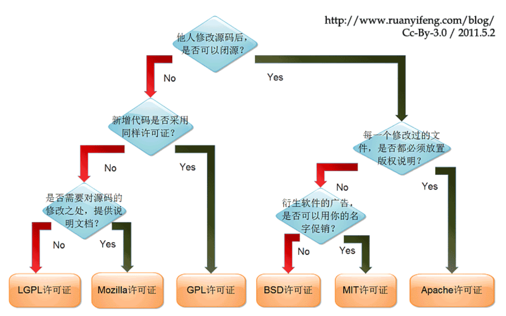
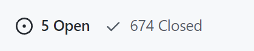

# 第十章：富文本与 markdown 综合处理之创建文章

## 10-1：开篇

本章中我们的核心业务就是 **编辑文章**。

而对于 **编辑文章** 而言提供了两种编辑方式：

1. 富文本
2. `markdown`

对于这两种编辑形式在现在的前端中都拥有非常多的第三方库，那么对于我们开发者而言，我们肯定也是从中去选择出一个适合我们当前业务的库来进行使用，从而实现出对应的编辑形式。

那么对于我们本章的内容而言，主要就是分成了三个部分：

1. 辅助业务：创建文章、编辑文章
2. 富文本库：介绍 、使用
3. `markdown`：介绍、使用

那么明确好了对应的内容之后，接下来我们就去进行对应的实现即可

## 10-2：辅助业务：创建文章基本结构实现

那么首先我们先去完成 **创建文章** 的基本结构，主要分成三部分：

1. `article-create` 页面：基本结构
2. `Editor` 组件：富文本编辑器
3. `Markdown` 组件：`markdown` 编辑器

那么明确好了之后，我们就去进行对应的实现：

1. 创建 `views/article-create/components/Editor`

2. 创建 `views/article-create/components/Markdown`

3. 在 `views/article-create` 完成基本结构

   ```vue
   <template>
     <div class="article-create">
       <el-card>
         <el-input
           class="title-input"
           :placeholder="$t('msg.article.titlePlaceholder')"
           v-model="title"
           maxlength="20"
           clearable
         >
         </el-input>
         <el-tabs v-model="activeName">
           <el-tab-pane :label="$t('msg.article.markdown')" name="markdown">
             <markdown></markdown>
           </el-tab-pane>
           <el-tab-pane :label="$t('msg.article.richText')" name="editor">
             <editor></editor>
           </el-tab-pane>
         </el-tabs>
       </el-card>
     </div>
   </template>

   <script setup>
     import Editor from './components/Editor.vue'
     import Markdown from './components/Markdown.vue'
     import { ref } from 'vue'

     const activeName = ref('markdown')
     const title = ref('')
   </script>

   <style lang="scss" scoped>
     .title-input {
       margin-bottom: 20px;
     }
   </style>
   ```

## 10-3：编辑库选择标准

对于现在的前端编辑库（`markdown` 与 富文本）而言，如果仅从功能上来去看的话，那么其实都是相差无几的。

随便从 `github` 中挑选编辑库，只要 `star` 在 `10K（保守些）` 以上的，编辑器之上的常用功能一应俱全。

那么这样的话就会导致一个问题我们想要去选择一个编辑库的话，应该如何去进行选择呢？

如果你现在想要去选择一个编辑库，那么可以从以下几点中进行选择：

1. [开源协议](https://www.runoob.com/w3cnote/open-source-license.html)：其中尽量选择 `MIT` 或者 `BSD` 协议的开源项目
   
2. 功能：功能需要满足基本需求
3. `issue`：通过 `issue` 查看作者对该库的维护程度
   
4. 文档：文档越详尽越好，最好提供了中文文档（英文好的可以忽略）
5. 国产的：或许你 `朋友的朋友的朋友` 就是这个库的作者

那么根据以上几点，我选择了以下的编辑器库：

1. `markdown` 编辑器：[tui.editor](https://github.com/nhn/tui.editor)
2. 富文本编辑器：[wangEditor](https://github.com/wangeditor-team/wangEditor)

那么最后给大家推荐一些编辑器库，大家可以进行一些参考：

1. `markdown` 编辑器：
   1. [tui.editor](https://github.com/nhn/tui.editor)：`Markdown` 所见即所得编辑器-高效且可扩展，使用 MIT 开源协议。
   2. [editor](https://github.com/lepture/editor)：纯文本 `markdown` 编辑器
   3. [editor.md](https://github.com/pandao/editor.md)：开源可嵌入的在线`markdown`编辑器(组件)，基于 `CodeMirror` & `jQuery` & `Marked`。国产
   4. [markdown-here](https://github.com/adam-p/markdown-here)：谷歌开源，但是已经 **多年不更新** 了
   5. [stackedit](https://github.com/benweet/stackedit)：基于`PageDown`，`Stack Overflow`和其他 Stack Exchange 站点使用的`Markdown`库的功能齐全的开源 Markdown 编辑器。**两年未更新了**
   6. [markdown-it](https://github.com/markdown-it/markdown-it)：可配置语法，可添加、替换规则。**挺长时间未更新了**
2. 富文本编辑器：
   1. [wangEditor](https://github.com/wangeditor-team/wangEditor)：国产、文档详尽、更新快速
   2. [tinymce](https://github.com/tinymce/tinymce)：对 `IE6+` 和 `Firefox1.5+` 都有着非常良好的支持
   3. [quill](https://github.com/quilljs/quill)：代码高亮功能、视频加载功能、公式处理比较强。
   4. [ckeditor5](https://github.com/ckeditor/ckeditor5)：编辑能力强
   5. [wysiwyg-editor](https://froala.com/wysiwyg-editor/)：**收费的** ， 就是牛

以上列举出的编辑器，大家可以进行一些参考

## 10-4：新建文章：markdown 实现

我们通过 [tui.editor](https://github.com/nhn/tui.editor) 实现 `markdown` 的编辑功能：

1. 下载 [tui.editor](https://github.com/nhn/tui.editor)

   ```
   npm i @toast-ui/editor@3.0.2
   ```

2. 渲染基本结构

   ```vue
   <template>
     <div class="markdown-container">
       <!-- 渲染区 -->
       <div id="markdown-box"></div>
       <div class="bottom">
         <el-button type="primary" @click="onSubmitClick">{{ $t('msg.article.commit') }}</el-button>
       </div>
     </div>
   </template>

   <script setup>
     import {} from 'vue'
   </script>

   <style lang="scss" scoped>
     .markdown-container {
       .bottom {
         margin-top: 20px;
         text-align: right;
       }
     }
   </style>
   ```

3. 初始化 `editor` ，处理国际化内容

   ```vue
   <script setup>
     import MkEditor from '@toast-ui/editor'
     import '@toast-ui/editor/dist/toastui-editor.css'
     import '@toast-ui/editor/dist/i18n/zh-cn'
     import { onMounted } from 'vue'
     import { useStore } from 'vuex'

     // Editor实例
     let mkEditor
     // 处理离开页面切换语言导致 dom 无法被获取
     let el
     onMounted(() => {
       el = document.querySelector('#markdown-box')
       initEditor()
     })

     const store = useStore()
     const initEditor = () => {
       mkEditor = new MkEditor({
         el,
         height: '500px',
         previewStyle: 'vertical',
         language: store.getters.language === 'zh' ? 'zh-CN' : 'en'
       })

       mkEditor.getMarkdown()
     }
   </script>
   ```

4. 在语言改变时，重置 `editor`

   ```js
   import { watchSwitchLang } from '@/utils/i18n'

   watchSwitchLang(() => {
     if (!el) return
     const htmlStr = mkEditor.getHTML()
     mkEditor.destroy()
     initEditor()
     mkEditor.setHTML(htmlStr)
   })
   ```

## 10-5：新建文章：markdown 文章提交

1. 在 `api/article` 中，定义创建文章接口

   ```js
   /**
    * 创建文章
    */
   export const createArticle = data => {
     return request({
       url: '/article/create',
       method: 'POST',
       data
     })
   }
   ```

2. 因为 `markdown` 或者是 富文本 最终都会处理提交事件，所以我们可以把这两件事情合并到一个模块中实现：

3. 创建 `article-create/components/commit.js`

   ```js
   import { createArticle } from '@/api/article'
   import { ElMessage } from 'element-plus'
   import i18n from '@/i18n'
   const t = i18n.global.t

   export const commitArticle = async data => {
     const res = await createArticle(data)
     ElMessage.success(t('msg.article.createSuccess'))
     return res
   }
   ```

4. 在 `markdown.vue` 中导入该方法

   ```js
   import { commitArticle } from './commit'
   ```

5. 触发按钮提交事件

   ```js
   const props = defineProps({
     title: {
       required: true,
       type: String
     }
   })

   const emits = defineEmits(['onSuccess'])
   ...
   // 处理提交
   const onSubmitClick = async () => {
     // 创建文章
     await commitArticle({
       title: props.title,
       content: mkEditor.getHTML()
     })

     mkEditor.reset()
     emits('onSuccess')
   }
   ```

6. 在 `article-create` 中传递 `title`，处理 `onSuccess` 事件

   ```js
   // 创建成功
   const onSuccess = () => {
     title.value = ''
   }
   ```

## 10-6：新建文章：markdown 文章编辑

1. 在 `article-detail` 中点击编辑按钮，进入创建文章页面

   ```js
   // 编辑
   const router = useRouter()
   const onEditClick = () => {
     router.push(`/article/editor/${articleId}`)
   }
   ```

2. 在 `article-craete` 中，处理 **编辑** 相关操作

3. 获取当前文章数据

   ```js
   // 处理编辑相关
   const route = useRoute()
   const articleId = route.params.id
   const detail = ref({})
   const getArticleDetail = async () => {
     detail.value = await articleDetail(articleId)
     // 标题赋值
     title.value = detail.value.title
   }
   if (articleId) {
     getArticleDetail()
   }
   ```

4. 把获取到的数据传递给 `markdown` 组件

   ```html
   <markdown :title="title" :detail="detail" @onSuccess="onSuccess"></markdown>
   ```

5. 在 `markdown` 中接收该数据

   ```js
   const props = defineProps({
    ...
     detail: {
       type: Object
     }
   })
   ```

6. 检测数据变化，存在 `detail` 时，把 `detail` 赋值给 `mkEditor`

   ```js
   // 编辑相关
   watch(
     () => props.detail,
     val => {
       if (val && val.content) {
         mkEditor.setHTML(val.content)
       }
     },
     {
       immediate: true
     }
   )
   ```

7. 创建 **编辑文章** 接口

   ```js
   /**
    * 编辑文章详情
    */
   export const articleEdit = data => {
     return request({
       url: '/article/edit',
       method: 'POST',
       data
     })
   }
   ```

8. 在 `commit.js` 中生成 **编辑文章** 方法

   ```js
   export const editArticle = async data => {
     const res = await articleEdit(data)
     ElMessage.success(t('msg.article.editorSuccess'))
     return res
   }
   ```

9. 在 `markdown` 中处理提交按钮事件

   ```js
   // 处理提交
   const onSubmitClick = async () => {
     if (props.detail && props.detail._id) {
       // 编辑文章
       await editArticle({
         id: props.detail._id,
         title: props.title,
         content: mkEditor.getHTML()
       })
     } else {
       // 创建文章
       await commitArticle({
         title: props.title,
         content: mkEditor.getHTML()
       })
     }

     mkEditor.reset()
     emits('onSuccess')
   }
   ```

## 10-7：新建文章：富文本 实现

富文本我们使用 [wangEditor](https://github.com/wangeditor-team/wangEditor)，所以我们得先去下载 [wangEditor](https://github.com/wangeditor-team/wangEditor)

```
npm i wangeditor@4.7.6
```

安装完成之后，我们就去实现对应的代码逻辑：

1. 创建基本组件结构

   ```vue
   <template>
     <div class="editor-container">
       <div id="editor-box"></div>
       <div class="bottom">
         <el-button type="primary" @click="onSubmitClick">{{ $t('msg.article.commit') }}</el-button>
       </div>
     </div>
   </template>

   <script setup>
     import {} from 'vue'
   </script>

   <style lang="scss" scoped>
     .editor-container {
       .bottom {
         margin-top: 20px;
         text-align: right;
       }
     }
   </style>
   ```

2. 初始化 `wangEditor`

   ```vue
   <script setup>
     import E from 'wangeditor'
     import { onMounted } from 'vue'

     // Editor实例
     let editor
     // 处理离开页面切换语言导致 dom 无法被获取
     let el
     onMounted(() => {
       el = document.querySelector('#editor-box')
       initEditor()
     })

     const initEditor = () => {
       editor = new E(el)
       editor.config.zIndex = 1
       // 菜单栏提示
       editor.config.showMenuTooltips = true
       editor.config.menuTooltipPosition = 'down'
       editor.create()
     }
   </script>
   ```

3. `wangEditor` 的 [国际化处理](https://www.wangeditor.com/doc/pages/12-%E5%A4%9A%E8%AF%AD%E8%A8%80/)，官网支持 [i18next](https://www.i18next.com/)，所以想要处理 `wangEditor` 的国际化，那么我们需要安装 [i18next](https://www.i18next.com/)

   ```js
   npm i --save i18next@20.4.0
   ```

4. 对 `wangEditor` 进行国际化处理

   ```js
   import i18next from 'i18next'
   import { useStore } from 'vuex'

   const store = useStore()
   ...
   const initEditor = () => {
     ...

     // 国际化相关处理
     editor.config.lang = store.getters.language === 'zh' ? 'zh-CN' : 'en'
     editor.i18next = i18next

     editor.create()
   }
   ```

5. 处理提交事件

   ```js
   import { onMounted, defineProps, defineEmits } from 'vue'
   import { commitArticle } from './commit'

   const props = defineProps({
     title: {
       required: true,
       type: String
     }
   })

   const emits = defineEmits(['onSuccess'])
   ...
   const onSubmitClick = async () => {
     // 创建文章
     await commitArticle({
       title: props.title,
       content: editor.txt.html()
     })

     editor.txt.html('')
     emits('onSuccess')
   }
   ```

6. 不要忘记在 `article-create` 中处理对应事件

   ```html
   <editor :title="title" :detail="detail" @onSuccess="onSuccess"></editor>
   ```

7. 最后处理编辑

   ```js
   const props = defineProps({
     ...
     detail: {
       type: Object
     }
   })

   // 编辑相关
   watch(
     () => props.detail,
     (val) => {
       if (val && val.content) {
         editor.txt.html(val.content)
       }
     },
     {
       immediate: true
     }
   )

   const onSubmitClick = async () => {
     if (props.detail && props.detail._id) {
       // 编辑文章
       await editArticle({
         id: props.detail._id,
         title: props.title,
         content: editor.txt.html()
       })
     } else {
       // 创建文章
       await commitArticle({
         title: props.title,
         content: editor.txt.html()
       })
     }

     editor.txt.html('')
     emits('onSuccess')
   }
   ```

## 10-8：总结

本章节中我们的核心重点就是 **编辑库** 的选择

常用的编辑库其实主要就分成了这么两种：

1. `markdown`
2. 富文本

那么对于大家而言，不一定非要使用我们在课程中使用的这两个编辑器库。

因为对于编辑器库而言，它的使用方式都是大同小异的，大家只需要根据我们 **《编辑器库选择标准》** 来选择使用自己当前情况的编辑器库即可
